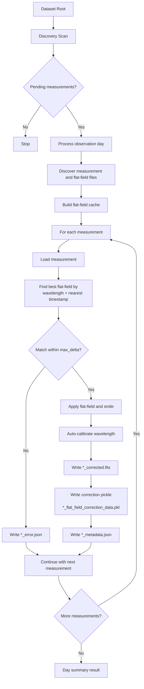
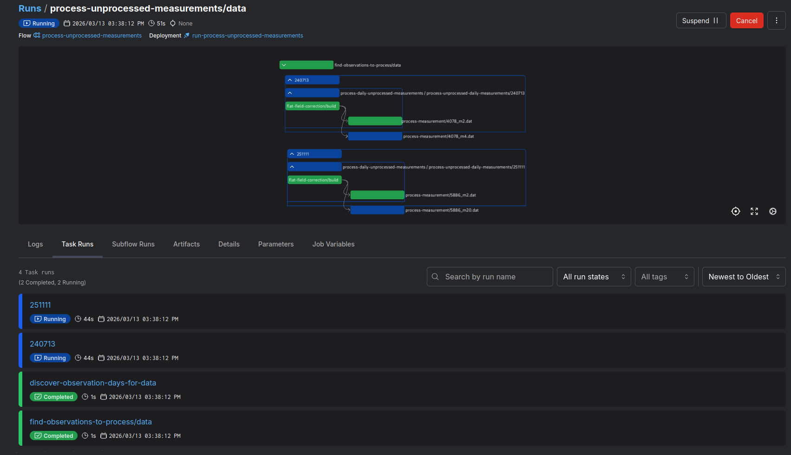

# IRSOL Data Pipeline

## Development status
 - [x] Implement flat field correction
 - [x] Implement wavelength auto-calibration
 - [x] Implement per-measurement processing pipeline
 - [x] Implement dataset scanning and orchestration with Prefect
 - [x] Prefect-only operational interface
 - [x] Correct export capabilities into `.fits` format for compatibility with existing tools and workflows.
 - [ ] Comprehensive unit and integration tests
 - [ ] Documentation and usage examples

## Overview

`irsol-data-pipeline` processes IRSOL ZIMPOL solar spectro-polarimetric measurements.
It discovers unprocessed observations, computes and reuses flat-field corrections,
applies those corrections to matching measurements, auto-calibrates wavelength,
and writes processed outputs plus metadata.

The project is operated through Prefect flows (scan and process multiple observation days).

The codebase also exposes lightweight local entrypoints for serving the Prefect
deployments, processing a single measurement, and plotting an existing FITS
product.

Expected dataset layout:

```text
<root>/
	<year>/
		<day>/
			raw/
			reduced/
			processed/
```

Inside `reduced/`:

- Measurement files: `<wavelength>_m<id>.dat` (example: `6302_m1.dat`)
- Flat-field files: `ff<wavelength>_m<id>.dat` (example: `ff6302_m3.dat`)
- Ignored as measurements: files starting with `cal` or `dark`

## Installation (via UV)

### 1. Install `uv`

If needed:

```bash
curl -LsSf https://astral.sh/uv/install.sh | sh
```

### 2. Create and sync environment

From the repository root:

```bash
uv sync
```

### 3. Run with Prefect

Make targets:

```bash
make lint
make test
make prefect/dashboard
make prefect/serve-flat-field-correction-pipeline
make prefect/serve-maintenance-pipeline
make prefect/reset
```

`prefect/reset` resets the local Prefect database and removes local Prefect state.

## Repository Structure

Current repository layout (abridged):

```text
irsol-data-pipeline/
├── data/                          # Local dataset root used in development
├── documentation/                 # Documentation assets (screenshots, notes)
├── entrypoints/                   # Runtime entry scripts (for deployments and ops)
│   ├── serve_flat_field_correction_pipeline.py
│   │                             # Serve the processing deployment locally
│   ├── serve_prefect_maintenance.py
│   │                             # Serve maintenance deployment(s) for Prefect state
│   ├── process_single_measurement.py
│   │                             # Run correction/calibration for one .dat file
│   └── plot_fits_profile.py       # Plot Stokes profiles from a processed FITS file
├── src/irsol_data_pipeline/
│   ├── core/                      # Shared domain and scientific core logic
│   │   ├── models.py              # Shared domain models/types used across modules
│   │   ├── config.py              # Shared configuration models/defaults
│   │   ├── correction/            # Flat-field correction analysis and application
│   │   └── calibration/           # Wavelength auto-calibration logic
│   ├── io/                        # File I/O and metadata persistence
│   │   ├── dat/                   # ZIMPOL .dat/.sav loader (Stokes + info array)
│   │   ├── fits/                  # FITS exporter/importer for processed measurements
│   │   ├── flatfield/             # Flat-field correction pickle reader/writer
│   │   └── processing_metadata/   # JSON metadata/error read-write helpers
│   ├── pipeline/                  # Processing orchestration and reusable pipeline steps
│   │   ├── day_processor.py       # Observation-day orchestration over pending measurements
│   │   ├── measurement_processor.py # Single-measurement correction/calibration pipeline
│   │   ├── flatfield_cache.py     # Flat-field correction cache build/query
│   │   ├── filesystem.py          # Dataset discovery + canonical output/cache paths
│   │   └── scanner.py             # Pending-measurement scanner
│   ├── orchestration/             # Prefect flows, decorators, and logging bridge
│   ├── plotting/                  # Plot generation for processed profiles
│   ├── exceptions.py              # Shared pipeline exceptions
│   ├── logging_config.py          # Loguru sinks/format setup
│   └── version.py                 # Package version
├── tests/unit/                    # Unit tests (e.g. test_retry.py, test_scanner.py)
├── pyproject.toml
├── Makefile
└── README.md
```

`entrypoints/` is intentionally small: it contains executable scripts that wire
the package into runtime environments (for example, serving a Prefect
deployment) without mixing deployment bootstrapping code into library modules.

## Architecture Overview

The codebase is split into focused layers.

### Core functionalities

- Shared domain models (`src/irsol_data_pipeline/core/models.py`):
	- Central dataclasses/types such as `Measurement`, `FlatField`,
	  `FlatFieldCorrection`, `MeasurementMetadata`, `StokesParameters`,
	  `CalibrationResult`, and processing result/policy models used across the
	  pipeline, I/O, and orchestration layers.
- Shared configuration module (`src/irsol_data_pipeline/core/config.py`):
	- Centralized configuration models/default values so pipeline
	  steps and orchestration flows consume a consistent configuration contract.
- I/O (`src/irsol_data_pipeline/io/`):
	- Read ZIMPOL `.dat`/`.sav` files into `StokesParameters` + raw `info`
	  arrays (`io/dat/importer.py`, exposed as `io.dat.read`)
	- Write processed Stokes data to multi-extension FITS with optional
	  calibration metadata (`io/fits/exporter.py`, exposed as `io.fits.write`)
	- Read processed FITS back into typed structures for plotting/inspection
	  (`io/fits/importer.py`, exposed as `io.fits.read`)
	- Persist and load `FlatFieldCorrection` payloads as pickle files
	  (`io/flatfield/exporter.py`, `io/flatfield/importer.py`, exposed as
	  `io.flatfield.write` / `io.flatfield.read`)
	- Persist processing metadata and per-measurement errors as JSON
	  (`io/processing_metadata/exporter.py`, exposed as
	  `io.processing_metadata.write` / `io.processing_metadata.write_error`)
- Flat-field analysis and correction:
	- Analyze flat-fields with `spectroflat`
	  (`core/correction/analyzer.py`)
	- Build and query correction cache (`pipeline/flatfield_cache.py`)
	- Persist/load flat-field correction pickle payloads through the new
	  dedicated modules (`io/flatfield/exporter.py`,
	  `io/flatfield/importer.py`), with cache paths generated by
	  `pipeline/filesystem.py` (`flatfield_correction_cache_path`)
	- Apply dust-flat and smile correction (`core/correction/corrector.py`)
- Wavelength auto-calibration:
	- Cross-correlate with bundled reference spectra and fit line positions
		(`core/calibration/autocalibrate.py`)
- Processing pipeline:
	- Discover observation days/files and build canonical output/cache paths
		(`pipeline/filesystem.py`)
	- Scan pending measurements (`pipeline/scanner.py`)
	- Process one observation day (`pipeline/day_processor.py`)
	- Process one measurement (`pipeline/measurement_processor.py`)
- Orchestration:
	- Prefect flows for dataset-wide processing and maintenance
		(`orchestration/flows/flat_field_correction.py`,
		`orchestration/flows/delete_old_prefect_data.py`)
	- Prefect-aware logging bridge (`orchestration/patch_logging.py`)

### Processing pipeline

Per day, the processing behavior is:

1. Discovery: find measurement files in `reduced/` and skip already processed
	 measurements (`*_corrected.fits` or `*_error.json` in `processed/`).
2. Flat-field analysis: build/load a cache of flat-field corrections per
	 wavelength.
3. Matching and correction: for each measurement, select the closest-time
	 flat-field with matching wavelength within `max_delta` and apply correction.
4. Auto-calibration: calibrate corrected Stokes spectra against reference data.
5. Write outputs: corrected data, correction payload, metadata, and per-file
	 error JSON when a measurement fails.

### Output files

For a source measurement `6302_m1.dat`, the pipeline writes into `processed/`:

- `6302_m1_corrected.fits`: corrected Stokes arrays and observation metadata in FITS format
- `6302_m1_flat_field_correction_data.pkl`: serialized flat-field correction payload
- `6302_m1_metadata.json`: processing metadata and calibration summary
- `6302_m1_profile_corrected.png`: plot of corrected Stokes profiles
- `6302_m1_profile_original.png`: plot of original Stokes profiles
- `6302_m1_error.json`: written only if processing fails

Flat-field analysis cache files are stored separately under
`processed/_cache/` as `ff<wavelength>_m<id>_correction_cache.pkl` and are
reused on subsequent runs when available. Both these cache files and the
per-measurement `*_flat_field_correction_data.pkl` artifacts are written and
read via `io.flatfield.write` / `io.flatfield.read`.



## Prefect Usage

### Recommended startup flow (Makefile)

Use the Make targets to start the local Prefect server/dashboard and serve both
processing and maintenance deployments from repository entrypoints.

1. Start the Prefect server and dashboard:

```bash
make prefect/dashboard
```

2. In another terminal, serve the flat-field correction deployment:

```bash
make prefect/serve-flat-field-correction-pipeline
```

This target runs `entrypoints/serve_flat_field_correction_pipeline.py`, which
serves two deployments:

- **`run-flat-field-correction-pipeline`** — scans the dataset root and
  processes all pending measurements across all days. Scheduled to run
  automatically every day at **01:00**.
- **`run-daily-flat-field-correction-pipeline`** — processes a single
  observation day directory on demand (no automatic schedule; triggered
  manually or by another flow).

3. In another terminal, serve the maintenance deployment:

```bash
make prefect/serve-maintenance-pipeline
```

This target runs `entrypoints/serve_prefect_maintenance.py`, which serves
**`delete-old-prefect-data`** — deletes flow runs older than the configured
retention window. Scheduled to run automatically every day at **00:00**.

### Why maintenance deployments are necessary

Prefect stores historical flow and task-run state in its local database. During
active development and operations, this history grows quickly and can make the
UI slower, increase disk usage, and add noise when troubleshooting recent runs.

The maintenance deployment provides a controlled and repeatable cleanup path:

- It deletes runs older than a configurable retention window (default: `672` hours / 4 weeks, controlled via the `hours` parameter).
- It runs on a daily cron schedule (`0 0 * * *`, midnight) so history is pruned
  without manual intervention.
- It avoids ad-hoc database operations.
- It can also be triggered manually on demand from the Prefect UI.

### How to run maintenance deployments

1. Ensure the Prefect server is running:

```bash
make prefect/dashboard
```

2. Serve the maintenance deployment:

```bash
make prefect/serve-maintenance-pipeline
```

Once served, the `delete-old-prefect-data` deployment runs automatically at
midnight every day. No additional action is needed for routine cleanup.

To trigger an immediate run:

3. In the Prefect UI (`http://127.0.0.1:4200`), go to `Deployments` and select
`delete-old-prefect-data`, then click `Run` / `Quick Run`.

4. Override parameters when needed:
- `hours`: retention window in hours (default: `672`, i.e. 4 weeks). Flow runs
  that ended more than `hours` hours ago are deleted.
- `interactive`: set `true` to add a confirmation prompt before deletion
  (useful when running the CLI directly); `false` is the default for the
  scheduled deployment.

Notes:

- `make prefect/serve-flat-field-correction-pipeline` and
	`make prefect/serve-maintenance-pipeline` set `PREFECT_ENABLED=true` so
	Prefect-aware decorators are active.
- The default processing deployment parameter root is `<repo>/data` (configured
	in `entrypoints/serve_flat_field_correction_pipeline.py`).
- If needed, reset local Prefect state with `make prefect/reset`.

### Automatic scheduling summary

| Deployment | Schedule | Purpose |
|---|---|---|
| `run-flat-field-correction-pipeline` | Daily at 01:00 (`0 1 * * *`) | Process all pending measurements across all days |
| `run-daily-flat-field-correction-pipeline` | On demand only | Process a single observation day |
| `delete-old-prefect-data` | Daily at 00:00 (`0 0 * * *`) | Prune Prefect flow-run history older than 4 weeks |

Schedules are active only while the corresponding serve process is running. Both
processing and maintenance serve processes must be kept alive (for example in
detached terminal sessions or as system services) for scheduled runs to execute.

### Invoking from the dashboard

1. Open the Prefect UI: `http://127.0.0.1:4200`.
2. Go to `Deployments` and select `run-flat-field-correction-pipeline`.
3. Click `Run` / `Quick Run`.
4. Optionally adjust parameters (`root`, `max_delta_hours`, `max_concurrent_days_to_process`).
5. Inspect run logs and artifacts:
- The scan summary is published as a markdown artifact.
- Each day processing run reports processed/skipped/failed counts.



## FITS Profile Plot Entry Point

For quick profile visualization from an existing FITS product, use:

```bash
uv run entrypoints/plot_fits_profile.py /path/to/measurement_corrected.fits
```

Optional output path:

```bash
uv run entrypoints/plot_fits_profile.py /path/to/measurement_corrected.fits -o /path/to/profile.png
```

The entrypoint reads Stokes image extensions from the FITS file, extracts title
metadata from headers, and passes wavelength calibration (`a0`/`a1`) to the
profile plot when calibration metadata is available.

## Single Measurement Correction Entry Point

To run correction/calibration for one `.dat` measurement:

```bash
uv run entrypoints/process_single_measurement.py /path/to/reduced/6302_m1.dat
```

Optional arguments:

```bash
uv run entrypoints/process_single_measurement.py /path/to/reduced/6302_m1.dat \
	--flatfield-dir /path/to/reduced \
	--output-dir /path/to/processed \
	--max-delta-hours 2.0 \
	--verbose
```

Notes:

- `--flatfield-dir` defaults to the measurement's parent `reduced/` directory.
- `--output-dir` defaults to the sibling `processed/` directory for the measurement.
