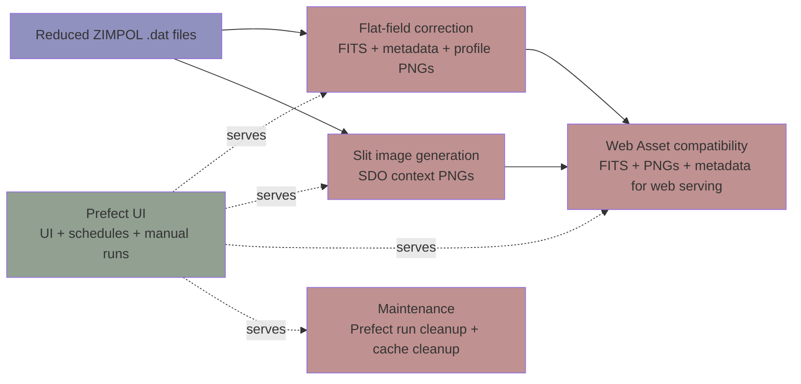

# IRSOL Data Pipeline

[](https://github.com/irsol-locarno/irsol-data-pipeline/actions/workflows/ci.yml)
[](https://github.com/irsol-locarno/irsol-data-pipeline/actions/workflows/release.yml)

| Package    | Version |
| -------- | ------- |
| Library  | [](https://badge.fury.io/py/irsol-data-pipeline)    |
| CLI | [](https://badge.fury.io/py/irsol-data-pipeline-cli) |

IRSOL Data Pipeline processes reduced ZIMPOL spectro-polarimetric observations and produces calibrated scientific outputs and operational artifacts.

This project is structured as a Python package with a command-line interface (CLI) and is orchestrated using Prefect for workflow management. The pipeline includes *core* data processing modules for __flat-field correction__, __wavelength auto-calibration__, __slit image generation__ and integration with the PIOMBO data server, as well as IO modules for handling various data formats. The outputs are designed to be compatible with web serving and include metadata for traceability.

The project can be installed as a simple python dependency and used programamtically.

The installed package also provides a CLI for common operations, including running the full pipeline, executing individual steps, and managing Prefect flows.

The following diagram illustrates the high-level data flow and module interactions within the IRSOL Data Pipeline:



## Quick Start

```bash
uv tool install irsol-data-pipeline
idp --version
```

For installation options see [docs/user/installation.md](docs/user/installation.md).

## Documentation

Use this section as the canonical traversal path.

### 1. Getting Started

| Page | Purpose |
|---|---|
| [docs/user/installation.md](docs/user/installation.md) | Install dependencies and set up local environment |
| [docs/user/quickstart.md](docs/user/quickstart.md) | Minimal working example and typical workflow |

### 2. Architecture

| Page | Purpose |
|---|---|
| [docs/overview/architecture.md](docs/overview/architecture.md) | Module layout, layer boundaries, dependency direction |

### 3. Core Modules

| Page | Purpose |
|---|---|
| [docs/core/flat_field_correction.md](docs/core/flat_field_correction.md) | Flat-field and smile correction algorithms |
| [docs/core/wavelength_autocalibration.md](docs/core/wavelength_autocalibration.md) | Wavelength auto-calibration via spectral line fitting |
| [docs/core/slit_image_creation.md](docs/core/slit_image_creation.md) | Slit image generation with SDO context |

### 4. Pipelines and IO

| Page | Purpose |
|---|---|
| [docs/pipeline/pipeline_overview.md](docs/pipeline/pipeline_overview.md) | End-to-end pipeline description and data flow |
| [docs/pipeline/prefect_integration.md](docs/pipeline/prefect_integration.md) | Prefect orchestration, flows, and task structure |
| [docs/io/io_modules.md](docs/io/io_modules.md) | Data loading, saving, and format support |

### 5. Operations

| Page | Purpose |
|---|---|
| [docs/cli/cli_usage.md](docs/cli/cli_usage.md) | CLI commands, arguments, and examples |
| [docs/maintainer/prefect_operations.md](docs/maintainer/prefect_operations.md) | Production deployment, monitoring, and troubleshooting |
| [docs/maintainer/create_a_release.md](docs/maintainer/create_a_release.md) | Step-by-step guide to creating a new release on GitHub and publishing to PyPI |
