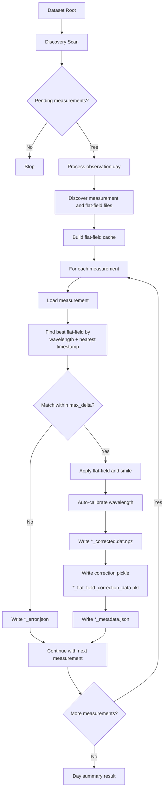

# IRSOL Data Pipeline

## Development status
 - [x] Implement flat field correction
 - [x] Implement wavelength auto-calibration
 - [x] Implement per-measurement processing pipeline
 - [x] Implement dataset scanning and orchestration with Prefect
 - [ ] Robust CLI capabilities for local processing and debugging
 - [ ] Correct export capabilities into `.fits` format, currently output is saved as `.npz` file but the final goal is to export into `.fits` format for compatibility with existing tools and workflows.
 - [ ] Comprehensive unit and integration tests
 - [ ] Documentation and usage examples

## Overview

`irsol-data-pipeline` processes IRSOL ZIMPOL solar spectro-polarimetric measurements.
It discovers unprocessed observations, computes and reuses flat-field corrections,
applies those corrections to matching measurements, auto-calibrates wavelength,
and writes processed outputs plus metadata.

The project supports two operation styles:

- Local CLI processing (single day or single measurement).
- Prefect-orchestrated processing (scan and process multiple observation days).

Expected dataset layout:

```text
<root>/
	<year>/
		<day>/
			raw/
			reduced/
			processed/
```

Inside `reduced/`:

- Measurement files: `<wavelength>_m<id>.dat` (example: `6302_m1.dat`)
- Flat-field files: `ff<wavelength>_m<id>.dat` (example: `ff6302_m3.dat`)
- Ignored as measurements: files starting with `cal` or `dark`

## Installation (via UV)

### 1. Install `uv`

If needed:

```bash
curl -LsSf https://astral.sh/uv/install.sh | sh
```

### 2. Create and sync environment

From the repository root:

```bash
uv sync
```

### 3. Set dataset root

```bash
export SOLAR_PIPELINE_ROOT=/path/to/your/dataset/root
```

### 4. Run commands

Examples:

```bash
uv run solar-pipeline scan
uv run solar-pipeline process-day /path/to/<year>/<day>
uv run solar-pipeline process-measurement /path/to/file.dat
uv run solar-pipeline export-fits /path/to/file.dat
uv run solar-pipeline plot-stokes /path/to/file.dat --calibrate
```

You can also run the Typer app module directly:

```bash
uv run python -m irsol_data_pipeline.cli.main --help
```

Optional Make targets:

```bash
make lint
make test
make prefect/dashboard
make prefect/serve-pipeline
make prefect/reset
```

`prefect/reset` resets the local Prefect database and removes local Prefect state.

## Architecture Overview

The codebase is split into focused layers.

### Core functionalities

- Domain models (`src/irsol_data_pipeline/core/`):
	- `Measurement`, `FlatField`, `FlatFieldCorrection`
	- `MeasurementMetadata`
	- `StokesParameters`
	- `CalibrationResult`
- I/O (`src/irsol_data_pipeline/io/`):
	- Read `.dat`/`.sav`/`.npz` (`dat_reader.py`)
	- Write corrected data (`dat_writer.py`)
	- Discover observation days/files (`filesystem.py`)
	- Persist metadata/error JSON (`metadata_store.py`)
	- Persist/load cached flat-field correction objects
- Flat-field analysis and correction:
	- Analyze flat-fields with `spectroflat` (`correction/analyzer.py`)
	- Build and query correction cache (`pipeline/flatfield_cache.py`)
	- Apply dust-flat and smile correction (`correction/corrector.py`)
- Wavelength auto-calibration:
	- Cross-correlate with bundled reference spectra and fit line positions
		(`calibration/autocalibrate.py`)
- Processing pipeline:
	- Scan pending measurements (`pipeline/scanner.py`)
	- Process one day / one measurement (`pipeline/day_processor.py`)
- Orchestration:
	- Prefect flows for dataset-wide and per-day processing
		(`orchestration/flows.py`)
	- Prefect-aware logging bridge (`orchestration/patch_logging.py`)
- CLI:
	- User-facing commands via Typer (`cli/main.py`)

### Processing pipeline

Per day, the processing behavior is:

1. Discovery: find measurement files in `reduced/` and skip already processed
	 measurements (`*_corrected.dat.npz` or `*_error.json` in `processed/`).
2. Flat-field analysis: build/load a cache of flat-field corrections per
	 wavelength.
3. Matching and correction: for each measurement, select the closest-time
	 flat-field with matching wavelength within `max_delta` and apply correction.
4. Auto-calibration: calibrate corrected Stokes spectra against reference data.
5. Write outputs: corrected data, correction payload, metadata, and per-file
	 error JSON when a measurement fails.

### Output files

For a source measurement `6302_m1.dat`, the pipeline writes into `processed/`:

- `6302_m1_corrected.dat.npz`: corrected Stokes arrays in NumPy NPZ format
- `6302_m1_flat_field_correction_data.pkl`: serialized flat-field correction payload
- `6302_m1_metadata.json`: processing metadata and calibration summary
- `6302_m1_profile_corrected.png`: plot of corrected Stokes profiles
- `6302_m1_profile_original.png`: plot of original Stokes profiles
- `6302_m1_error.json`: written only if processing fails

Note: corrected output uses an NPZ container with a `.dat` stem
(`*_corrected.dat.npz`) for compatibility with existing naming conventions.



## Prefect Usage

### Recommended startup flow (Makefile)

Use the Make targets to start the local Prefect server/dashboard and serve the
pipeline deployment from the repository entrypoint.

1. Start the Prefect server and dashboard:

```bash
make prefect/dashboard
```

2. In another terminal, serve the pipeline deployment:

```bash
make prefect/serve-pipeline
```

This target runs `entrypoints/serve_pipeline.py`, which serves
`process_unprocessed_measurements` as deployment
`run-process-unprocessed-measurements`.

Notes:

- `make prefect/serve-pipeline` sets `PREFECT_ENABLED=true` so Prefect-aware decorators are active.
- The default deployment parameter root is `<repo>/data` (configured in `entrypoints/serve_pipeline.py`).
- If needed, reset local Prefect state with `make prefect/reset`.

### Invoking from the dashboard

1. Open the Prefect UI: `http://127.0.0.1:4200`.
2. Go to `Deployments` and select `run-process-unprocessed-measurements`.
3. Click `Run` / `Quick Run`.
4. Optionally adjust parameters (`root`, `max_delta_hours`, `refdata_dir`, `max_concurrency`).
5. Inspect run logs and artifacts:
- The scan summary is published as a markdown artifact.
- Each day processing run reports processed/skipped/failed counts.
