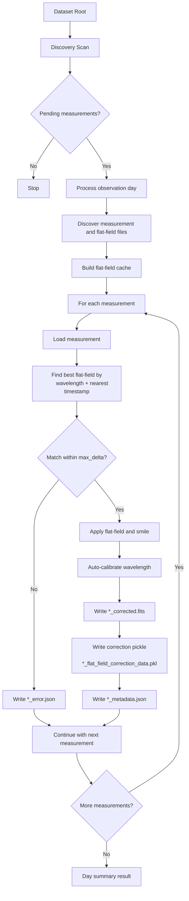

# IRSOL Data Pipeline

## Development status
 - [x] Implement flat field correction
 - [x] Implement wavelength auto-calibration
 - [x] Implement per-measurement processing pipeline
 - [x] Implement dataset scanning and orchestration with Prefect
 - [x] Prefect-only operational interface
 - [x] Correct export capabilities into `.fits` format for compatibility with existing tools and workflows.
 - [ ] Comprehensive unit and integration tests
 - [ ] Documentation and usage examples

## Overview

`irsol-data-pipeline` processes IRSOL ZIMPOL solar spectro-polarimetric measurements.
It discovers unprocessed observations, computes and reuses flat-field corrections,
applies those corrections to matching measurements, auto-calibrates wavelength,
and writes processed outputs plus metadata.

The project is operated through Prefect flows (scan and process multiple observation days).

Expected dataset layout:

```text
<root>/
	<year>/
		<day>/
			raw/
			reduced/
			processed/
```

Inside `reduced/`:

- Measurement files: `<wavelength>_m<id>.dat` (example: `6302_m1.dat`)
- Flat-field files: `ff<wavelength>_m<id>.dat` (example: `ff6302_m3.dat`)
- Ignored as measurements: files starting with `cal` or `dark`

## Installation (via UV)

### 1. Install `uv`

If needed:

```bash
curl -LsSf https://astral.sh/uv/install.sh | sh
```

### 2. Create and sync environment

From the repository root:

```bash
uv sync
```

### 3. Run with Prefect

Use Prefect as the only interaction path:

```bash
make prefect/dashboard
make prefect/serve-pipeline
```

Optional Make targets:

```bash
make lint
make test
make prefect/dashboard
make prefect/serve-pipeline
make prefect/reset
```

`prefect/reset` resets the local Prefect database and removes local Prefect state.

## Repository Structure

Current repository layout (abridged):

```text
irsol-data-pipeline/
├── data/                          # Local dataset root used in development
├── documentation/                 # Documentation assets (screenshots, notes)
├── entrypoints/                   # Runtime entry scripts (for deployments and ops)
│   ├── serve_pipeline.py          # Serve the Prefect deployment locally
│   ├── process_single_measurement.py
│   │                             # Run correction/calibration for one .dat file
│   └── plot_fits_profile.py       # Plot Stokes profiles from a processed FITS file
├── src/irsol_data_pipeline/
│   ├── core/                      # Shared domain and scientific core logic
│   │   ├── models.py              # Shared domain models/types used across modules
│   │   ├── config.py              # Shared configuration models/defaults
│   │   ├── correction/            # Flat-field correction analysis and application
│   │   └── calibration/           # Wavelength auto-calibration logic
│   ├── io/                        # File I/O and metadata persistence
│   │   └── fits/                  # FITS export functionality
│   ├── pipeline/                  # Processing orchestration and reusable pipeline steps
│   │   ├── day_processor.py       # Observation-day orchestration over pending measurements
│   │   ├── measurement_processor.py # Single-measurement correction/calibration pipeline
│   │   ├── flatfield_cache.py     # Flat-field correction cache build/query
│   │   └── scanner.py             # Dataset/day/measurement discovery helpers
│   ├── orchestration/             # Prefect flows, decorators, and logging bridge
│   ├── plotting/                  # Plot generation for processed profiles
│   └── logging_config.py
├── tests/unit/                    # Unit tests
├── pyproject.toml
├── Makefile
└── README.md
```

`entrypoints/` is intentionally small: it contains executable scripts that wire
the package into runtime environments (for example, serving a Prefect
deployment) without mixing deployment bootstrapping code into library modules.

## Architecture Overview

The codebase is split into focused layers.

### Core functionalities

- Shared domain models (`src/irsol_data_pipeline/core/models.py`):
	- Central dataclasses/types such as `Measurement`, `FlatField`,
	  `FlatFieldCorrection`, `MeasurementMetadata`, `StokesParameters`,
	  `CalibrationResult`, and processing result/policy models used across the
	  pipeline, I/O, and orchestration layers.
- Shared configuration module (`src/irsol_data_pipeline/core/config.py`):
	- Centralized configuration models/default values so pipeline
	  steps and orchestration flows consume a consistent configuration contract.
- I/O (`src/irsol_data_pipeline/io/`):
	- Read `.dat`/`.sav` (`dat_reader.py`)
	- Persist correction cache payloads (`dat_writer.py`)
	- Export FITS products (`io/fits/exporter.py`)
	- Discover observation days/files (`filesystem.py`)
	- Persist metadata/error JSON (`metadata_store.py`)
	- Persist/load cached flat-field correction objects
- Flat-field analysis and correction:
	- Analyze flat-fields with `spectroflat`
	  (`core/correction/analyzer.py`)
	- Build and query correction cache (`pipeline/flatfield_cache.py`)
	- Apply dust-flat and smile correction (`core/correction/corrector.py`)
- Wavelength auto-calibration:
	- Cross-correlate with bundled reference spectra and fit line positions
		(`core/calibration/autocalibrate.py`)
- Processing pipeline:
	- Scan pending measurements (`pipeline/scanner.py`)
	- Process one observation day (`pipeline/day_processor.py`)
	- Process one measurement (`pipeline/measurement_processor.py`)
- Orchestration:
	- Prefect flows for dataset-wide and per-day processing
		(`orchestration/flows.py`)
	- Prefect-aware logging bridge (`orchestration/patch_logging.py`)

### Processing pipeline

Per day, the processing behavior is:

1. Discovery: find measurement files in `reduced/` and skip already processed
	 measurements (`*_corrected.fits` or `*_error.json` in `processed/`).
2. Flat-field analysis: build/load a cache of flat-field corrections per
	 wavelength.
3. Matching and correction: for each measurement, select the closest-time
	 flat-field with matching wavelength within `max_delta` and apply correction.
4. Auto-calibration: calibrate corrected Stokes spectra against reference data.
5. Write outputs: corrected data, correction payload, metadata, and per-file
	 error JSON when a measurement fails.

### Output files

For a source measurement `6302_m1.dat`, the pipeline writes into `processed/`:

- `6302_m1_corrected.fits`: corrected Stokes arrays and observation metadata in FITS format
- `6302_m1_flat_field_correction_data.pkl`: serialized flat-field correction payload
- `6302_m1_metadata.json`: processing metadata and calibration summary
- `6302_m1_profile_corrected.png`: plot of corrected Stokes profiles
- `6302_m1_profile_original.png`: plot of original Stokes profiles
- `6302_m1_error.json`: written only if processing fails



## Prefect Usage

### Recommended startup flow (Makefile)

Use the Make targets to start the local Prefect server/dashboard and serve the
pipeline deployment from the repository entrypoint.

1. Start the Prefect server and dashboard:

```bash
make prefect/dashboard
```

2. In another terminal, serve the pipeline deployment:

```bash
make prefect/serve-pipeline
```

This target runs `entrypoints/serve_pipeline.py`, which serves
`process_unprocessed_measurements` as deployment
`run-process-unprocessed-measurements`.

Notes:

- `make prefect/serve-pipeline` sets `PREFECT_ENABLED=true` so Prefect-aware decorators are active.
- The default deployment parameter root is `<repo>/data` (configured in `entrypoints/serve_pipeline.py`).
- If needed, reset local Prefect state with `make prefect/reset`.

### Invoking from the dashboard

1. Open the Prefect UI: `http://127.0.0.1:4200`.
2. Go to `Deployments` and select `run-process-unprocessed-measurements`.
3. Click `Run` / `Quick Run`.
4. Optionally adjust parameters (`root`, `max_delta_hours`, `refdata_dir`, `max_concurrency`).
5. Inspect run logs and artifacts:
- The scan summary is published as a markdown artifact.
- Each day processing run reports processed/skipped/failed counts.


## FITS Profile Plot Entry Point

For quick profile visualization from an existing FITS product, use:

```bash
uv run entrypoints/plot_fits_profile.py /path/to/measurement_corrected.fits
```

Optional output path:

```bash
uv run entrypoints/plot_fits_profile.py /path/to/measurement_corrected.fits -o /path/to/profile.png
```

The entrypoint reads Stokes image extensions from the FITS file, extracts title
metadata from headers, and passes wavelength calibration (`a0`/`a1`) to the
profile plot when calibration metadata is available.

## Single Measurement Correction Entry Point

To run correction/calibration for one `.dat` measurement:

```bash
uv run entrypoints/process_single_measurement.py /path/to/reduced/6302_m1.dat
```

Optional arguments:

```bash
uv run entrypoints/process_single_measurement.py /path/to/reduced/6302_m1.dat \
	--flatfield-dir /path/to/reduced \
	--output-dir /path/to/processed \
	--refdata-dir /path/to/refdata \
	--max-delta-hours 2.0
```
