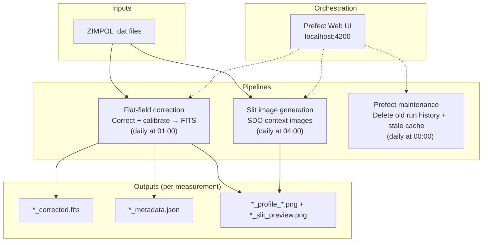

# IRSOL Data Pipeline

The IRSOL data pipeline processes raw ZIMPOL spectro-polarimetric solar observations from the IRSOL observatory (Locarno, Switzerland). It runs three independent pipelines against the same dataset:



## Quick start

```bash
# Install dependencies
uv sync

# Flat-field correction — process a single measurement (no Prefect required)
uv run entrypoints/process_single_measurement.py /path/to/reduced/6302_m1.dat
```
## Documentation

| Page | Description |
|---|---|
| [concepts.md](documentation/concepts.md) | Domain vocabulary: Stokes parameters, flat-field, smile, calibration |
| [architecture.md](documentation/architecture.md) | Repository layout and layered design |
| [installation.md](documentation/installation.md) | Prerequisites, `uv sync`, and available `make` targets |
| **Pipelines** | |
| [pipeline.md](documentation/pipeline.md) | Overview of all pipelines, shared dataset layout, output files |
| [pipeline-flat-field-correction.md](documentation/pipeline-flat-field-correction.md) | Flat-field + smile correction + wavelength calibration → FITS |
| [pipeline-slit-image-generation.md](documentation/pipeline-slit-image-generation.md) | SDO context images with spectrograph slit overlay |
| [pipeline-maintenance.md](documentation/pipeline-maintenance.md) | Prefect flow run-history and cache cleanup |
| **Operations** | |
| [running.md](documentation/running.md) | How to run each pipeline (CLI, Python, Prefect) |
| [prefect-production.md](documentation/prefect-production.md) | Production deployment, monitoring, manual triggers |
| **Development** | |
| [library-usage.md](documentation/library-usage.md) | Using the pipeline as a plain Python library |
| [extending.md](documentation/extending.md) | Custom policies, new wavelengths, new output formats, new flows |
| [configuration.md](documentation/configuration.md) | All constants defined in `core/config.py` |
| [testing.md](documentation/testing.md) | Running tests and test conventions |
| [info_array.md](documentation/info_array.md) | Fields available in the `.dat` info array |
