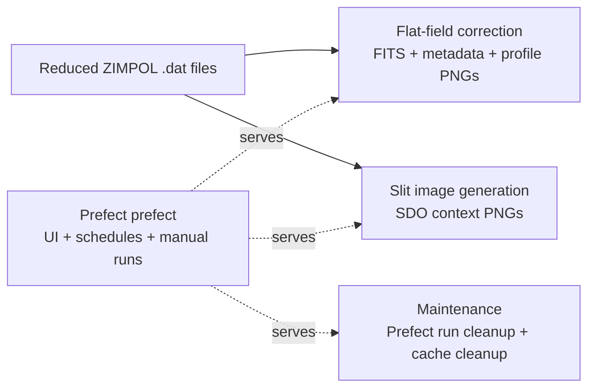

# IRSOL Data Pipeline

[](https://github.com/irsol-locarno/irsol-data-pipeline/actions/workflows/ci.yml)
[](https://badge.fury.io/py/irsol-data-pipeline)

IRSOL Data Pipeline processes reduced ZIMPOL spectro-polarimetric observations and produces calibrated scientific outputs and operational artifacts.

The repository contains three independent pipelines over the same dataset root.



## Quick Start

```bash
uv sync
uv run entrypoints/process_single_measurement.py /path/to/reduced/6302_m1.dat
```

For installation options (editable development install from a clone, or dependency install from PyPI with `uv add irsol-data-pipeline`), see [docs/user/installation.md](docs/user/installation.md).

## Documentation

Use this section as the canonical traversal path.

### 1. Getting Started

| Page | Purpose |
|---|---|
| [docs/user/installation.md](docs/user/installation.md) | Install dependencies, set up local environment, discover `make` targets |
| [docs/user/quickstart.md](docs/user/quickstart.md) | Minimal working example and typical workflow |

### 2. Architecture

| Page | Purpose |
|---|---|
| [docs/overview/architecture.md](docs/overview/architecture.md) | Module layout, layer boundaries, dependency direction |

### 3. Core Modules

| Page | Purpose |
|---|---|
| [docs/core/flat_field_correction.md](docs/core/flat_field_correction.md) | Flat-field and smile correction algorithms |
| [docs/core/wavelength_autocalibration.md](docs/core/wavelength_autocalibration.md) | Wavelength auto-calibration via spectral line fitting |
| [docs/core/slit_image_creation.md](docs/core/slit_image_creation.md) | Slit image generation with SDO context |

### 4. Pipelines and IO

| Page | Purpose |
|---|---|
| [docs/pipeline/pipeline_overview.md](docs/pipeline/pipeline_overview.md) | End-to-end pipeline description and data flow |
| [docs/pipeline/prefect_integration.md](docs/pipeline/prefect_integration.md) | Prefect orchestration, flows, and task structure |
| [docs/io/io_modules.md](docs/io/io_modules.md) | Data loading, saving, and format support |

### 5. Operations

| Page | Purpose |
|---|---|
| [docs/cli/cli_usage.md](docs/cli/cli_usage.md) | CLI commands, arguments, and examples |
| [docs/maintainer/prefect_operations.md](docs/maintainer/prefect_operations.md) | Production deployment, monitoring, and troubleshooting |
| [docs/maintainer/create_a_release.md](docs/maintainer/create_a_release.md) | Step-by-step guide to creating a new release on GitHub and publishing to PyPI |
