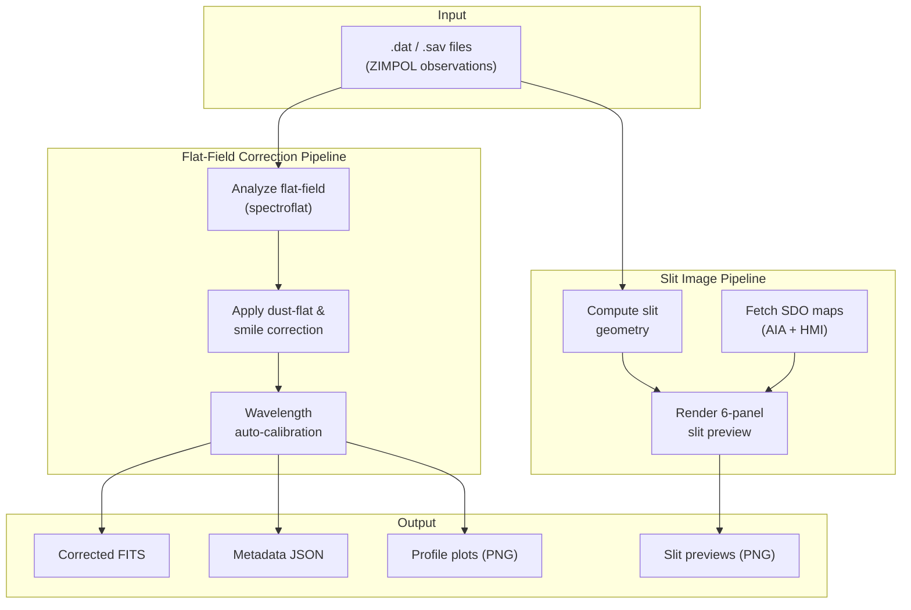

# IRSOL Data Pipeline

The **IRSOL Data Pipeline** processes reduced ZIMPOL spectropolarimetric solar observations from the Istituto Ricerche Solari (IRSOL) in Locarno, Switzerland. Starting from raw `.dat` / `.sav` IDL save-files, the pipeline applies flat-field and smile corrections, performs wavelength auto-calibration, and exports publication-ready Stokes (I, Q, U, V) data as multi-extension FITS files. It also generates contextual slit preview images using SDO/AIA and SDO/HMI data.

## Key Features

- **Flat-field & smile correction** — dust-flat and spectral-distortion correction via the [spectroflat](https://github.com/irsol-locarno/spectroflat) library.
- **Wavelength auto-calibration** — cross-correlation against reference atlases followed by Gaussian sub-pixel line fitting.
- **Slit image generation** — six-panel SDO context images showing spectrograph slit position on the solar disc.
- **Prefect orchestration** — optional scheduling, retries, and a web dashboard (runs equally well as plain Python).
- **CLI interface** — a single `idp` command for processing, plotting, and operational tasks.

## System Overview

## Documentation

| Section | Description |
|---------|-------------|
| [Architecture](overview/architecture.md) | Global architecture, module interactions, and data flow |
| **Core Modules** | |
| [Flat-Field Correction](core/flat_field_correction.md) | Dust-flat analysis, smile correction, and application |
| [Wavelength Auto-Calibration](core/wavelength_autocalibration.md) | Spectral line fitting and calibration |
| [Slit Image Creation](core/slit_image_creation.md) | SDO context image generation |
| **IO** | |
| [IO Modules](io/io_modules.md) | Data loading, saving, and format support |
| [Output Artefacts](io/output_artefacts.md) | Structure and content of every file the pipeline exports (FITS headers, JSON, PNGs) |
| **Pipeline** | |
| [Pipeline Overview](pipeline/pipeline_overview.md) | End-to-end processing flow |
| [Prefect Integration](pipeline/prefect_integration.md) | Orchestration, flows, and task structure |
| [Prefect Automations](prefect/automations.md) | Automated flow run cleanup and monitoring |
| **CLI** | |
| [CLI Usage](cli/cli_usage.md) | Commands, arguments, and examples |
| **User Guides** | |
| [Installation](user/installation.md) | Setup, dependencies, and environment |
| [Quick Start](user/quickstart.md) | Minimal working example and typical workflow |
| **Maintainer** | |
| [Prefect Operations](maintainer/prefect_operations.md) | Deployment, monitoring, and troubleshooting |
| [Creating a Release](maintainer/create_a_release.md) | Step-by-step guide to creating a new release on GitHub and publishing to PyPI |

## Technologies

| Technology | Role |
|-----------|------|
| Python ≥ 3.10 | Runtime |
| [spectroflat](https://github.com/irsol-locarno/spectroflat) | Flat-field and smile correction engine |
| [Prefect 3](https://docs.prefect.io/) | Workflow orchestration (optional) |
| [Astropy](https://www.astropy.org/) / [SunPy](https://sunpy.org/) | FITS I/O, solar coordinates |
| [Pydantic 2](https://docs.pydantic.dev/) | Data validation and domain models |
| [Cyclopts](https://github.com/BrianPugh/cyclopts) | CLI framework |
| [Loguru](https://github.com/Delgan/loguru) | Structured logging |
| [uv](https://github.com/astral-sh/uv) | Package management |
