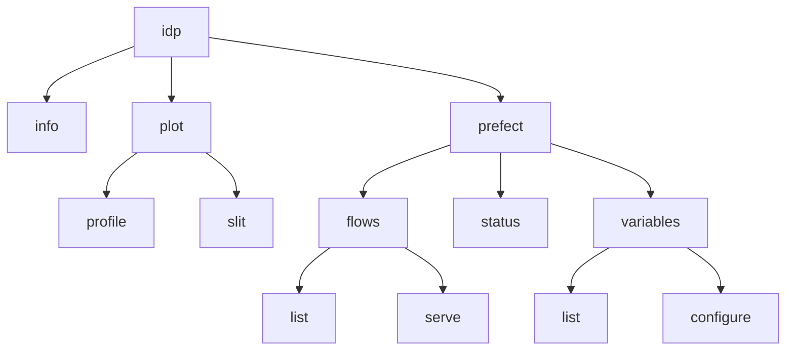
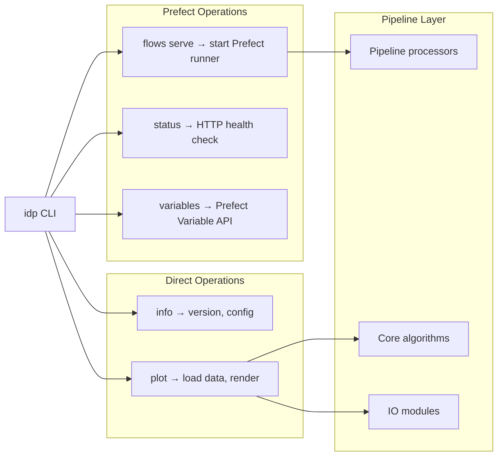

# CLI Usage

The IRSOL Data Pipeline provides a command-line interface through the `idp` command, built with the [Cyclopts](https://github.com/BrianPugh/cyclopts) framework. The CLI supports data processing operations, visualization, and Prefect workflow management.

## Command Structure

```
idp [OPTIONS] <command> [SUBCOMMAND] [ARGS]
```



## Global Options

| Option | Short | Description |
|--------|-------|-------------|
| `--verbose` | `-v` | Increase log verbosity. Use `-v` for DEBUG, `-vv` for TRACE. |
| `--log-level LEVEL` | | Explicit log level override (`DEBUG`, `INFO`, `WARNING`, `ERROR`, `CRITICAL`). |

## Commands

### `idp info`

Display runtime and operational information including pipeline version, configured flow groups, Prefect variable status, and installed distributions.

```bash
# Table format (default)
idp info

# JSON format
idp info --format json
```

---

### `idp plot`

Render visualizations from observation data.

#### `idp plot profile`

Render a four-panel Stokes profile plot (I, Q/I, U/I, V/I) from a raw measurement file.

```bash
# Save to file
idp plot profile /path/to/6302_m1.dat --output-path profile.png

# Display interactively
idp plot profile /path/to/6302_m1.dat --show

# From a FITS file
idp plot profile /path/to/6302_m1_corrected.fits --output-path profile.png
```

**Arguments:**
| Argument | Description |
|----------|-------------|
| `input_file_path` | Path to `.dat`, `.sav`, or `.fits` measurement file |

**Options:**
| Option | Description |
|--------|-------------|
| `--output-path PATH` | Save the plot to this file |
| `--show` | Display the plot interactively |

#### `idp plot slit`

Render a six-panel SDO slit context image showing the spectrograph slit position on the solar disc.

```bash
idp plot slit /path/to/6302_m1.dat user@example.com --output-path slit.png

# With SDO cache directory
idp plot slit /path/to/6302_m1.dat user@example.com --cache-dir /tmp/sdo_cache
```

**Arguments:**
| Argument | Description |
|----------|-------------|
| `input_file_path` | Path to `.dat` or `.sav` measurement file |
| `jsoc_email` | Email registered with JSOC for DRMS queries |

**Options:**
| Option | Description |
|--------|-------------|
| `--output-path PATH` | Save the plot to this file |
| `--show` | Display the plot interactively |
| `--cache-dir PATH` | Directory for caching downloaded SDO FITS files |

---

### `idp prefect`

Manage Prefect workflow orchestration.

#### `idp prefect flows list`

List discoverable flow groups and their served deployments.

```bash
# List all flow groups
idp prefect flows list

# Filter by topic
idp prefect flows list flat-field-correction

# JSON output
idp prefect flows list --format json
```

**Flow groups:** `flat-field-correction`, `slit-images`, `maintenance`

#### `idp prefect flows serve`

Register and start serving one or more flow groups. This starts a long-running process that listens for scheduled and manual triggers.

```bash
# Serve a single group
idp prefect flows serve flat-field-correction

# Serve multiple groups
idp prefect flows serve flat-field-correction slit-images

# Serve all groups
idp prefect flows serve --all
```

#### `idp prefect status`

Check whether the local Prefect server is reachable.

```bash
# Basic health check
idp prefect status

# With deep analysis of running flows
idp prefect status --deep-analysis

# Custom host/port
idp prefect status --host 192.168.1.10 --port 4200

# JSON output
idp prefect status --format json
```

**Exit codes:**
| Code | Meaning |
|------|---------|
| 0 | Prefect server is reachable |
| 1 | Prefect server is not reachable |

#### `idp prefect variables list`

Display current Prefect variable values.

```bash
idp prefect variables list
idp prefect variables list --format json
```

#### `idp prefect variables configure`

Interactively configure Prefect variables. Prompts for each variable with optional defaults.

```bash
# Configure unset variables
idp prefect variables configure

# Update all variables (including already-set ones)
idp prefect variables configure --update-existing
```

**Variables configured:**
| Variable | Description | Required |
|----------|-------------|----------|
| `data-root-path` | Dataset root directory | Yes |
| `jsoc-email` | JSOC DRMS email | Yes (for slit images) |
| `cache-expiration-hours` | Cache retention hours | Optional |
| `flow-run-expiration-hours` | Run history retention hours | Optional |

---

## How the CLI Interacts with the Pipeline



The CLI does not directly run the processing pipeline. Instead:

- **`idp plot`** uses the IO and core modules directly to load data and render plots.
- **`idp prefect flows serve`** starts Prefect flow runners that invoke the pipeline layer.
- **`idp info`** and **`idp prefect status/variables`** query runtime and configuration state.

## Related Documentation

- [Installation](../user/installation.md) — how to install the `idp` command
- [Quick Start](../user/quickstart.md) — common workflow examples
- [Prefect Operations](../maintainer/prefect_operations.md) — production deployment
