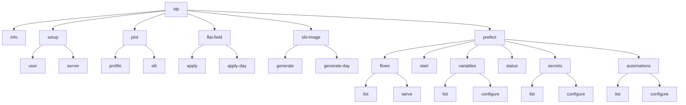
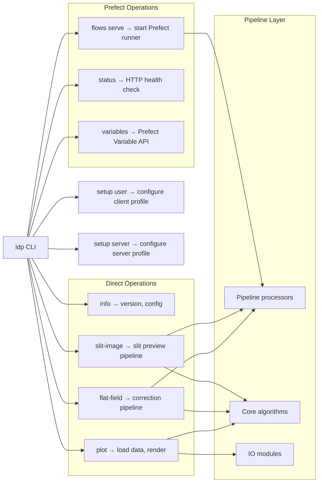

# CLI Usage

The IRSOL Data Pipeline provides a command-line interface through the `idp` command, built with the [Cyclopts](https://github.com/BrianPugh/cyclopts) framework. The CLI supports data processing operations, visualization, and Prefect workflow management.

## Command Structure

```
idp [OPTIONS] <command> [SUBCOMMAND] [ARGS]
```



## Global Options

| Option | Short | Description |
|--------|-------|-------------|
| `--verbose` | `-v` | Increase log verbosity. Use `-v` for DEBUG, `-vv` for TRACE. |
| `--log-level LEVEL` | | Explicit log level override (`DEBUG`, `INFO`, `WARNING`, `ERROR`, `CRITICAL`). |


## Automations

The IRSOL Data Pipeline includes built-in Prefect Automations to monitor and manage flow runs.
Automations are registered on the Prefect server using a dedicated command that requires the server to be running:

```bash
idp prefect automations configure
```

This separates the server profile setup (which does not require a running server) from automation
registration (which does). See [Automations](./automations.md) for details on available automations
and customization.

## Commands

### `idp setup`

The `setup` command group configures Prefect profiles.  Use `idp setup user` when connecting
to an existing server as a regular user, or `idp setup server` when you own and run the Prefect
server process.

#### `idp setup user`

Configure your local Prefect client profile to connect to the shared Prefect server.  Run this
once after installing the package as a **regular user** who wants to interact with a server
managed by someone else.

```bash
idp setup user
```

You will be prompted for:

| Prompt | Default | Description |
|--------|---------|-------------|
| Server host | `127.0.0.1` | Hostname or IP of the Prefect server |
| Server port | `4200` | Port the Prefect server is listening on |

The command writes a `default` Prefect profile to `~/.prefect/profiles.toml` with:
- `PREFECT_API_URL` pointing to the specified server
- `PREFECT_SERVER_ANALYTICS_ENABLED=false`

After running this command, `idp info` should display Prefect variable values instead of `<unset>`.


#### `idp setup server`

Maintainer-level command to create or update the Prefect **server** profile, including database
location.  Intended for the user who owns and runs the Prefect server process.  This command
does **not** require a running Prefect server.

```bash
idp setup server
```

You will be prompted for:

| Prompt | Default | Description |
|--------|---------|-------------|
| Database path | `/dati/.prefect/prefect.db` | Path to the SQLite database used by the server |
| API port | `4200` | Port the server will listen on |

The command writes:
- `PREFECT_API_DATABASE_CONNECTION_URL`
- `PREFECT_API_URL`
- `PREFECT_SERVER_ANALYTICS_ENABLED=false`

### `idp info`


Display runtime and operational information including pipeline version, configured flow groups, Prefect variable status, Prefect secret status (masked), and installed distributions.


```bash
# Table format (default)
idp info

# JSON format
idp info --format json
```

The output now includes a "Prefect Secrets" section, listing all known Prefect secrets. Secret values are always masked as `[REDACTED]` if set, or `<unset>` if not configured. This helps operators verify which secrets are present without exposing sensitive values.


### `idp flat-field`

Apply flat-field corrections and wavelength auto-calibration to ZIMPOL measurements.
These commands invoke the full processing pipeline directly — no Prefect server is required.

#### `idp flat-field apply`

Apply flat-field correction to a **single** `.dat` measurement file.

The command discovers flat-field files from the same directory as the measurement, builds a
`FlatFieldCache`, and runs the full correction + wavelength-calibration pipeline.

**Output artifacts** written to `--output-dir`:

| File | Description |
|------|-------------|
| `<stem>_corrected.fits` | Flat-field corrected Stokes FITS file |
| `<stem>_flat_field_correction_data.fits` | Serialised correction object (FITS) |
| `<stem>_flat_field_correction_data_offset_map.fits` | Serialised correction offset map (FITS) |
| `<stem>_metadata.json` | Processing metadata |
| `<stem>_profile_corrected.png` | Stokes profile plot (corrected data) |
| `<stem>_profile_original.png` | Stokes profile plot (original data) |

If any of these files already exist in `--output-dir` the command prompts for confirmation
before proceeding. Use `--force` to skip the prompt and overwrite.

```bash
# Basic usage — process a single measurement
idp flat-field apply ./reduced/6302_m1.dat --output-dir ./processed/

# With a persistent flat-field cache directory
idp flat-field apply ./reduced/6302_m1.dat \
  --output-dir ./processed/ \
  --cache-dir ./ff-cache/

# Force reprocessing even if output files already exist
idp flat-field apply ./reduced/6302_m1.dat \
  --output-dir ./processed/ \
  --force
```

**Arguments:**
| Argument | Description |
|----------|-------------|
| `measurement_path` | Path to an existing `.dat` measurement file |

**Options:**
| Option | Description |
|--------|-------------|
| `--output-dir PATH` | *(required)* Directory where processed artifacts are written |
| `--cache-dir PATH` | Directory for flat-field correction cache `.fits` files |
| `--force` | Skip confirmation prompts and overwrite existing output files |

**Exit codes:**
| Code | Meaning |
|------|---------|
| 0 | Measurement processed successfully |
| 1 | Processing failed or user declined the overwrite prompt |

#### `idp flat-field apply-day`

Apply flat-field correction to **all** measurements in an observation day directory.

The day must contain a `reduced/` sub-directory with `.dat` measurement and flat-field files.
A flat-field cache is built once and reused across all measurements in the day.

Measurements that already have a `*_corrected.fits` **or** `*_error.json` artifact in
`--output-dir` are silently skipped. Use `--force` to reprocess them.

When a measurement fails, a `*_error.json` artifact is written and processing continues
with the remaining measurements. The command exits with code 1 if any measurement failed.

```bash
# Process an entire observation day (output defaults to <day>/processed/)
idp flat-field apply-day ./data/240713

# Explicit output directory
idp flat-field apply-day ./data/240713 --output-dir ./out/240713

# Force reprocessing of all measurements (including previously failed ones)
idp flat-field apply-day ./data/240713 --force
```

**Arguments:**
| Argument | Description |
|----------|-------------|
| `day_path` | Path to the observation day directory (must contain `reduced/`) |

**Options:**
| Option | Description |
|--------|-------------|
| `--output-dir PATH` | Target directory for artifacts; defaults to `<day>/processed/` |
| `--force` | Skip confirmation prompts and reprocess already-processed measurements |

**Exit codes:**
| Code | Meaning |
|------|---------|
| 0 | All measurements processed (or skipped) successfully |
| 1 | One or more measurements failed, or user declined the confirmation prompt |


### `idp slit-image`

Generate six-panel slit context images from ZIMPOL measurements using SDO/AIA solar data
fetched from the [JSOC DRMS](http://jsoc.stanford.edu/) service.
These commands invoke the slit-image generation pipeline directly — no Prefect server is required.

> **Note:** Fetching SDO/AIA data requires internet access and an email address
> [registered with the JSOC service](http://jsoc.stanford.edu/ajax/register_email.html).

#### `idp slit-image generate`

Generate a slit context image for a **single** `.dat` measurement file.

The command fetches SDO/AIA FITS maps matching the measurement's timestamp and renders a
six-panel image showing the IRSOL spectrograph slit overlaid on full-disk and zoomed solar
views.

**Output artifacts** written to `--output-dir`:

| File | Description |
|------|-------------|
| `<stem>_slit_preview.png` | Six-panel slit context image (on success) |
| `<stem>_slit_preview_error.json` | Error details (on failure) |

If either artifact already exists in `--output-dir` the command skips generation and prints
a warning. Use `--force` to regenerate.

```bash
# Basic usage
idp slit-image generate ./reduced/6302_m1.dat \
  --jsoc-email me@example.com \
  --output-dir ./processed/

# With a persistent SDO data cache to avoid redundant downloads
idp slit-image generate ./reduced/6302_m1.dat \
  --jsoc-email me@example.com \
  --output-dir ./processed/ \
  --cache-dir ./sdo-cache/

# Force regeneration even if a preview already exists
idp slit-image generate ./reduced/6302_m1.dat \
  --jsoc-email me@example.com \
  --output-dir ./processed/ \
  --force
```

**Arguments:**
| Argument | Description |
|----------|-------------|
| `measurement_path` | Path to an existing `.dat` measurement file |

**Options:**
| Option | Description |
|--------|-------------|
| `--jsoc-email EMAIL` | *(required)* Email registered with the JSOC DRMS service |
| `--output-dir PATH` | *(required)* Directory where the slit preview PNG is written |
| `--cache-dir PATH` | Directory for caching downloaded SDO/AIA FITS files |
| `--force` | Skip the "already generated" check and regenerate the preview |

**Exit codes:**
| Code | Meaning |
|------|---------|
| 0 | Slit image generated successfully (or skipped — artifact already existed) |
| 1 | Generation failed |

#### `idp slit-image generate-day`

Generate slit context images for **all** measurements in an observation day directory.

The day must contain a `reduced/` sub-directory with `.dat` measurement files. Downloaded
SDO/AIA data is cached under `<day>/processed/_cache/sdo/` (or `--output-dir/_cache/sdo/`
when `--output-dir` is provided) to avoid redundant JSOC requests.

Measurements that already have a `*_slit_preview.png` **or** `*_slit_preview_error.json`
artifact are silently skipped. Use `--force` to regenerate them.

When a measurement fails, a `*_slit_preview_error.json` artifact is written and processing
continues with the remaining measurements. The command exits with code 1 if any measurement
failed.

```bash
# Generate slit images for an entire observation day
idp slit-image generate-day ./data/240713 \
  --jsoc-email me@example.com

# Explicit output directory
idp slit-image generate-day ./data/240713 \
  --jsoc-email me@example.com \
  --output-dir ./out/240713

# Force regeneration of all measurements
idp slit-image generate-day ./data/240713 \
  --jsoc-email me@example.com \
  --force
```

**Arguments:**
| Argument | Description |
|----------|-------------|
| `day_path` | Path to the observation day directory (must contain `reduced/`) |

**Options:**
| Option | Description |
|--------|-------------|
| `--jsoc-email EMAIL` | *(required)* Email registered with the JSOC DRMS service |
| `--output-dir PATH` | Target directory for previews; defaults to `<day>/processed/` |
| `--force` | Skip confirmation prompts and regenerate already-generated previews |

**Exit codes:**
| Code | Meaning |
|------|---------|
| 0 | All measurements processed (or skipped) successfully |
| 1 | One or more measurements failed, or user declined the confirmation prompt |


### `idp plot`

Render visualizations from observation data.

#### `idp plot profile`

Render a four-panel Stokes profile plot (I, Q/I, U/I, V/I) from a raw measurement file.

```bash
# Save to file
idp plot profile /path/to/6302_m1.dat --output-path profile.png

# Display interactively
idp plot profile /path/to/6302_m1.dat --show

# From a FITS file
idp plot profile /path/to/6302_m1_corrected.fits --output-path profile.png
```

**Arguments:**
| Argument | Description |
|----------|-------------|
| `input_file_path` | Path to `.dat`, `.sav`, or `.fits` measurement file |

**Options:**
| Option | Description |
|--------|-------------|
| `--output-path PATH` | Save the plot to this file |
| `--show` | Display the plot interactively |

#### `idp plot slit`

Render a six-panel SDO slit context image showing the spectrograph slit position on the solar disc.

```bash
idp plot slit /path/to/6302_m1.dat user@example.com --output-path slit.png

# With SDO cache directory
idp plot slit /path/to/6302_m1.dat user@example.com --cache-dir /tmp/sdo_cache
```

**Arguments:**
| Argument | Description |
|----------|-------------|
| `input_file_path` | Path to `.dat` or `.sav` measurement file |
| `jsoc_email` | Email registered with JSOC for DRMS queries |

**Options:**
| Option | Description |
|--------|-------------|
| `--output-path PATH` | Save the plot to this file |
| `--show` | Display the plot interactively |
| `--cache-dir PATH` | Directory for caching downloaded SDO FITS files |


### `idp prefect`

Manage Prefect workflow orchestration.

#### `idp prefect start`

Starts the prefect server.

#### `idp prefect automations list`

Display the built-in automation definitions and whether they are currently registered on the server.

```bash
idp prefect automations list
idp prefect automations list --format json
```

#### `idp prefect automations configure`

Register or update the built-in automations on the running Prefect server.  Run this after the
server is started for the first time or after the automation definitions change.

```bash
idp prefect automations configure
```

**Exit codes:**
| Code | Meaning |
|------|---------|
| 0 | All automations configured successfully |
| 3 | One or more automations failed to register or update |

#### `idp prefect flows list`

List discoverable flow groups and their served deployments.

```bash
# List all flow groups
idp prefect flows list

# Filter by topic
idp prefect flows list flat-field-correction

# JSON output
idp prefect flows list --format json
```

**Flow groups:** `flat-field-correction`, `slit-images`, `web-assets-compatibility`, `maintenance`

#### `idp prefect flows serve`

Register and start serving one or more flow groups. This starts a long-running process that listens for scheduled and manual triggers.

```bash
# Serve a single group
idp prefect flows serve flat-field-correction

# Serve multiple groups
idp prefect flows serve flat-field-correction slit-images

# Serve all groups
idp prefect flows serve --all
```

#### `idp prefect status`

Check whether the local Prefect server is reachable.

```bash
# Basic health check
idp prefect status

# With deep analysis of running flows
idp prefect status --deep-analysis

# Custom host/port
idp prefect status --host 192.168.1.10 --port 4200

# JSON output
idp prefect status --format json
```

**Exit codes:**
| Code | Meaning |
|------|---------|
| 0 | Prefect server is reachable |
| 1 | Prefect server is not reachable |

#### `idp prefect variables list`

Display current Prefect variable values.

```bash
idp prefect variables list
idp prefect variables list --format json
```

#### `idp prefect variables configure`

Interactively configure Prefect variables. Prompts for each variable with optional defaults.

```bash
# Configure unset variables
idp prefect variables configure

# Update all variables (including already-set ones)
idp prefect variables configure --update-existing
```

**Variables configured:**
| Variable | Description | Required |
|----------|-------------|----------|
| `data-root-path` | Dataset root directory or comma-separated list of directories (e.g. `/srv/data1,/srv/data2`) | Yes |
| `jsoc-email` | JSOC DRMS email | Yes (for slit images) |
| `jsoc-data-delay-days` | Minimum day age for `slit-images-full` scanning | Optional |
| `cache-expiration-hours` | Cache retention hours | Optional |
| `flow-run-expiration-hours` | Run history retention hours | Optional |

The `data-root-path` variable accepts a comma-separated list of paths.  All top-level
flows (`ff-correction-full`, `slit-images-full`, `web-assets-compatibility-full`,
`maintenance-cache-cleanup`) will scan **every** configured root and collect
observation days from all of them before dispatching per-day tasks.


## How the CLI Interacts with the Pipeline



The CLI provides two modes of interaction with the processing pipeline:

- **`idp plot`** uses the IO and core modules directly to load data and render plots.
- **`idp flat-field`** and **`idp slit-image`** call pipeline processors directly
  (no Prefect server required). They are equivalent to running the Prefect flows locally,
  making them ideal for single-measurement ad-hoc processing or debugging.
- **`idp prefect flows serve`** starts Prefect flow runners that invoke the pipeline layer
  for scheduled and automated batch processing.
- **`idp info`** and **`idp prefect status/variables`** query runtime and configuration state.

## Related Documentation

- [Installation](../user/installation.md) — how to install the `idp` command
- [Quick Start](../user/quickstart.md) — common workflow examples
- [Prefect Operations](../maintainer/prefect_operations.md) — production deployment
