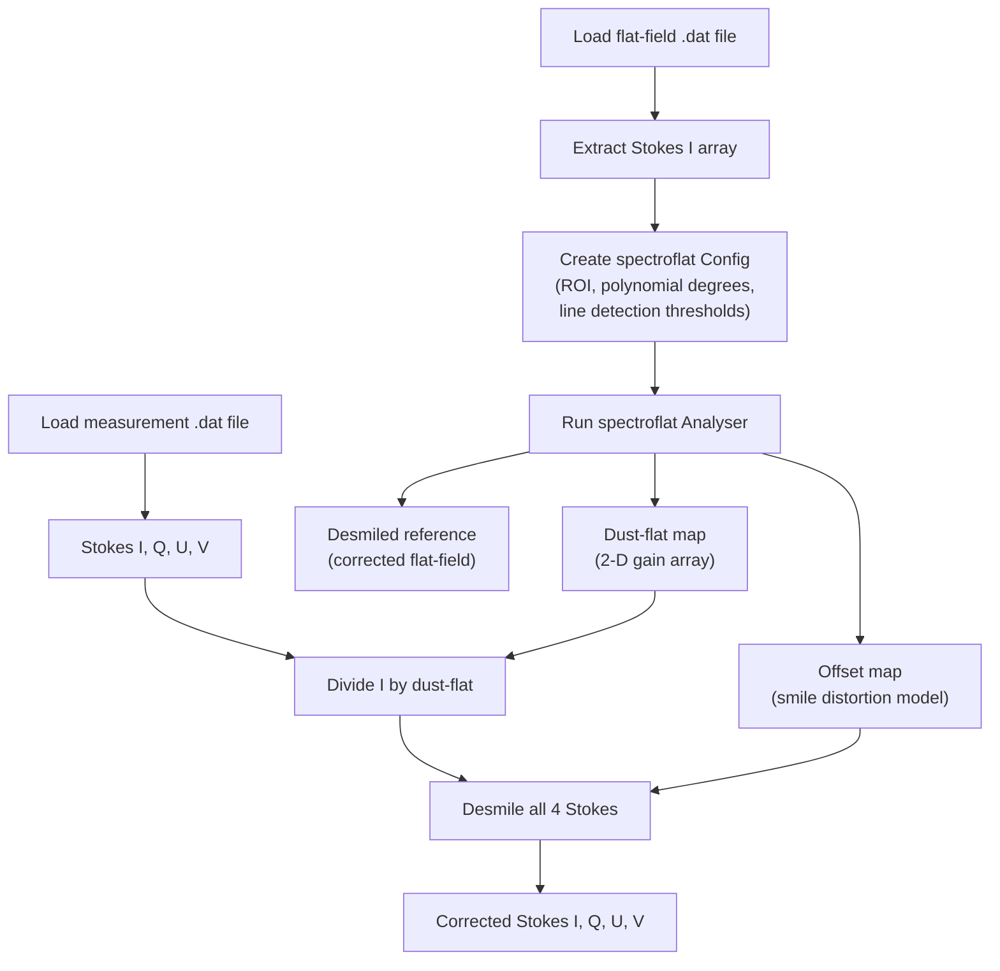

# Flat-Field Correction

Flat-field correction removes instrumental signatures from spectropolarimetric observations. The pipeline performs two complementary corrections in sequence: **dust-flat correction** (pixel-level gain normalization) and **smile correction** (removal of spectral-line curvature caused by optical distortion).

Both operations are powered by the [spectroflat](https://github.com/irsol-locarno/spectroflat) library.

## Purpose

- Remove spatial variations in detector sensitivity (dust, pixel defects).
- Straighten curved spectral lines caused by spectrograph smile distortion.
- Produce a clean baseline for wavelength auto-calibration and scientific analysis.

## Processing Flow



## Step 1 — Flat-Field Analysis

**Module:** `core.correction.analyzer`

The `analyze_flatfield()` function takes a raw flat-field Stokes I array and produces three outputs:

| Output | Type | Description |
|--------|------|-------------|
| `dust_flat` | `np.ndarray` | 2-D pixel-gain map (spatial × spectral) |
| `offset_map` | `spectroflat.OffsetMap` | Per-row sub-pixel wavelength shift model |
| `desmiled` | `np.ndarray` | The flat-field after smile correction |


### Algorithm

1. A region of interest (ROI) is defined by excluding a 1-pixel border from the flat-field image.
2. The `spectroflat.Analyser` runs for 2 iterations:
   - **Sensor-flat fitting** — fits a degree-13 polynomial along the spatial axis, producing a 2-D gain correction map (`dust_flat`).
   - **Smile detection** — identifies spectral lines with a configurable prominence threshold, fits a degree-3 polynomial to the line curvature, and produces an `OffsetMap` describing per-row sub-pixel shifts.
3. The flat-field itself is desmiled to produce a reference image.

## Step 2 — Applying the Correction

**Module:** `core.correction.corrector`

The `apply_correction()` function takes the original measurement Stokes parameters together with the pre-computed `dust_flat` and `offset_map`:

### Dust-flat Correction

```python
I_corrected = I / dust_flat
```

Only Stokes I is divided by the dust-flat because the polarimetric ratios (Q/I, U/I, V/I) cancel the gain.

### Smile Correction

All four Stokes parameters (I, Q, U, V) are independently corrected using the `spectroflat.SmileInterpolator`:

```python
interpolator = SmileInterpolator(offset_map, data, mod_state=0)
interpolator.run()
corrected = interpolator.result
```

The interpolator shifts each row by the sub-pixel offsets from the `OffsetMap`, using spline interpolation to preserve spectral resolution.

## Caching

Flat-field analysis is computationally expensive. The pipeline caches results:

- **In-memory** — the `FlatFieldCache` (in `pipeline.flatfield_cache`) groups corrections by wavelength and retrieves the temporally closest one for each measurement.
- **On-disk** — corrections are persisted as FITS files (`*_flat_field_correction_data.fits`) in the `processed/_cache/` directory and reloaded on subsequent runs.

## Inputs / Outputs

| | Description | Format |
|---|---|---|
| **Input** | Raw flat-field `.dat` file | ZIMPOL IDL save-file |
| **Input** | Raw measurement `.dat` file | ZIMPOL IDL save-file |
| **Output** | Corrected Stokes parameters | In-memory `StokesParameters` model |
| **Output** | Cached correction data | FITS file (`.fits`) |


## Related Documentation

- [Wavelength Auto-Calibration](wavelength_autocalibration.md) — runs after flat-field correction
- [Pipeline Overview](../pipeline/pipeline_overview.md) — full processing sequence
- [IO Modules](../io/io_modules.md) — flat-field FITS import/export
