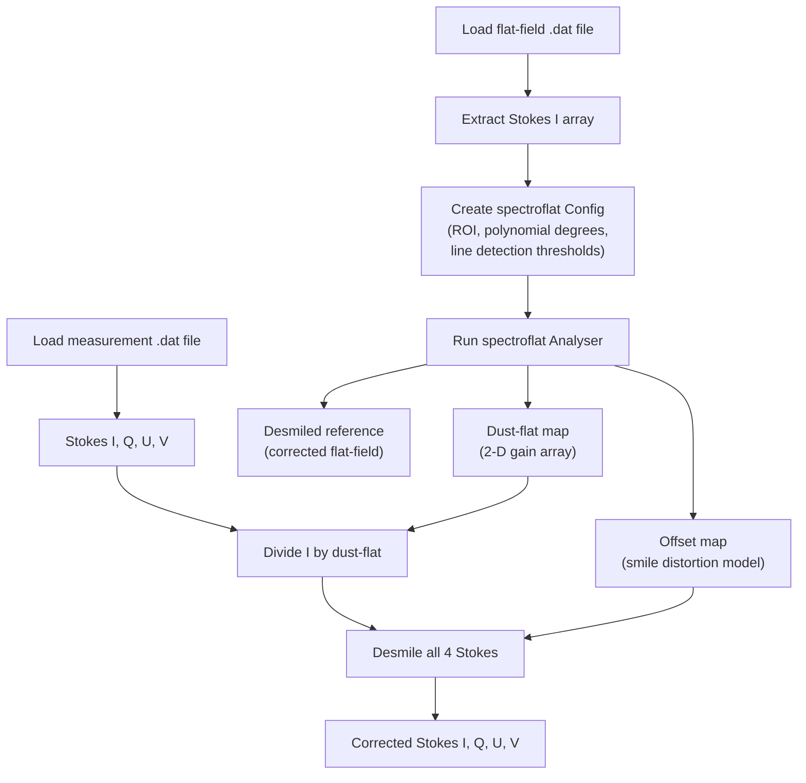
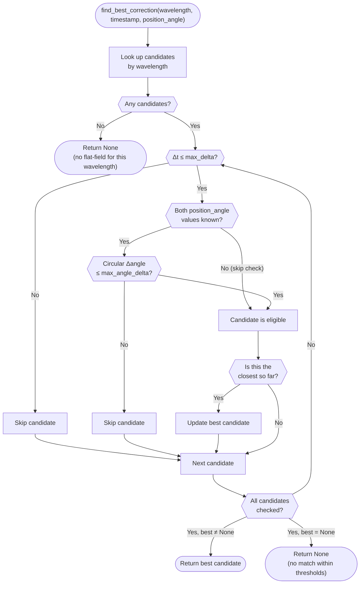

# Flat-Field Correction

Flat-field correction removes instrumental signatures from spectropolarimetric observations. The pipeline performs two complementary corrections in sequence: **dust-flat correction** (pixel-level gain normalization) and **smile correction** (removal of spectral-line curvature caused by optical distortion).

Both operations are powered by the [spectroflat](https://github.com/irsol-locarno/spectroflat) library.

## Purpose

- Remove spatial variations in detector sensitivity (dust, pixel defects).
- Straighten curved spectral lines caused by spectrograph smile distortion.
- Produce a clean baseline for wavelength auto-calibration and scientific analysis.

## Processing Flow



## Step 1 — Flat-Field Analysis

**Module:** `core.correction.analyzer`

The `analyze_flatfield()` function takes a raw flat-field Stokes I array and produces three outputs:

| Output | Type | Description |
|--------|------|-------------|
| `dust_flat` | `np.ndarray` | 2-D pixel-gain map (spatial × spectral) |
| `offset_map` | `spectroflat.OffsetMap` | Per-row sub-pixel wavelength shift model |
| `desmiled` | `np.ndarray` | The flat-field after smile correction |


### Algorithm

1. A region of interest (ROI) is defined by excluding a 1-pixel border from the flat-field image.
2. The `spectroflat.Analyser` runs for 2 iterations:
   - **Sensor-flat fitting** — fits a degree-13 polynomial along the spatial axis, producing a 2-D gain correction map (`dust_flat`).
   - **Smile detection** — identifies spectral lines with a configurable prominence threshold, fits a degree-3 polynomial to the line curvature, and produces an `OffsetMap` describing per-row sub-pixel shifts.
3. The flat-field itself is desmiled to produce a reference image.

## Step 2 — Applying the Correction

**Module:** `core.correction.corrector`

The `apply_correction()` function takes the original measurement Stokes parameters together with the pre-computed `dust_flat` and `offset_map`:

### Dust-flat Correction

```python
I_corrected = I / dust_flat
```

Only Stokes I is divided by the dust-flat because the polarimetric ratios (Q/I, U/I, V/I) cancel the gain.

### Smile Correction

All four Stokes parameters (I, Q, U, V) are independently corrected using the `spectroflat.SmileInterpolator`:

```python
interpolator = SmileInterpolator(offset_map, data, mod_state=0)
desmiled = interpolator.run()
corrected = desmiled.result
```

The interpolator shifts each row by the sub-pixel offsets from the `OffsetMap`, using spline interpolation to preserve spectral resolution.

## Caching

Flat-field analysis is computationally expensive. The pipeline caches results:

- **In-memory** — the `FlatFieldCache` (in `pipeline.flatfield_cache`) groups corrections by wavelength and retrieves the best match for each measurement using the association policy described below.
- **On-disk** — corrections are persisted as FITS files (`*_flat_field_correction_data.fits`) in the `processed/_cache/` directory and reloaded on subsequent runs.

## Flat-Field Association Policy

When the pipeline needs to associate a flat-field correction with a measurement it applies **three independent filters** in order.  All three conditions must be satisfied for a candidate to be eligible:

| # | Filter | Default threshold | Behaviour when unknown |
|---|--------|-------------------|------------------------|
| 1 | **Wavelength match** | Exact integer match (Å) | Always required |
| 2 | **Time-delta policy** | ≤ 2 hours (`DEFAULT_MAX_DELTA`) | Always required |
| 3 | **Angle policy** | ≤ 5° (`DEFAULT_MAX_ANGLE_DELTA`) | Skipped if either angle is `None` |

Among all eligible candidates the **temporally closest** one is chosen.

The `position_angle` used for filter 3 is `measurement.derotator.position_angle` (the derotator position angle recorded in the ZIMPOL `.dat` metadata).  The angular distance is computed as the **shortest arc** on the circle, so 358° and 2° are considered 4° apart.

Both thresholds are configurable constants in `irsol_data_pipeline.core.config`:

```python
# core/config.py
DEFAULT_MAX_DELTA: datetime.timedelta = datetime.timedelta(hours=2)
DEFAULT_MAX_ANGLE_DELTA: float = 5.0  # degrees
```

### Association Flow



> **Note:** When the flat-field or measurement was recorded without a derotator position angle (`position_angle = None`), the angle filter is **skipped gracefully** and only the wavelength and time-delta constraints are enforced.  This preserves backward compatibility with older data files that lack this metadata.

## Inputs / Outputs

### Inputs

| | Description | Format |
|---|---|---|
| **Input** | Raw flat-field `.dat` file | ZIMPOL IDL save-file |
| **Input** | Raw measurement `.dat` file | ZIMPOL IDL save-file |

### Pipeline outputs — successful run

| Artefact | File suffix | Description |
|----------|-------------|-------------|
| Corrected Stokes data | `_corrected.fits` | Flat-field and smile corrected Stokes I, Q/I, U/I, V/I with `FFCORR=True` |
| Processing metadata | `_metadata.json` | Provenance record: flat-field used, timestamps, wavelength calibration result |
| Original Stokes profile plot | `_profile_original.png` | Quick-look plot of the raw Stokes profiles (before correction) |
| Corrected Stokes profile plot | `_profile_corrected.png` | Quick-look plot after all corrections |
| Flat-field correction cache | `_cache/flat-field-cache/*_correction_cache.fits` | Serialised spectroflat result; reused on subsequent runs |

### Pipeline outputs — failed run

| Artefact | File suffix | Description |
|----------|-------------|-------------|
| Error metadata | `_error.json` | Error description and pipeline version |
| Original Stokes profile plot | `_profile_original.png` | Best-effort quick-look plot from uncorrected Stokes data |

When `convert_on_ff_failure=True` is set, two additional artefacts are produced:

| Artefact | File suffix | Description |
|----------|-------------|-------------|
| Converted FITS | `_converted.fits` | Raw (uncorrected) Stokes data with `FFCORR=False` header |
| Converted profile plot | `_profile_converted.png` | Quick-look plot generated alongside `_converted.fits` |

See [Output Artefacts](../io/output_artefacts.md) for full file format details and the [Pipeline Overview](../pipeline/pipeline_overview.md) for the end-to-end processing sequence.


## Related Documentation

- [Wavelength Auto-Calibration](wavelength_autocalibration.md) — runs after flat-field correction
- [Pipeline Overview](../pipeline/pipeline_overview.md) — full processing sequence
- [IO Modules](../io/io_modules.md) — flat-field FITS import/export
