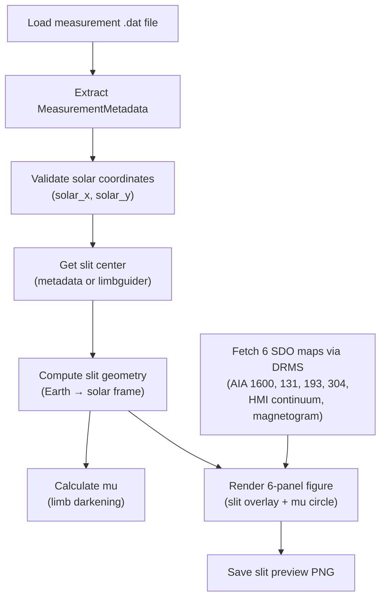

# Slit Image Creation

Slit image creation generates six-panel contextual preview images showing the spectrograph slit position overlaid on SDO/AIA and SDO/HMI solar images. These previews help researchers visualize exactly where on the solar disc each measurement was taken.

**Modules:** `core.slit_images.*`, `pipeline.slit_images_processor`, `plotting.slit`

## Purpose

- Compute the spectrograph slit geometry in the solar reference frame.
- Fetch contemporaneous SDO context images (UV, EUV, continuum, magnetogram).
- Render a publication-quality 6-panel figure showing the slit on each data product.
- Provide the **mu** value (cos θ, limb-darkening parameter) for the observation.

## Processing Flow



## Step 1 — Slit Geometry Computation

**Module:** `core.slit_images.coordinates`

The `compute_slit_geometry()` function transforms instrument coordinates into the solar reference frame:

1. **Image center** — obtained from `solar_disc_coordinates` in the measurement metadata, or optionally from the limbguider via the Z3BD raw file header.
2. **Offset corrections** — manual (x, y) offsets in arcseconds can be applied.
3. **Coordinate system** — determined from the derotator setting (equatorial or heliographic).
4. **Solar rotation** — the Earth-frame center is rotated to the solar frame using the solar P₀ angle:
   ```
   R = [[cos(P₀), −sin(P₀)],
        [sin(P₀),  cos(P₀)]]
   center_solar = R · center_earth
   ```
5. **Slit endpoints** — computed using the telescope's slit radius:
   ```
   x_start = center_x − radius · cos(angle)
   x_end   = center_x + radius · cos(angle)
   y_start = center_y − radius · sin(angle)
   y_end   = center_y + radius · sin(angle)
   ```

The result is a `SlitGeometry` dataclass containing slit center, endpoints, angle, mu value, observation times, and telescope metadata.

### Telescope Specifications

| Telescope | Slit Radius (arcsec) | Slit Width |
|-----------|---------------------|------------|
| IRSOL (Gregory) | 91 | 7.9 × wavelength (µm) |
| GREGOR | 22 | 0.25 arcsec (constant) |

### Mu Calculation

The `compute_mu()` function calculates the limb-darkening parameter:

1. Gets the solar angular radius at the observation time.
2. Computes the distance from disc center: `d = √(x² + y²)`.
3. Returns `mu = cos(arcsin(d / R_sun))`.
   - Positive values indicate on-disc observations.
   - Negative values indicate off-limb observations.

## Step 2 — SDO Data Retrieval

**Module:** `core.slit_images.solar_data`

The `fetch_sdo_maps()` function retrieves six context images from the JSOC DRMS service:

| Product | Wavelength | Type |
|---------|-----------|------|
| AIA 1600 Å | 1600 | UV |
| AIA 131 Å | 131 | EUV |
| AIA 193 Å | 193 | EUV |
| AIA 304 Å | 304 | EUV |
| HMI Continuum | 6173 | Visible |
| HMI Magnetogram | 6173 | Magnetic |

### Retrieval Process

1. Compute the observation midpoint time.
2. Build a padded time range (±5 minutes).
3. Query DRMS for each data product with up to 3 retries.
4. Find the record closest in time (filtering out records with > 5000 missing pixels).
5. Download the FITS file (with optional caching in `_sdo_cache/`).
6. Construct a SunPy `Map` from the FITS data and DRMS metadata.
7. Apply HMI-specific corrections (CDELT sign flip, 180° rotation).

### Caching

Downloaded SDO FITS files are cached in the `processed/_sdo_cache/` directory per observation day, avoiding redundant downloads across measurements.

## Step 3 — Rendering

**Module:** `plotting.slit`

The `plot()` function renders a 2×3 panel matplotlib figure:

- Each panel shows one SDO data product with appropriate color normalization.
- The spectrograph slit is drawn as a colored line.
- A **+Q** direction indicator shows the polarization reference.
- An optional **mu iso-contour** circle shows the limb distance.
- The solar limb is drawn for reference.
- Figure title includes observation name, measurement name, time range, and mu value.

## Inputs / Outputs

| | Description | Format |
|---|---|---|
| **Input** | Measurement `.dat` file (for metadata) | ZIMPOL IDL save-file |
| **Input** | JSOC email (for DRMS queries) | String |
| **Output** | Slit preview image | PNG file (`*_slit_preview.png`) |
| **Output** | Error metadata (on failure) | JSON file (`*_slit_preview_error.json`) |

## Dependencies

| Dependency | Role |
|-----------|------|
| `astropy` | Coordinates, units, FITS I/O |
| `sunpy` | Solar coordinate transforms, P₀ angle, Map objects |
| `drms` | JSOC Data Record Management System client |
| `requests` | HTTP downloads of SDO FITS files |
| `matplotlib` | Figure rendering |
| `numpy` | Array operations |

## Related Documentation

- [Pipeline Overview](../pipeline/pipeline_overview.md) — slit image generation in the full pipeline
- [Prefect Integration](../pipeline/prefect_integration.md) — scheduling of slit image flows
- [IO Modules](../io/io_modules.md) — metadata import/export
