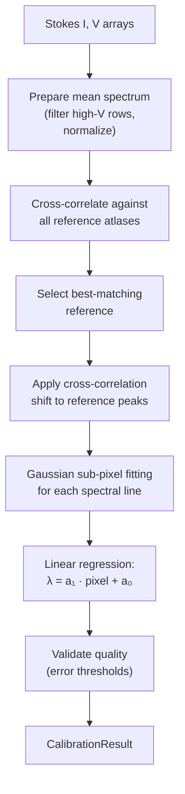

# Wavelength Auto-Calibration

Wavelength auto-calibration establishes a mapping from detector pixel position to absolute wavelength (in Ångströms). The algorithm cross-correlates the observed spectrum against bundled reference atlases and refines individual line positions with Gaussian sub-pixel fitting.

**Module:** `core.calibration.autocalibrate`

## Purpose

- Convert the pixel axis of a spectrogram into an absolute wavelength axis.
- Provide a linear calibration model: **λ = a₁ · pixel + a₀**.
- Estimate calibration uncertainties (1-σ errors on a₀ and a₁).
- Identify which reference atlas best matches the observation.

## Processing Flow



## Algorithm Details

### 1. Prepare Mean Spectrum

The function `_prepare_mean_spectrum(si, sv)` creates a clean 1-D spectrum for correlation:

1. **Normalize Stokes V intensity per row:**
   ```
   v_intensity[row] = (Σ|V[row]| - min) / (max - min)
   ```
2. **Exclude contaminated rows** where `|0.5 − v_intensity| ≥ V_STOKES_CUTOFF` (default 0.4). This removes rows dominated by strong magnetic signals.
3. **Average** the remaining rows to produce a 1-D mean spectrum.
4. **Normalize** by dividing by the maximum value.

### 2. Find Best Reference

The function `_find_refdata(simean, refdata_dir)` selects the reference atlas:

1. Loads all `.npy` files from the reference data directory (`core/calibration/refdata/`).
2. For each reference file, computes the cross-correlation with the mean spectrum.
3. Scores each correlation by:
   ```
   score = max_correlation × length_factor × distance_factor
   ```
   - **length_factor** penalizes references much longer/shorter than the spectrum.
   - **distance_factor** penalizes large alignment shifts.
4. Returns the reference with the highest score, along with its known spectral line positions and wavelengths.

### 3. Wavelength Calibration Fit

The function `_wavelength_calibration(...)` establishes the pixel-to-wavelength mapping:

1. **Shift** the reference peak positions by the cross-correlation offset.
2. **Refine** each peak using `_fit_line_position()`:
   - Extracts a ±12-pixel window around each expected line.
   - Fits a Gaussian model: `A · exp(−(x−b)² / (2c²)) + 1`
   - Strategy: fit the 7 central points first; if the result deviates more than 2 pixels, retry with the full window.
   - Falls back to the discrete minimum if fitting fails.
3. **Linear regression** via `scipy.optimize.curve_fit`:
   ```
   λ = a₁ · pixel + a₀
   ```
4. **Validation**: the fit is accepted if a₀ error < 5 pixels and a₁ error < 0.1 pixels; otherwise a warning is logged.

### 4. Result

The calibration produces a `CalibrationResult` model:

| Field | Type | Description |
|-------|------|-------------|
| `pixel_scale` (a₁) | `float` | Ångströms per pixel |
| `wavelength_offset` (a₀) | `float` | Wavelength at pixel 0 |
| `pixel_scale_error` | `float` | 1-σ error on a₁ |
| `wavelength_offset_error` | `float` | 1-σ error on a₀ |
| `reference_file` | `str` | Name of the best-matching atlas |
| `peak_pixels` | `np.ndarray` | Fitted peak positions (pixels) |
| `reference_lines` | `np.ndarray` | Wavelengths of reference lines (Å) |

The model provides convenience methods:

```python
result.pixel_to_wavelength(500)   # → wavelength at pixel 500
result.wavelength_to_pixel(6302)  # → pixel position of 6302 Å
```

## Inputs / Outputs

| | Description | Format |
|---|---|---|
| **Input** | Corrected Stokes parameters (I, V) | `StokesParameters` model (2-D arrays) |
| **Input** | Reference data directory | Path to `.npy` atlas files |
| **Output** | Calibration result | `CalibrationResult` Pydantic model |

## Reference Data

Reference spectral atlases are bundled in `core/calibration/refdata/` as NumPy `.npy` files. Each file contains a dictionary with:

- **Spectrum** — normalized 1-D reference spectrum.
- **Peak positions** — pixel locations of known spectral lines in the reference.
- **Line wavelengths** — absolute wavelengths (Å) of the spectral lines.
- **Calibration parameters** — the reference's own a₀ and a₁ values.

## Dependencies

| Dependency | Role |
|-----------|------|
| `numpy` | Array operations and cross-correlation |
| `scipy` | Gaussian curve fitting (`curve_fit`) |

## Related Documentation

- [Flat-Field Correction](flat_field_correction.md) — runs before calibration
- [Pipeline Overview](../pipeline/pipeline_overview.md) — calibration in the full pipeline context
