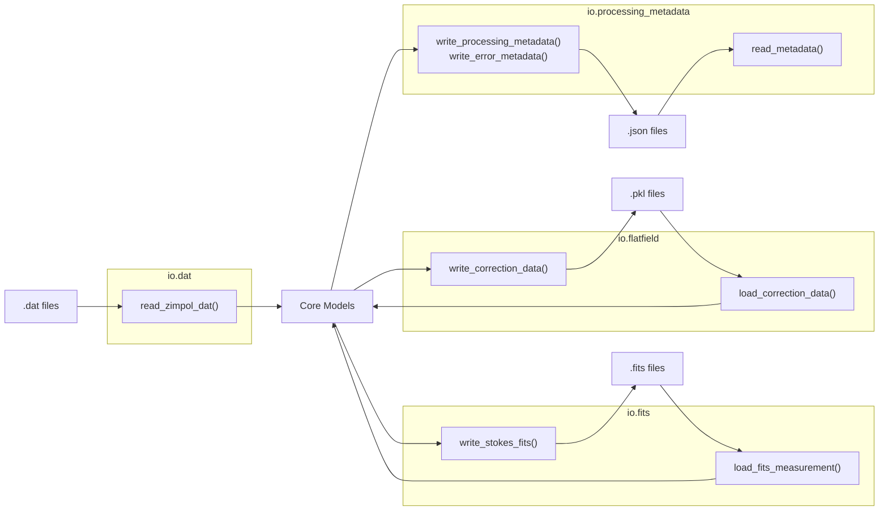

# IO Modules

The `io/` package handles all data loading and saving, providing a clean abstraction layer between the pipeline logic and the various file formats used by the IRSOL data pipeline.

## Supported Formats

| Format | Module | Read | Write | Description |
|--------|--------|------|-------|-------------|
| ZIMPOL `.dat` / `.sav` | `io.dat` | ✅ | — | Raw IDL save-files from the ZIMPOL instrument |
| Multi-extension FITS | `io.fits` | ✅ | ✅ | Corrected Stokes data with WCS and metadata |
| Flat-field pickle | `io.flatfield` | ✅ | ✅ | Cached `FlatFieldCorrection` objects |
| JSON metadata | `io.processing_metadata` | ✅ | ✅ | Processing metadata and error records |

## Module Overview



## DAT Importer

**Module:** `io.dat.importer`

```python
def read_zimpol_dat(file_path: Path | str) -> tuple[StokesParameters, np.ndarray]:
```

Reads ZIMPOL `.dat` or `.sav` files using `scipy.io.readsav()`:

- Extracts the four Stokes parameters (I, Q, U, V) from the IDL save structure.
- Returns the raw info metadata array (Nx2 byte array used to construct `MeasurementMetadata`).
- Handles 3-D → 2-D averaging for Stokes I and V when no TCU averaging was performed.
- Raises `DatImportError` on unsupported formats or read failures.

## FITS Importer

**Module:** `io.fits.importer`

```python
def load_fits_measurement(fits_path: Path) -> ImportedFitsMeasurement:
```

Reads corrected multi-extension FITS files produced by the pipeline:

- Loads Stokes I, Q, U, V from named HDU extensions (by `EXTNAME`) with fallback to positional indices.
- Extracts wavelength calibration from FITS header keywords (`WAVECAL`, `CRVAL3`, `CDELT3`).
- Transposes data from `(wavelength, spatial)` to `(spatial, spectral)` for consistency.
- Returns an `ImportedFitsMeasurement` frozen model with Stokes data, calibration, and header fields.
- Raises `FitsImportError` on read failures.

## FITS Exporter

**Module:** `io.fits.exporter`

```python
def write_stokes_fits(
    output_path: Path,
    stokes: StokesParameters,
    info: MeasurementMetadata,
    calibration: CalibrationResult | None = None,
) -> Path:
```

Writes corrected Stokes data as a multi-extension FITS file:

- **5-HDU structure:** Primary (metadata only) + I, Q/I, U/I, V/I image extensions.
- **SOLARNET compliance:** includes standardized header keywords.
- **WCS support:** helioprojective-Cartesian coordinates (HPLN, HPLT, AWAV axes).
- **Metadata:** telescope location, solar disc coordinates, P₀ angle, Carrington rotation.
- **Wavelength calibration:** `CDELT3`, `CRVAL3`, `CRDER3`, `CSYER3` keywords when calibration is provided.
- **Data statistics:** min, max, median, and percentile values per extension.
- **Integrity:** `CHECKSUM` for data verification.
- Raises `FitsExportError` on write failures.

### FITS HDU Layout

| Extension | Name | Content |
|-----------|------|---------|
| 0 | Primary | Metadata header (no data) |
| 1 | `STOKES_I` | Stokes I intensity |
| 2 | `STOKES_QI` | Stokes Q / I ratio |
| 3 | `STOKES_UI` | Stokes U / I ratio |
| 4 | `STOKES_VI` | Stokes V / I ratio |

## Flat-Field Importer / Exporter

**Module:** `io.flatfield.importer` / `io.flatfield.exporter`

```python
def load_correction_data(path: Path) -> FlatFieldCorrection:
def write_correction_data(output_path: Path | str, data: FlatFieldCorrection) -> Path:
```

Persists `FlatFieldCorrection` objects (containing the dust-flat array, offset map, and desmiled data) as Python pickle files:

- Uses `pickle.HIGHEST_PROTOCOL` for write performance.
- Creates parent directories automatically.
- Validates the unpickled type on load; raises `FlatfieldCorrectionImportError` on type mismatch or corruption.

## Processing Metadata

**Module:** `io.processing_metadata.importer` / `io.processing_metadata.exporter`

```python
def write_processing_metadata(
    output_path: Path,
    source_file: str,
    flat_field_used: str,
    flat_field_timestamp: datetime.datetime,
    measurement_timestamp: datetime.datetime,
    flat_field_time_delta_seconds: float,
    calibration_info: dict[str, Any],
    extra: dict[str, Any] | None = None,
) -> Path:

def write_error_metadata(
    output_path: Path,
    source_file: str,
    error: str,
) -> Path:

def read_metadata(path: Path) -> dict[str, Any]:
```

### Processing Metadata JSON

Written after successful measurement processing. Contains:

- Source file name and flat-field file used.
- Timestamps and time delta between measurement and flat-field.
- Wavelength calibration parameters (a₀, a₁, errors, reference file).
- Pipeline version and processing timestamp.

### Error Metadata JSON

Written when processing fails. Contains:

- Source file name.
- Error message.
- Pipeline version and timestamp.

## Error Handling

Each IO module raises its own domain-specific exception:

| Module | Exception |
|--------|-----------|
| `io.dat` | `DatImportError` |
| `io.fits` (read) | `FitsImportError` |
| `io.fits` (write) | `FitsExportError` |
| `io.flatfield` | `FlatfieldCorrectionImportError` |

All exceptions inherit from `IrsolDataPipelineException` and carry contextual information for debugging.

## Related Documentation

- [Flat-Field Correction](../core/flat_field_correction.md) — uses flat-field import/export
- [Pipeline Overview](../pipeline/pipeline_overview.md) — IO modules in the processing chain
- [Architecture](../overview/architecture.md) — IO layer in the architecture
