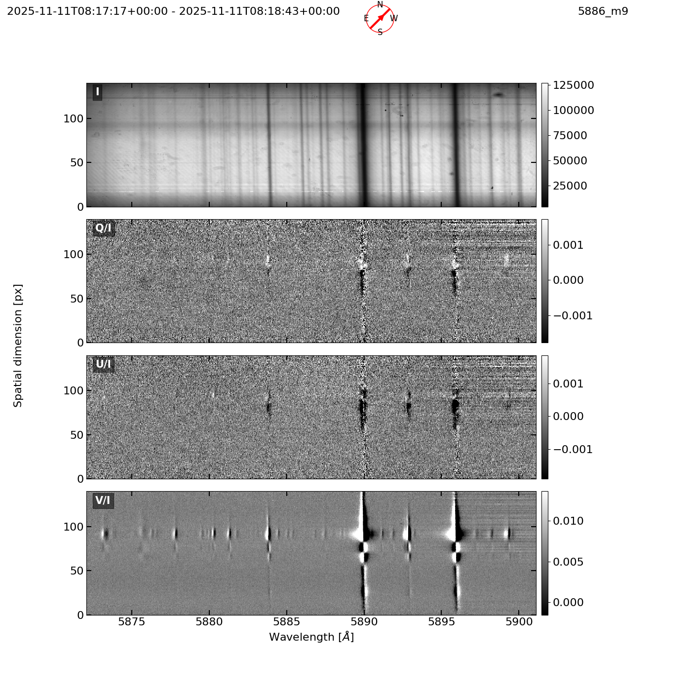
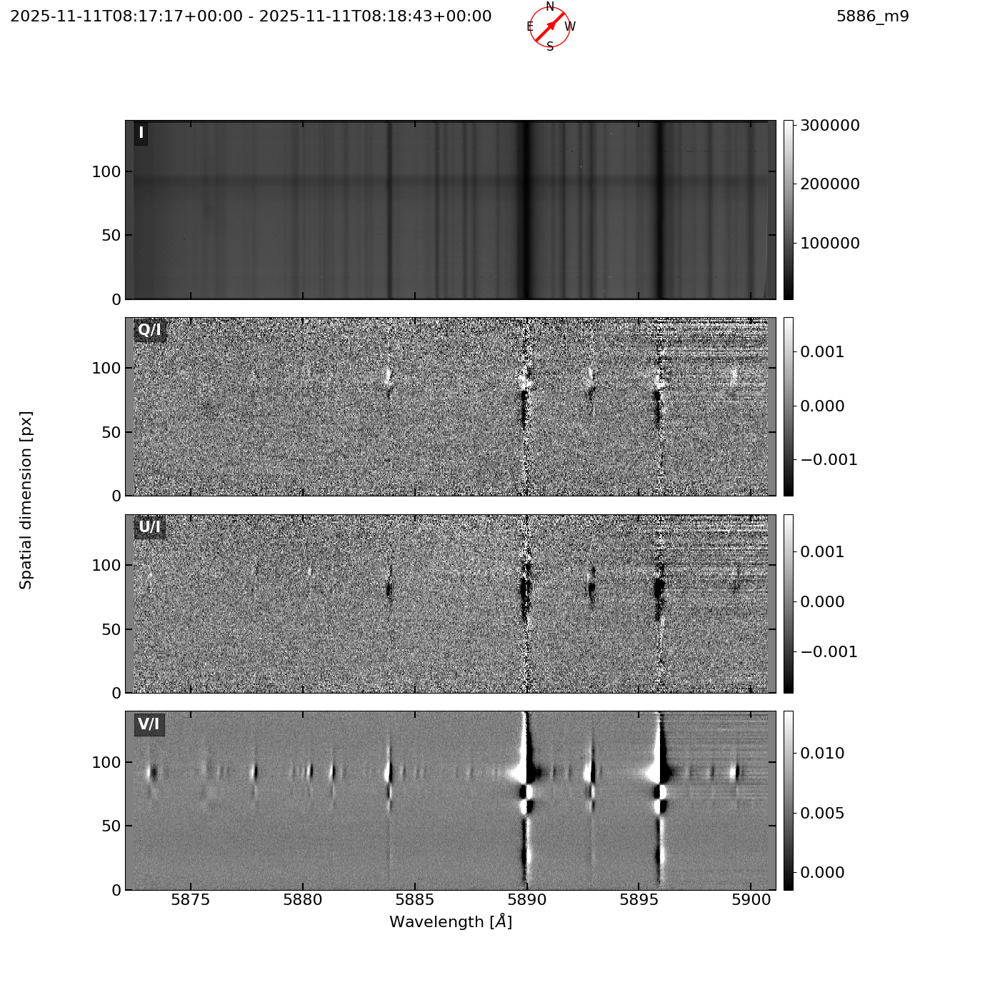
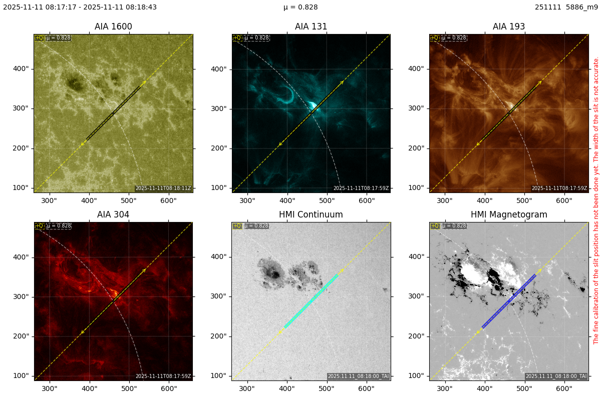

# Output Artefacts

The IRSOL Data Pipeline produces several distinct artefact types for each processed observation measurement. This document describes the structure, naming conventions, and content of every output the pipeline generates.

## Overview

### Flat-field correction pipeline — successful run

When flat-field correction succeeds, four artefacts are produced per measurement:

| Artefact | File suffix | Format | Description |
|----------|-------------|--------|-------------|
| [Corrected FITS](#corrected-fits-file) | `_corrected.fits` | FITS | Calibrated Stokes I, Q/I, U/I, V/I spectropolarimetric data with full WCS and SOLARNET-compliant metadata |
| [Processing metadata](#processing-metadata-json) | `_metadata.json` | JSON | Pipeline provenance record (flat-field used, wavelength calibration, timestamps, version) |
| [Original Stokes profile plot](#stokes-profile-plots-png) | `_profile_original.png` | PNG | Four-panel Stokes profile before flat-field correction |
| [Corrected Stokes profile plot](#stokes-profile-plots-png) | `_profile_corrected.png` | PNG | Four-panel Stokes profile after all corrections |

### Flat-field correction pipeline — failed run

When flat-field correction fails, the pipeline always writes an error record and attempts to generate a profile plot from the raw (uncorrected) Stokes data:

| Artefact | File suffix | Format | Description |
|----------|-------------|--------|-------------|
| [Error metadata](#error-metadata-json) | `_error.json` | JSON | Error description and pipeline version |
| [Original Stokes profile plot](#stokes-profile-plots-png) | `_profile_original.png` | PNG | Four-panel Stokes profile from uncorrected data (best-effort) |

When the `convert_on_ff_failure` option is enabled, two additional artefacts are produced:

| Artefact | File suffix | Format | Description |
|----------|-------------|--------|-------------|
| [Converted FITS](#converted-fits-file) | `_converted.fits` | FITS | Raw (uncorrected) Stokes data with `FFCORR=False` header |
| [Converted profile plot](#stokes-profile-plots-png) | `_profile_converted.png` | PNG | Four-panel Stokes profile plot generated alongside `_converted.fits` |

### Slit image pipeline

The slit image pipeline independently generates one additional artefact per measurement:

| Artefact | File suffix | Format | Description |
|----------|-------------|--------|-------------|
| [Slit preview image](#slit-preview-image-png) | `_slit_preview.png` | PNG | Six-panel SDO context image showing the spectrograph slit on the solar disc |

### Summary by scenario

| Scenario | Artefacts produced |
|----------|--------------------|
| Correction **succeeded** | `_corrected.fits`, `_metadata.json`, `_profile_original.png`, `_profile_corrected.png` |
| Correction **failed** | `_error.json`, `_profile_original.png` *(best-effort)* |
| Correction **failed** + `convert_on_ff_failure=True` | `_error.json`, `_profile_original.png` *(best-effort)*, `_converted.fits`, `_profile_converted.png` |

### Naming Convention

All output files share the same stem as the source `.dat` file.

**Successful run:**

```
processed/
├── 6302_m1_corrected.fits                           # Flat-field corrected Stokes data (FFCORR=True)
├── 6302_m1_flat_field_correction_data.fits          # Spectroflat correction data used for the flat-field correction
├── 6302_m1_flat_field_correction_data_offset_map.fits  # Offset map used for the smile correction
├── 6302_m1_metadata.json                            # Provenance record (timestamps, flat-field used, calibration result)
├── 6302_m1_profile_original.png                     # Quick-look plot of the original Stokes profiles (before correction)
├── 6302_m1_profile_corrected.png                    # Quick-look plot of the corrected Stokes profiles (after correction)
├── 6302_m1_slit_preview.png                         # Slit preview showing the slit position on the solar disc
└── _cache/
    └── flat-field-cache/
        ├── ff6302_m1_correction_cache.fits          # Cached spectroflat correction data for a flat-field file
        └── ff6302_m1_correction_cache_offset_map.fits  # Cached offset map for a flat-field file
```

**Failed run (flat-field correction failed):**

```
processed/
├── 6302_m1_error.json          # Error description and pipeline version
└── 6302_m1_profile_original.png  # Quick-look plot from uncorrected Stokes data (best-effort)
```

**Failed run with `convert_on_ff_failure=True`:**

```
processed/
├── 6302_m1_error.json             # Error description and pipeline version
├── 6302_m1_profile_original.png   # Quick-look plot from uncorrected Stokes data (best-effort)
├── 6302_m1_converted.fits         # Raw Stokes data without flat-field correction (FFCORR=False)
└── 6302_m1_profile_converted.png  # Quick-look plot generated alongside _converted.fits
```


## Corrected FITS File

File: `<stem>_corrected.fits`

The corrected FITS file is the primary scientific output of the pipeline. It is a file that carries all four Stokes parameters together with their World Coordinate System (WCS) mapping and a rich set of observatory, instrument, and provenance metadata.

The file conforms to the SOLARNET FITS standard.

### HDU Layout

| Extension index | `EXTNAME` | Content |
|----------------|-----------|---------|
| 0 | `PRIMARY` | Metadata header only — **no image data** |
| 1 | `Stokes I` | Stokes I intensity cube |
| 2 | `Stokes Q/I` | Stokes Q/I fractional polarization cube |
| 3 | `Stokes U/I` | Stokes U/I fractional polarization cube |
| 4 | `Stokes V/I` | Stokes V/I fractional polarization cube |

Each image extension stores a three-dimensional array with axes ordered as **(wavelength, spatial, fake-x)**. The third axis has length 1 and exists to allow a full 3-D WCS description (HPLN, HPLT, AWAV). The real data lies in the first two axes:

- **Axis 1 (NAXIS1)** — wavelength dimension (spectral pixels)
- **Axis 2 (NAXIS2)** — spatial dimension along the slit (spatial pixels)
- **Axis 3 (NAXIS3)** — always length 1 (degenerate spatial axis perpendicular to slit)

Every extension (including PRIMARY) carries `FILENAME`, `SWVER`, `SWVERNP`, `SWVERSP`, `SWVERSF`, `SWVERPD`, and `CHECKSUM` keywords. The four image extensions additionally carry `DATASUM`.


### Primary HDU Header

The primary HDU carries no image data. It holds two groups of metadata:

1. **Observatory-level constants** — fixed per observatory, written once.
2. **Extended measurement metadata** — all ZIMPOL instrument settings encoded at observation time.

#### Observatory / File-level Constants

| Keyword | Value | Description |
|---------|-------|-------------|
| `EXTNAME` | `PRIMARY` | HDU name |
| `SOLARNET` | `1` | SOLARNET standard compliance flag |
| `OBJNAME` | `Sun` | Observed object |
| `TIMESYS` | `UTC` | Time system used throughout the file |
| `DATE` | ISO-8601 timestamp | UTC creation date/time of the FITS header |
| `ORIGIN` | `IRSOL, Locarno, Switzerland` | Institution that created the file |
| `WAVEUNIT` | `-10` | `WAVELNTH` unit: `10^WAVEUNIT` m = Ångström |
| `WAVEREF` | `air` | Wavelengths are in air |
| `WL_ATLAS` | *citation string* | Reference atlas for wavelength calibration |
| `PIXSIZEX` | `22.5` | [µm] CCD pixel size in x-direction |
| `PIXSIZEY` | `90` | [µm] CCD pixel size in y-direction |
| `CAMTEMP` | *float* | Camera temperature in °C |
| `SOLAR_P0` | *float* | Sun-Earth position angle P₀ in degrees |
| `FILENAME` | *string* | Suggested output filename |
| `SWVER` | *string* | `irsol_data_pipeline` package version |
| `SWVERNP` | *string* | `numpy` package version |
| `SWVERSP` | *string* | `scipy` package version |
| `SWVERSF` | *string* | `spectroflat` package version |
| `SWVERPD` | *string* | `pydantic` package version |

#### Top-level Measurement Fields

| Keyword | Description |
|---------|-------------|
| `INSTPF` | Post-focus instrument identifier |
| `MODTYPE` | Polarimetric modulator type |
| `SEQLEN` | Total sequence length |
| `SBSEQLN` | Sub-sequence length |
| `SBSEQNM` | Sub-sequence name |
| `STOKVEC` | Stokes vector configuration (e.g. `IQUV`) |
| `IMGLST` | Space-separated list of image counts per exposure group |
| `IMGTYPE` | Image type label |
| `IMGTYPX` | Image type along x-axis |
| `IMGTYPY` | Image type along y-axis |
| `GUIDST` | Guiding system status |
| `PIGINT` | PIG (Pupil Image Guider) intensity level |
| `SOLAR_XY` | Solar disc coordinates of the slit in arcsec (`"X Y"`) |
| `LMGST` | Limb guider status |
| `PLCST` | Polarization compensator status |

#### Camera Sub-model

| Keyword | Description |
|---------|-------------|
| `CAMPOS` | Camera position identifier |

#### Spectrograph Sub-model

| Keyword | Description |
|---------|-------------|
| `SPALPH` | Spectrograph alpha angle (grating incidence angle) |
| `SPGRTWL` | Grating design wavelength |
| `SPORD` | Diffraction order |
| `SPSLIT` | Slit width in mm |

#### Derotator Sub-model

| Keyword | Description |
|---------|-------------|
| `DRCSYS` | Coordinate system (`0` = solar, `1` = equatorial) |
| `DRANGL` | [deg] Derotator position angle |
| `DROFFS` | Derotator offset |

#### TCU (Telescope Control Unit) Sub-model

| Keyword | Description |
|---------|-------------|
| `TCUMODE` | TCU operating mode |
| `TCURTRN` | Retarder wave-plate name |
| `TCURTRP` | Retarder wavelength parameter(s) |
| `TCUPOSN` | TCU retarder positions |

#### Reduction Sub-model

These keywords describe the ZIMPOL software reduction that was applied to the raw frames before the data reached this pipeline.

| Keyword | Description |
|---------|-------------|
| `REDSOFT` | Reduction software name/version |
| `REDSTAT` | Reduction success status (`T`/`F`) |
| `REDFILE` | Reduction input file name |
| `REDNFIL` | Number of files combined during reduction |
| `REDDCFL` | Dark-correction file used |
| `REDDCFT` | Dark current fit method |
| `REDDMOD` | Demodulation matrix identifier |
| `REDROWS` | Order of rows (space-separated integers) |
| `REDMODE` | Reduction mode |
| `REDTCUM` | TCU reduction method |
| `REDPIXR` | Number of pixels replaced during reduction |
| `REDONAM` | Reduction output filename |

#### ZIMPOL Calibration Sub-model

These keywords describe the ZIMPOL-internal calibration (distinct from the wavelength calibration performed by this pipeline).

| Keyword | Description |
|---------|-------------|
| `ZCSOFT` | ZIMPOL calibration software |
| `ZCFILE` | ZIMPOL calibration file |
| `ZCSTAT` | Calibration status (`T`/`F`) |
| `ZCDESC` | Calibration description |

#### Processing Flags and Solar Orientation

| Keyword | Description |
|---------|-------------|
| `FFSTAT` | ZIMPOL internal flat-field reduction status (`T`/`F`) from raw metadata |
| `FFCORR` | Pipeline-applied flat-field correction flag (`T`/`F`) |
| `FFFILE` | Filename of the flat-field used (set only when `FFCORR=True`) |
| `GLBNOISE` | Global noise levels from ZIMPOL reduction |
| `GLBMEAN` | Global mean values from ZIMPOL reduction |
| `SLTANGL` | [deg] Slit angle in the solar reference frame |

#### Custom Processing History (`PROC_NNN`)

The primary HDU may contain an ordered sequence of pipeline-step records stamped via the `extra_header` parameter of `write_stokes_fits`. Keys follow the pattern `PROC_NNN`, where `NNN` is a zero-padded three-digit index (001–999). Each value is a human-readable string describing the step and, optionally, its parameters.

| Keyword pattern | Example value | Description |
|----------------|---------------|-------------|
| `PROC_001` | `flat-field correction` | First recorded processing step |
| `PROC_002` | `smile correction` | Second recorded processing step |
| `PROC_003` | `wavelength calibration: reference_file=ref.npy` | Third step with details |
| … | … | Additional steps in sequential order |

These keys are written only when the caller provides an `extra_header` mapping to `write_stokes_fits`. The recommended way to build this mapping is through the `ProcessingHistory` utility class (see [FITS Exporter](#fits-exporter) in `io_modules.md`).


### Image Extension Headers (Stokes I, Q/I, U/I, V/I)

Each of the four image extensions carries an independent header. The content is identical across all four extensions except for the `EXTNAME`, `BTYPE`, and `BUNIT` keywords, and the per-extension data statistics.

#### Identification and Classification

| Keyword | Example value | Description |
|---------|---------------|-------------|
| `EXTNAME` | `Stokes I` | HDU name (matches Stokes component) |
| `BTYPE` | `phys.polarization.stokes.I` | Unified Content Descriptor (UCD) |
| `BUNIT` | `ADU` / `Fractional pol.` | Data unit (`ADU` for Stokes I; `Fractional pol.` for Q/I, U/I, V/I) |
| `OBS_HDU` | `1` | Marks this HDU as containing observational data |
| `SOLARNET` | `1` | SOLARNET standard compliance flag |
| `OBJNAME` | `Sun` | Observed object |
| `TIMESYS` | `UTC` | Time system |
| `DATE` | ISO-8601 | UTC creation timestamp of this header |
| `ORIGIN` | `IRSOL, Locarno, Switzerland` | Creating institution |
| `FILENAME` | *string* | Suggested output filename |
| `SWVER` | *string* | `irsol_data_pipeline` package version |
| `SWVERNP` | *string* | `numpy` package version |
| `SWVERSP` | *string* | `scipy` package version |
| `SWVERSF` | *string* | `spectroflat` package version |
| `SWVERPD` | *string* | `pydantic` package version |

#### Observation Timing

| Keyword | Description |
|---------|-------------|
| `DATE-OBS` | Start date/time of the observation (FITS format, UTC) |
| `DATE-BEG` | Same as `DATE-OBS` |
| `DATE-END` | End date/time of the observation (may be `None` if not recorded) |

#### Telescope and Instrument

| Keyword | Description |
|---------|-------------|
| `TELESCOP` | Telescope name (e.g. `IRSOL`, `Gregory IRSOL`, or `GREGOR`) |
| `OBSGEO-X` | [m] Observatory geocentric X coordinate (ITRS) |
| `OBSGEO-Y` | [m] Observatory geocentric Y coordinate (ITRS) |
| `OBSGEO-Z` | [m] Observatory geocentric Z coordinate (ITRS) |
| `SLIT_WID` | [arcsec] Slit width on sky (computed from `SPSLIT` mm value) |
| `INSTRUME` | Instrument name (e.g. `ZIMPOL`) |
| `DATATYPE` | Measurement type |
| `POINT_ID` | Unique measurement identifier |
| `OBSERVER` | Observer name |
| `PROJECT` | Observing project name |
| `MEASNAME` | Measurement name / label |

> **Observatory coordinates**
> IRSOL (Locarno): X = 4 372 553.13 m, Y = 676 011.48 m, Z = 4 579 249.18 m.
> GREGOR (Tenerife): X = 5 390 388.83 m, Y = −1 597 803.42 m, Z = 3 007 217.82 m.

#### Exposure Information

| Keyword | Description |
|---------|-------------|
| `NSUMEXP` | Total number of summed exposures (sum of `IMGLST` values) |
| `TEXPOSUR` | [s] Single exposure time |
| `XPOSURE` | [s] Total effective exposure time (`TEXPOSUR × NSUMEXP`) |
| `CAMERA` | Camera identity string |
| `CCD` | CCD sensor identity string |
| `WAVELNTH` | [Å] Guideline/target wavelength of the observation |

#### Data Statistics

The following statistics are computed independently for each image extension over the full 3-D data array.

| Keyword | Description |
|---------|-------------|
| `DATAMIN` | Minimum data value |
| `DATAMAX` | Maximum data value |
| `DATAMEDN` | Median data value |
| `DATAMEAN` | Mean data value |
| `DATASTD` | Standard deviation of data values |
| `DATAPnn` | *n*th percentile value (nn ∈ {01, 02, 05, 10, 25, 50, 75, 90, 95, 98, 99}) |
| `DATANPnn` | *n*th percentile normalized by `DATAMEAN` (same set of percentiles) |

#### World Coordinate System (WCS)

The WCS maps image pixel coordinates to physical sky and spectral coordinates using the FITS WCS standard.

**Axis mapping**

| FITS axis | `CTYPE` | Physical coordinate | Units |
|-----------|---------|---------------------|-------|
| 1 | `HPLN-TAN` | Helioprojective longitude (along slit / fake axis) | arcsec |
| 2 | `HPLT-TAN` | Helioprojective latitude (slit length direction) | arcsec |
| 3 | `AWAV` | Air wavelength | Å |

**Spatial axis 1 (HPLN — perpendicular to slit / fake)**

| Keyword | Description |
|---------|-------------|
| `CTYPE1` | `HPLN-TAN` |
| `CNAME1` | `spatial` (or `image_type_x` value when Fabry-Pérot mode) |
| `CUNIT1` | `arcsec` |
| `CRPIX1` | Reference pixel (1.0 in standard slit mode) |
| `CDELT1` | [arcsec/pixel] Plate scale in x (`1.0` for IRSOL slit, `0.325` for FP) |
| `CRVAL1` | [arcsec] HPLN of reference pixel (rotated from `SOLAR_XY`) |
| `CRDER1` | [arcsec] Random coordinate error (0.0 in standard slit mode) |
| `CSYER1` | `10.0` [arcsec] Systematic pointing error |
| `CD1_1` | [arcsec/pixel] x-component of slit rotation matrix |
| `CD1_2` | [arcsec/pixel] y-component of slit rotation matrix |

**Spatial axis 2 (HPLT — along slit)**

| Keyword | Description |
|---------|-------------|
| `CTYPE2` | `HPLT-TAN` |
| `CNAME2` | `image_type_y` value (or `spectral` fallback) |
| `CUNIT2` | `arcsec` |
| `CRPIX2` | Reference pixel (centre of slit: `NAXIS2/2 + 1`) |
| `CDELT2` | [arcsec/pixel] Plate scale in y (`1.3` for IRSOL, `1.0` for GREGOR) |
| `CRVAL2` | [arcsec] HPLT of reference pixel (rotated from `SOLAR_XY`) |
| `CRDER2` | `1.5` [arcsec] Random tracking error |
| `CSYER2` | `10.0` [arcsec] Systematic pointing error |
| `CD2_1` | [arcsec/pixel] x-component of slit rotation matrix |
| `CD2_2` | [arcsec/pixel] y-component of slit rotation matrix |

**Spectral axis 3 (AWAV — wavelength)**

| Keyword | Description |
|---------|-------------|
| `CTYPE3` | `AWAV` |
| `CNAME3` | `image_type_x` value (or `spectral` fallback) |
| `CUNIT3` | `angstrom` |
| `CRPIX3` | `1.0` — wavelength at first pixel |
| `CDELT3` | [Å/pixel] Dispersion (wavelength calibration scale `a₁`); `1.0` if uncalibrated |
| `CRVAL3` | [Å] Wavelength at reference pixel (`a₀`); `0.0` if uncalibrated |
| `CRDER3` | [Å] Random error on wavelength scale (`a₁` error) |
| `CSYER3` | [Å] Systematic error on wavelength shift (`a₀` error) |
| `WAVEMIN` | [Å] Minimum wavelength in the data |
| `WAVEMAX` | [Å] Maximum wavelength in the data |
| `WAVECAL` | `1` if wavelength calibration was applied; absent otherwise |
| `SPECSYS` | `TOPOCENT` — spectral reference frame (no Doppler correction) |
| `VELOSYS` | `0.0` [m/s] — reference velocity |

**WCS name**

| Keyword | Value |
|---------|-------|
| `WCSNAME` | `Helioprojective-cartesian` |

#### Polarization Reference Frame

| Keyword | Description |
|---------|-------------|
| `POLCCONV` | `(+HPLT,-HPLN,+HPRZ)` — reference system for Stokes sign convention |
| `POLCANGL` | [deg] Angle between the +Q direction and solar north (`90 + DRANGL + DROFFS`) |

#### Solar Ephemeris and Observer Location

These values are computed at `DATE-OBS` for the IRSOL geodetic position.

| Keyword | Description |
|---------|-------------|
| `RSUN_REF` | `695 700 000` [m] Standard solar radius |
| `DSUN_REF` | `149 597 870 700` [m] Standard Sun-Earth distance (1 AU) |
| `RSUN_OBS` | [arcsec] Apparent angular radius of the Sun at observation time |
| `DSUN_OBS` | [m] Actual Sun-Earth distance at observation time |
| `CRLN_OBS` | [deg] Carrington longitude of observer at observation time |
| `CRLT_OBS` | [deg] Carrington latitude of observer at observation time |


## Converted FITS File

File: `<stem>_converted.fits`

The converted FITS file is produced when flat-field correction fails **and** the `convert_on_ff_failure` option is enabled. It contains the same raw Stokes data as the source `.dat` file, without any flat-field or smile correction applied. The HDU layout and metadata keywords are identical to the corrected FITS file, with the following key differences:

| Aspect | Corrected FITS (`_corrected.fits`) | Converted FITS (`_converted.fits`) |
|--------|-------------------------------------|--------------------------------------|
| Flat-field applied | Yes | **No** |
| `FFCORR` header | `True` | **`False`** |
| `FFFILE` header | Present (flat-field filename) | **Absent** |
| Wavelength calibration | Applied to corrected Stokes | Best-effort on uncorrected Stokes |

The `FFCORR=False` header keyword unambiguously signals to downstream consumers that the Stokes data has **not** been flat-field corrected. Consumers should treat this file as a fallback of last resort.

> The converted FITS is only written when `convert_on_ff_failure=True` is configured (off by default).
> See [Pipeline Overview — non-happy path](../pipeline/pipeline_overview.md#non-happy-path-flat-field-correction-fails).


## Processing Metadata JSON

Written alongside every successfully processed measurement. The file is human-readable JSON, formatted with two-space indentation.

### Success Metadata (`_metadata.json`)

```json
{
  "source_file": "5886_m9.dat",
  "flat_field_used": "ff5886_m2.dat",
  "flat_field_timestamp": "2025-11-11T07:52:57+00:00",
  "measurement_timestamp": "2025-11-11T08:17:17+00:00",
  "flat_field_time_delta_seconds": 1460.0,
  "auto_calibrated_wavelength": {
    "pixel_scale": 0.023440290681415264,
    "wavelength_offset": 5872.073366465534,
    "pixel_scale_error": 0.0001781430804402674,
    "wavelength_offset_error": 0.08670102715766094,
    "reference_file": "ref_data5886_irsol.npy",
    "peak_pixels": "[ 47.77161679 709.42196805 814.30365032 381.03493138 503.5501199\n 245.58662134 174.29116933]",
    "reference_lines": "[5873.18001459 5888.68596778 5891.14280512 5881.2519624  5883.79228705\n 5877.76609452 5876.10777383]"
  },
  "processing_timestamp": "2026-03-27T13:00:01.693623+00:00",
  "pipeline_version": "0.1.19"
}
```

| Field | Type | Description |
|-------|------|-------------|
| `source_file` | string | Source `.dat` filename |
| `flat_field_used` | string | Flat-field `.dat` filename used for correction |
| `flat_field_timestamp` | ISO-8601 | Timestamp of the flat-field observation |
| `measurement_timestamp` | ISO-8601 | Timestamp of the science measurement |
| `flat_field_time_delta_seconds` | float | Time difference between measurement and flat-field (seconds) |
| `auto_calibrated_wavelength` | object | Wavelength calibration result (see below) |
| `processing_timestamp` | ISO-8601 (UTC) | When this pipeline run completed |
| `pipeline_version` | string | `irsol_data_pipeline` package version |

**`auto_calibrated_wavelength` sub-object**

| Field | Description |
|-------|-------------|
| `pixel_scale` | [Å/pixel] Wavelength dispersion (`a₁`) — corresponds to `CDELT3` in FITS |
| `wavelength_offset` | [Å] Wavelength at pixel 0 (`a₀`) — corresponds to `CRVAL3` in FITS |
| `pixel_scale_error` | Uncertainty on `pixel_scale` — corresponds to `CRDER3` |
| `wavelength_offset_error` | Uncertainty on `wavelength_offset` — corresponds to `CSYER3` |
| `reference_file` | Atlas file used for calibration |
| `peak_pixels` | List of pixel positions of identified reference lines |
| `reference_lines` | List of atlas wavelengths [Å] matched to `peak_pixels` |

### Error Metadata (`_error.json`)

Written when processing fails. Replaces the success artefacts (`_corrected.fits`, `_metadata.json`, `_profile_corrected.png`). The `_profile_original.png` is also **always attempted** after the error is recorded — if the raw `.dat` file is readable, a best-effort profile plot from the uncorrected Stokes data will be present alongside the error file.

```json
{
  "source_file": "6302_m1.dat",
  "error": "FlatFieldAssociationNotFoundException: no flat-field within 2h for wavelength 6302.5 at 2025-11-11T08:17:17+00:00 and target angle 42.0",
  "processing_timestamp": "2024-03-15T12:00:00+00:00",
  "pipeline_version": "1.4.0"
}
```

| Field | Type | Description |
|-------|------|-------------|
| `source_file` | string | Source `.dat` filename |
| `error` | string | Human-readable error description |
| `processing_timestamp` | ISO-8601 (UTC) | When the failure was recorded |
| `pipeline_version` | string | `irsol_data_pipeline` package version |


## Stokes Profile Plots (PNG)

Up to three profile plot variants can be produced per measurement depending on the processing outcome:

| File | When produced | Content |
|------|---------------|---------|
| `_profile_original.png` | Always (success **and** failure) | Four-panel Stokes profile from the raw reduced `.dat` data, before any correction |
| `_profile_corrected.png` | Successful runs only | Four-panel Stokes profile after flat-field, smile, and wavelength corrections |
| `_profile_converted.png` | Failed runs with `convert_on_ff_failure=True` | Four-panel Stokes profile generated alongside `_converted.fits` |

Each plot contains four sub-panels: **I**, **Q/I**, **U/I**, **V/I**, rendered as 2-D spectrograms (spatial axis vs. wavelength axis). These files are not intended for machine reading; they serve as quick-look quality control artefacts.

The `_profile_original.png` is produced on **every** run — including failed ones — so that the web-asset compatibility pipeline always has a quick-look image to deploy, even for measurements where flat-field correction could not be applied.

| Original profile | Corrected profile |
|------------------|-------------------|
|  |  |


## Slit Preview Image (PNG)

File: `_slit_preview.png`

A six-panel context image that shows the position of the spectrograph slit on the solar disc, generated from SDO (Solar Dynamics Observatory) data fetched at the time of observation:

| Panel | Content |
|-------|---------|
| SDO/AIA 1600 Å | UV chromospheric context |
| SDO/AIA 1700 Å | UV chromospheric context |
| SDO/AIA 304 Å | EUV He II context |
| SDO/AIA 171 Å | EUV coronal context |
| SDO/HMI Continuum | Photospheric intensity |
| SDO/HMI Magnetogram | Line-of-sight magnetic field |

The spectrograph slit is overlaid as a line on each panel. The image is purely a visual quick-look product and contains no embedded machine-readable metadata.




## Flat-field Correction Cache (`.fits`)

Files:
 * `_cache/flat-field-cache/<stem>_correction_cache.fits`
 * `_cache/flat-field-cache/<stem>_correction_cache_offset_map.fits`

A FITS file that serialises result of the _Spectroflat_ analysis performed on a flat-field measurement. This cache avoids recomputing the (expensive) spectroflat analysis for every measurement that shares the same flat-field.

The main FITS file uses the following HDU layout:

| Extension | `EXTNAME` | Content |
|-----------|-----------|---------|
| 0 (Primary) | — | Header with provenance metadata |
| 1 | `DUSTFLAT` | Normalised dust-flat correction array |
| 2 | `DESMILED` | Desmiled flat-field array |

The primary header stores the following keys:

| Header key | Description |
|------------|-------------|
| `SRCFFPTH` | Absolute path to the source flat-field `.dat` file |
| `WAVELEN` | Target wavelength [Å] of the flat-field |
| `TIMESTMP` | Observation time of the flat-field measurement (ISO 8601) |
| `OMAPFILE` | Basename of the companion offset-map FITS file (absent when no offset map) |


> **Note** The FITS cache format is internal to the pipeline and is not intended as a data exchange format. Its schema may change between pipeline versions. Cached files are automatically invalidated and regenerated when the source flat-field `.dat` changes.


## Related Documentation

- [IO Modules](io_modules.md) — API reference for all importers and exporters
- [Pipeline Overview](../pipeline/pipeline_overview.md) — end-to-end processing flow that produces these artefacts
- [Flat-Field Correction](../core/flat_field_correction.md) — how the flat-field and smile corrections work
- [Wavelength Auto-Calibration](../core/wavelength_autocalibration.md) — how the spectral calibration is performed
- [Architecture](../overview/architecture.md) — dataset directory convention and pipeline structure
