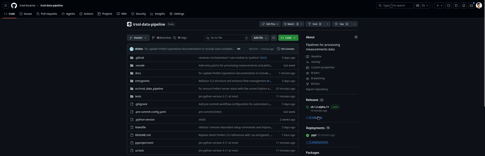
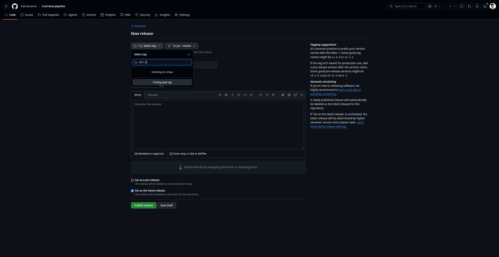
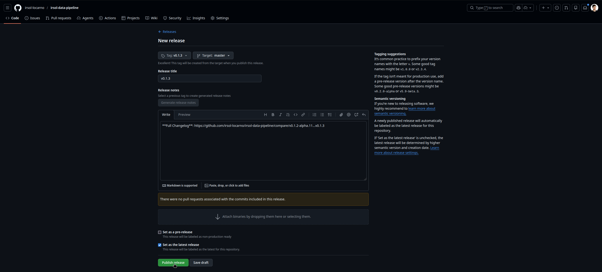
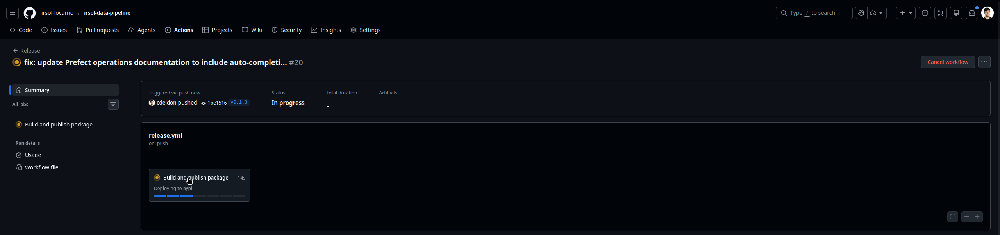

# Creating a Release

This document provides instructions for creating a new release of the IRISOL Data Pipeline python package via the Github interface. The release process is automated via GitHub Actions, which builds and publishes the package to PyPI when a new release is created.

The goal of creating a release is to publish a new version of the package to PyPI, which can then be installed via `pip` or `uv tool install`. Releases are also tagged in git, which helps with version control and tracking changes.

## Steps to Create a Release

Navigate to the [GitHub repository](https://github.com/irsol-locarno/irsol-data-pipeline) for the IRISOL Data Pipeline and follow these steps:

1. Create a new Github Release by selecting which branch to release from (usually `master`) and providing a version number (following semantic versioning, e.g. `v1.0.0`) and release notes describing the changes in this release.

   
   
   
   

2. Monitor the GitHub Actions workflow for the release. It will automatically build the package, and publish to PyPI.

   

3. Once the workflow completes successfully, the new version will be available on PyPI and can be installed using `pip install irsol-data-pipeline==<version>` or `uv tool install irsol-data-pipeline==<version>`.

   

## Notes on semantic versioning
- The version number should follow the format `vMAJOR.MINOR.PATCH[-alpha.<N>]` (e.g., `v1.0.0`, or `v3.1.4-alpha.432`).

- Increment the MAJOR version when you make incompatible API changes, the MINOR version when you add functionality in a backwards-compatible manner, and the PATCH version when you make backwards-compatible bug fixes.

- For pre-release versions (`alpha`), append a hyphen and the pre-release identifier. Each pre-release version should have a unique identifier (e.g., `alpha.1`, `alpha.2`, etc.) to distinguish between different pre-release iterations. The pre-release identifier should be incremented for each new pre-release version to indicate progression towards the final release.
