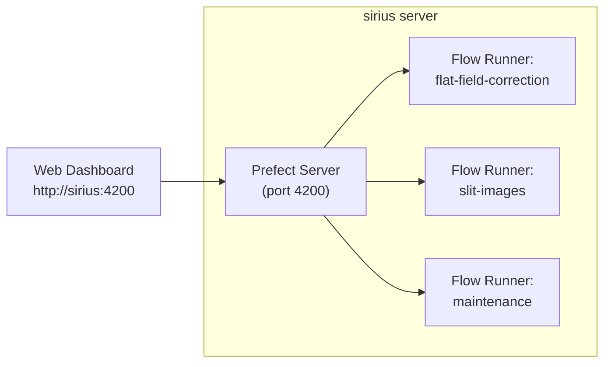

# Prefect Operations

This guide covers deploying, monitoring, and maintaining the IRSOL Data Pipeline's Prefect orchestration in a production environment.

## Operating Model

The pipeline runs as four long-lived processes under a dedicated Unix user (e.g., `irsol-prefect`):



| Process | Command | Purpose |
|---------|---------|---------|
| Prefect Server | `idp prefect start` | API server and web dashboard |
| Flat-field runner | `idp prefect flows serve flat-field-correction` | Scheduled + manual flat-field correction |
| Slit images runner | `idp prefect flows serve slit-images` | Scheduled + manual slit image generation |
| Maintenance runner | `idp prefect flows serve maintenance` | Cache cleanup and run history pruning |

## Deployment

### Bootstrap Checklist

1. **Install the pipeline:**
   ```bash
   uv tool install irsol-data-pipeline
   ```

2. **Verify installation:**
   ```bash
   idp --version
   idp info
   ```

3. **Start the Prefect server:**
   ```bash
   idp prefect start
   ```
   > This automatically configures the Prefect API URL and analytics settings.

4. **Configure variables:**
   ```bash
   idp prefect variables configure
   ```
   Required variables:
   - `data-root-path` — Path to the dataset root directory.
   - `jsoc-email` — Email registered with JSOC for SDO data queries.
   - `cache-expiration-hours` — Cache file retention (default: 672 hours = 28 days).
   - `flow-run-expiration-hours` — Prefect run history retention (default: 672 hours).

5. **Verify configuration:**
   ```bash
   idp info
   idp prefect variables list
   idp prefect flows list
   ```

### systemd Services

Create a service unit for each process. Example for the Prefect server:

```ini
# /etc/systemd/system/irsol-prefect-server.service
[Unit]
Description=IRSOL Prefect Server
After=network.target

[Service]
Type=simple
User=irsol-prefect
ExecStart=/home/irsol-prefect/.local/bin/idp prefect start
Restart=always
RestartSec=5

[Install]
WantedBy=multi-user.target
```

Example for a flow runner:

```ini
# /etc/systemd/system/irsol-prefect-serve-flatfield.service
[Unit]
Description=IRSOL Flat-Field Correction Runner
After=irsol-prefect-server.service
Requires=irsol-prefect-server.service

[Service]
Type=simple
User=irsol-prefect
ExecStart=/home/irsol-prefect/.local/bin/idp prefect flows serve flat-field-correction
Environment=PREFECT_ENABLED=1
Restart=always
RestartSec=5

[Install]
WantedBy=multi-user.target
```

Repeat for `slit-images` and `maintenance` runners.

Enable and start all services:

```bash
sudo systemctl daemon-reload
sudo systemctl enable --now irsol-prefect-server
sudo systemctl enable --now irsol-prefect-serve-flatfield
sudo systemctl enable --now irsol-prefect-serve-slitimages
sudo systemctl enable --now irsol-prefect-serve-maintenance
```

## Monitoring

### Health Check

```bash
# CLI health check
idp prefect status

# With deep analysis (running flows and tasks)
idp prefect status --deep-analysis

# JSON output for automation
idp prefect status --format json
```

### Dashboard

Access the Prefect dashboard at `http://sirius:4200`:

- **Deployments** tab — view registered deployments and their schedules.
- **Flow Runs** tab — inspect completed, running, and failed runs.
- **Tasks** tab — drill into individual task execution.
- **Logs** — view Prefect-captured log output.

### Service Status

```bash
# Check all services
systemctl status irsol-prefect-server
systemctl status irsol-prefect-serve-flatfield
systemctl status irsol-prefect-serve-slitimages
systemctl status irsol-prefect-serve-maintenance
```

### Logs

```bash
# Prefect server logs
journalctl -u irsol-prefect-server -n 200 --no-pager

# Flow runner logs
journalctl -u irsol-prefect-serve-flatfield -n 200 --no-pager

# Pipeline application log (rotating)
tail -f solar_pipeline.log
```

## Manual Trigger

Use the Prefect dashboard at `http://sirius:4200/deployments` to manually trigger deployment runs. Select the target deployment and click **Run**, optionally overriding parameters such as `day_path`.

Available deployments:

| Deployment | Description |
|-----------|-------------|
| `ff-correction-full/flat-field-correction-full` | Process all unprocessed measurements |
| `ff-correction-daily/flat-field-correction-daily` | Process a single observation day (set `day_path`) |
| `slit-images-full/slit-images-full` | Generate all pending slit images |
| `slit-images-daily/slit-images-daily` | Generate slit images for one day (set `day_path`) |
| `delete-old-cache-files/maintenance` | Run cache cleanup |

## Common Failure Modes

| Symptom | Likely Cause | Fix |
|---------|-------------|-----|
| `DatasetRootNotConfiguredError` | Missing `data-root-path` variable | Run `idp prefect variables configure` |
| `FlatFieldAssociationNotFoundException` | No flat-field within time delta | Check reduced/ for flat-field files, adjust `max_delta_hours` |
| SDO fetch timeouts | JSOC service unavailable | Retry automatically (2 retries, 30s delay); check JSOC status |
| `DatImportError` | Corrupted or unsupported .dat file | Inspect file manually; pipeline writes error JSON and continues |
| Prefect server unreachable | Server process crashed | Check `journalctl`, restart service |
| Stale cache files filling disk | Maintenance flow not running | Verify maintenance service is active |

## Reprocessing

To reprocess specific measurements, delete their output files:

```bash
# Remove all outputs for a measurement
rm /data/2025/20250312/processed/6302_m1_corrected.fits
rm /data/2025/20250312/processed/6302_m1_metadata.json
rm /data/2025/20250312/processed/6302_m1_error.json

# Trigger reprocessing via the Prefect dashboard
# (select ff-correction-daily, set day_path=/data/2025/20250312)
```

To reprocess an entire day:

```bash
rm /data/2025/20250312/processed/*_corrected.fits
rm /data/2025/20250312/processed/*_error.json
rm /data/2025/20250312/processed/*_metadata.json
```

## Database Reset

> **⚠️ Destructive operation.** This deletes all Prefect run history.

```bash
idp prefect reset-database
```

Use this only as a last resort when the Prefect database is corrupted.

## Upgrade Procedure

1. **Stop flow runner services** (keep the Prefect server running):
   ```bash
   sudo systemctl stop irsol-prefect-serve-flatfield
   sudo systemctl stop irsol-prefect-serve-slitimages
   sudo systemctl stop irsol-prefect-serve-maintenance
   ```

2. **Upgrade the package:**
   ```bash
   uv tool upgrade irsol-data-pipeline
   ```

3. **Verify the new version:**
   ```bash
   idp --version
   idp info
   ```

4. **Restart the flow runners:**
   ```bash
   sudo systemctl start irsol-prefect-serve-flatfield
   sudo systemctl start irsol-prefect-serve-slitimages
   sudo systemctl start irsol-prefect-serve-maintenance
   ```

5. **Trigger a smoke-test run** via the Prefect dashboard (select `ff-correction-daily`, set `day_path` to a known observation day).

6. **Check the dashboard** for successful completion.

## Best Practices

- **One user per stack** — run all processes under a single dedicated Unix user.
- **systemd for lifecycle** — let systemd handle restarts and boot ordering.
- **Monitor the dashboard** — check daily for failed runs and unexpected patterns.
- **Keep maintenance active** — ensure the maintenance flow runner is always serving to prevent cache and run history accumulation.
- **Test upgrades** — always run a smoke test after upgrading before relying on scheduled runs.
- **Back up Prefect variables** — document your variable configuration in case of database reset.

## Related Documentation

- [Prefect Integration](../pipeline/prefect_integration.md) — flow architecture and technical details
- [CLI Usage](../cli/cli_usage.md) — CLI command reference
- [Installation](../user/installation.md) — initial setup
