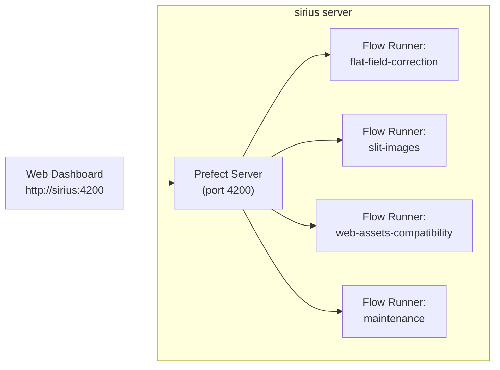

# Prefect Operations

This guide covers deploying, monitoring, and maintaining the IRSOL Data Pipeline's Prefect orchestration in a production environment.

## Operating Model

The pipeline runs as four long-lived processes under a dedicated Unix user (e.g., `operator`):



| Process | Command | Purpose |
|---------|---------|---------|
| Prefect Server | `idp prefect start` | API server and web dashboard |
| Flat-field runner | `idp prefect flows serve flat-field-correction` | Scheduled + manual flat-field correction |
| Slit images runner | `idp prefect flows serve slit-images` | Scheduled + manual slit image generation |
| Web asset compatibility runner | `idp prefect flows serve web-assets-compatibility` | Scheduled + manual web asset compatibility generation |
| Maintenance runner | `idp prefect flows serve maintenance` | Cache cleanup and run history pruning |

## Deployment

The pipeline is deployed on the `sirius` server under the dedicated `operator` Unix user. The
orchestration processes run as systemd services that are automatically restarted on reboot.

The installation requires **two user accounts**:

| Account | Role |
|---------|------|
| `operator` | Owns the `idp` installation and all pipeline processes |
| `root` | Registers the systemd unit files (requires write access to `/etc/systemd/system`) |

Both accounts must have `irsol-data-pipeline-cli` installed independently so that each user
can invoke `idp install service` (root) or the Prefect commands (operator) from their own
managed environment.

### Step 1 — Install and configure as `operator`

Log in as `operator` and install the CLI tool:

```bash
curl -LsSf https://astral.sh/uv/install.sh | sh
uv tool install irsol-data-pipeline-cli --no-cache-dir --python 3.10
```

Verify the installation and note the executable path (you will need it in Step 3):

```bash
idp --version
which idp           # e.g. /home/operator/.local/bin/idp
```

Optionally, install shell auto-completion:

```bash
idp --install-completion
source ~/.bashrc
```

Configure the Prefect server profile:

```bash
idp setup server
```

This command creates or updates the `default` Prefect profile and sets:
- `PREFECT_API_DATABASE_CONNECTION_URL`
- `PREFECT_API_URL=http://127.0.0.1:4200/api`
- `PREFECT_SERVER_ANALYTICS_ENABLED=false`

During setup you are prompted to:
- Confirm the database path (default: `/dati/.prefect/prefect.db`). This is the path where
  Prefect flow history is stored. It should be on a persistent volume with sufficient space
  (a few hundred MB to a few GB depending on run history retention). When the default path is
  accepted, its parent directory is created automatically.
- Select the API port (default: `4200`).

The resulting profile is stored in `~/.prefect/profiles.toml` and will be used by all
`idp prefect` commands.

Start the Prefect server to verify it works:

```bash
idp prefect start
```

Configure variables and secrets (the server must be running):

```bash
idp prefect variables configure
idp prefect secrets configure
```

Required variables:

| Variable | Description |
|----------|-------------|
| `data-root-path` | Path(s) to the dataset root directories (comma-separated for multiple) |
| `jsoc-email` | Email registered with JSOC for SDO data queries |
| `jsoc-data-delay-days` | Minimum age (days) for observation-day folders processed by `slit-images-full` (default: 14) |
| `cache-expiration-hours` | Cache file retention in hours (default: 672 = 28 days) |
| `flow-run-expiration-hours` | Prefect run history retention in hours (default: 672) |

Required secrets:

| Secret | Description |
|--------|-------------|
| `piombo-password` | SFTP password for Piombo uploads (used by web asset compatibility flows) |

Verify the configuration:

```bash
idp info
idp prefect variables list
idp prefect secrets list
idp prefect flows list
```

Stop the server (the systemd services started in Step 3 will manage it from this point on):

```bash
# Press Ctrl+C in the terminal where `idp prefect start` is running
```

### Step 2 — Install as `root`

Log in as `root` (or use `sudo -i`) and install the CLI tool using the same procedure:

```bash
curl -LsSf https://astral.sh/uv/install.sh | sh
uv tool install irsol-data-pipeline-cli --no-cache-dir --python 3.10
```

Verify:

```bash
idp --version
```

`root` needs its own `idp` installation so it can invoke the `idp install service` command
in the next step.

### Step 3 — Register systemd services as `root`

Still logged in as `root`, run the interactive service installer:

```bash
idp install service
```

When prompted, provide the following values:

| Prompt | Value |
|--------|-------|
| Systemd unit directory | `/etc/systemd/system` (default) |
| Unix user to run services as | `operator` |
| Path to `idp` executable | `/home/operator/.local/bin/idp` (from `which idp` in Step 1) |
| Working directory | `/home/operator` (or another suitable directory) |
| Services to install | Select all (server + all flow runners) |

The command writes unit files to `/etc/systemd/system/` and prints the next steps.

Reload systemd and enable all services so they start automatically on boot:

```bash
systemctl daemon-reload
systemctl enable --now irsol-prefect-server
systemctl enable --now irsol-prefect-serve-flatfield
systemctl enable --now irsol-prefect-serve-slitimages
systemctl enable --now irsol-prefect-serve-web-assets-compatibility
systemctl enable --now irsol-prefect-serve-maintenance
```

Verify that all services are running:

```bash
systemctl status irsol-prefect-server
systemctl status irsol-prefect-serve-flatfield
systemctl status irsol-prefect-serve-slitimages
systemctl status irsol-prefect-serve-web-assets-compatibility
systemctl status irsol-prefect-serve-maintenance
```

> **How the services run:** Each unit file sets `User=operator` so all pipeline processes run
> under the `operator` account using its `idp` installation and Prefect profile, even though
> the unit files were registered by `root`.

### Bootstrap Checklist

| # | Who | Action |
|---|-----|--------|
| 1 | `operator` | Install `irsol-data-pipeline-cli` with `uv tool install` |
| 2 | `operator` | Run `idp setup server` to configure the Prefect profile |
| 3 | `operator` | Start `idp prefect start` and configure variables/secrets, then stop |
| 4 | `root` | Install `irsol-data-pipeline-cli` with `uv tool install` |
| 5 | `root` | Run `idp install service`, selecting `operator` user and `operator`'s `idp` path |
| 6 | `root` | `systemctl daemon-reload` and `systemctl enable --now` all services |

## Monitoring

### Health Check

```bash
# CLI health check
idp prefect status

# With deep analysis (running flows and tasks)
idp prefect status --deep-analysis

# JSON output for automation
idp prefect status --format json
```

### Service Status

```bash
# Check all services
systemctl status irsol-prefect-server
systemctl status irsol-prefect-serve-flatfield
systemctl status irsol-prefect-serve-slitimages
systemctl status irsol-prefect-serve-web-assets-compatibility
systemctl status irsol-prefect-serve-maintenance
```

### Logs

```bash
# Prefect server logs
journalctl -u irsol-prefect-server -n 200 --no-pager

# Flow runner logs
journalctl -u irsol-prefect-serve-flatfield -n 200 --no-pager
```

## Database Reset

> **⚠️ Destructive operation.** This deletes all Prefect run history.

```bash
idp prefect reset-database
```

Use this only as a last resort when the Prefect database is corrupted.

## Upgrade Procedure

The upgrade must be performed as `operator` (who owns the installation). The systemd services
are managed by `root`, but the package itself lives in `operator`'s `uv` tool environment.

1. **Stop flow runner services as `root`** (keep the Prefect server running so in-flight flows can finish):
   ```bash
   systemctl stop irsol-prefect-serve-flatfield
   systemctl stop irsol-prefect-serve-slitimages
   systemctl stop irsol-prefect-serve-web-assets-compatibility
   systemctl stop irsol-prefect-serve-maintenance
   ```

2. **Upgrade the package as `operator`:**
   ```bash
   uv tool upgrade irsol-data-pipeline-cli --no-cache-dir --python 3.10
   ```

3. **Verify the new version as `operator`:**
   ```bash
   idp --version
   idp info
   ```

4. **Restart the flow runners as `root`:**
   ```bash
   systemctl start irsol-prefect-serve-flatfield
   systemctl start irsol-prefect-serve-slitimages
   systemctl start irsol-prefect-serve-web-assets-compatibility
   systemctl start irsol-prefect-serve-maintenance
   ```


## Dashboard

In order to access the Prefect dashboard, you need to have the Prefect server running on sirius (see instructions above) and a port forwarding setup from sirius to your local machine.

Ensure a port is forwarded from sirius to your local environment:
```bash
ssh -L 4200:localhost:4200 <username>@sirius
```

This command will open an SSH connection from your local environment to sirius (where the prefect server is running) and forward the prefect server port (4200) to your local machine. You can then access the Prefect dashboard at `http://localhost:4200` in your web browser:

- **Deployments** tab — view registered deployments and their schedules.
- **Flow Runs** tab — inspect completed, running, and failed runs.
- **Tasks** tab — drill into individual task execution.
- **Logs** — view Prefect-captured log output.

## Best Practices

- **One user per stack** — run all processes under a single dedicated Unix user.
- **systemd for lifecycle** — let systemd handle restarts and boot ordering.
- **Monitor the dashboard** — check daily for failed runs and unexpected patterns.
- **Keep maintenance active** — ensure the maintenance flow runner is always serving to prevent cache and run history accumulation.
- **Test upgrades** — always run a smoke test after upgrading before relying on scheduled runs.
- **Back up Prefect variables and secrets** — document your variable and secret configuration in case of database reset. Use `idp prefect variables list` and `idp prefect secrets list` to export current values (secrets will be redacted).

## Related Documentation

- [Prefect Integration](../pipeline/prefect_integration.md) — flow architecture and technical details
- [CLI Usage](../cli/cli_usage.md) — CLI command reference
- [Installation](../user/installation.md) — initial setup
