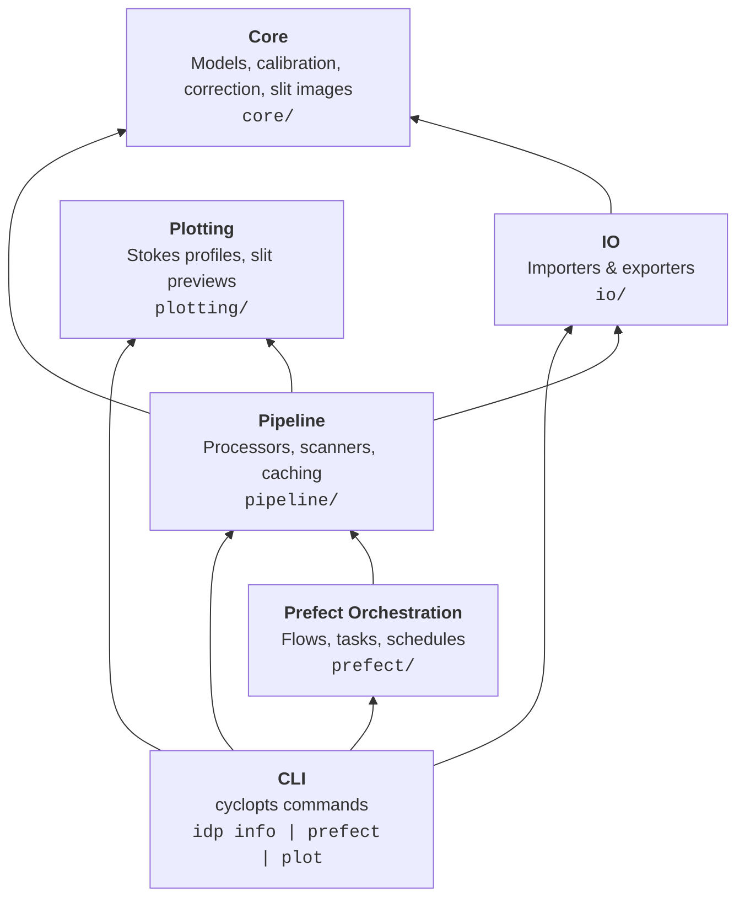
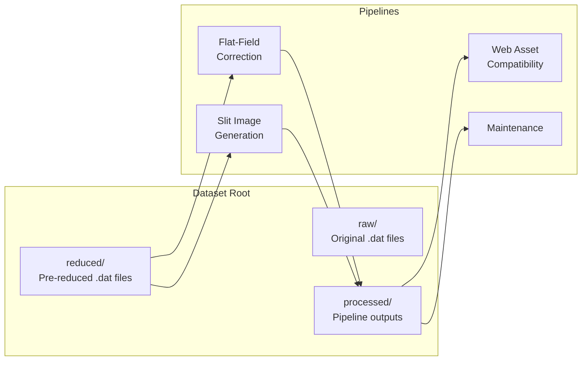

# Architecture

This document describes the high-level architecture of the IRSOL Data Pipeline, its layered design, and how the major components interact.

## Layered Architecture

The pipeline follows a strict layered architecture where each layer may only depend on layers above it.



| Layer | Module | Responsibility |
|-------|--------|----------------|
| **Core** | `core/` | Domain models (Pydantic), calibration algorithms, correction logic, slit image geometry, config constants |
| **IO** | `io/` | Read/write `.dat`, FITS, flat-field FITS cache, and JSON metadata |
| **Pipeline** | `pipeline/` | Orchestrate per-measurement and per-day processing, flat-field caching, filesystem discovery |
| **Prefect** | `prefect/` | Conditional decorators, flow definitions, retry policies, Prefect variable management |
| **Plotting** | `plotting/` | Matplotlib-based Stokes profile and slit context image rendering |
| **CLI** | `cli/` | User-facing `idp` command: info, plot, and Prefect operations |

## Dataset Directory Convention

Each observation day is stored in a directory with the structure:

```
<dataset_root>/
└── <year>/
    └── <YYYYMMDD>/
        ├── raw/               # Original camera data (.z3bd, etc.)
        ├── reduced/           # Pre-reduced ZIMPOL .dat files
        │   ├── 6302_m1.dat    # Observation measurement
        │   ├── ff6302_m1.dat  # Corresponding flat-field
        │   └── ...
        └── processed/         # Pipeline outputs
            ├── 6302_m1_corrected.fits
            ├── 6302_m1_metadata.json
            ├── 6302_m1_profile_corrected.png
            ├── 6302_m1_slit_preview.png
            └── _cache/
                  ├── flat-field-cache/ # Flat-field correction cache (.fits)
                  └── sdo/  # Downloaded SDO FITS cache for slit image generation
```

## Four Independent Pipelines

The system contains four independently schedulable pipelines that share the same dataset root directory:

The fourth pipeline, **Web Asset Compatibility**, exists specifically to replace legacy cron/script
image publishing with a first-class pipeline stage while preserving legacy public URL contracts.



| Pipeline | Input | Output | Schedule |
|----------|-------|--------|----------|
| **Flat-field correction** | `reduced/*.dat` | `processed/*_corrected.fits`, metadata JSON, profile PNGs | Daily (or manual) |
| **Slit image generation** | `reduced/*.dat` | `processed/*_slit_preview.png` | Daily (or manual) |
| **Web asset compatibility** | `processed/*.png` | JPG-converted assets, deployed to Piombo SFTP | Daily (or manual) |
| **Maintenance** | `processed/_cache/`, Prefect DB | Deleted stale files | Periodic |

## Key Design Decisions

- **Prefect is optional** — The `prefect/decorators.py` module provides `@task` and `@flow` decorators that become transparent no-ops when `PREFECT_ENABLED` is not set. All pipeline logic works as plain Python. The CLI entrypoints take care to setup the `PREFECT_ENABLED` variable where needed.
- **Pydantic for domain models** — Frozen Pydantic v2 models enforce data integrity. `arbitrary_types_allowed` is used for numpy arrays.
- **Loguru for logging** — Context variables via `logger.bind()` and `logger.contextualize()`, never f-string interpolation inside log calls.
- **Typed exceptions** — Every failure mode has a domain-specific exception class inheriting from `IrsolDataPipelineException`.
- **Idempotent processing** — Measurements already processed (presence of `_corrected.fits` or `_error.json`) are skipped automatically.
