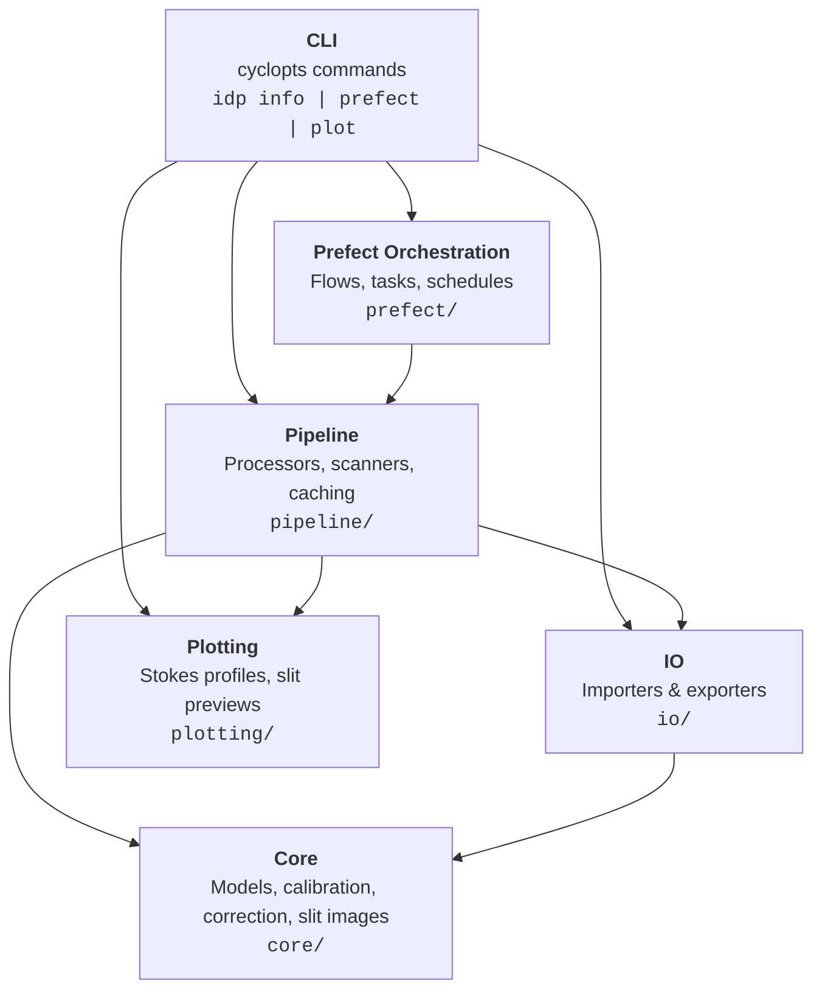
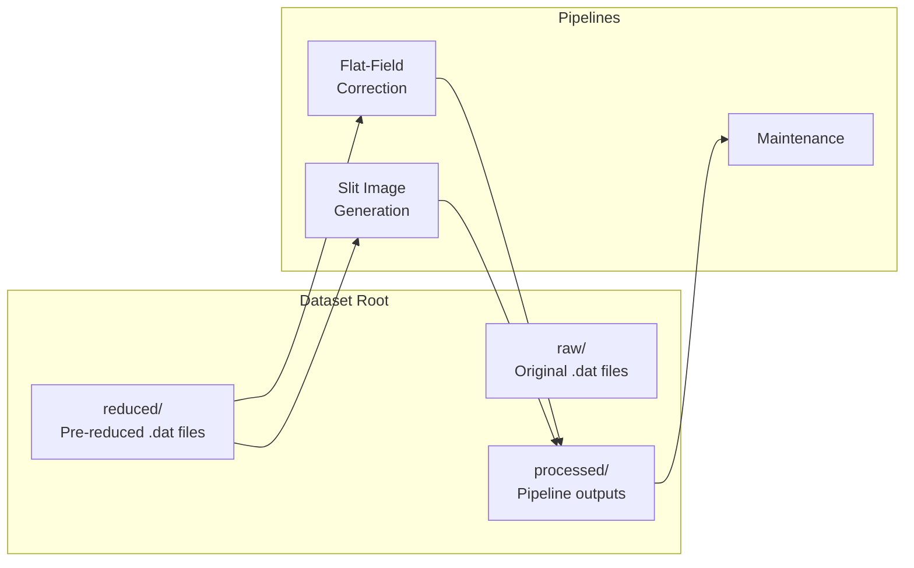

# Architecture

This document describes the high-level architecture of the IRSOL Data Pipeline, its layered design, and how the major components interact.

## Layered Architecture

The pipeline follows a strict layered architecture where each layer may only depend on layers below it.



| Layer | Module | Responsibility |
|-------|--------|----------------|
| **Core** | `core/` | Domain models (Pydantic), calibration algorithms, correction logic, slit image geometry, config constants |
| **IO** | `io/` | Read/write `.dat`, FITS, flat-field pickles, and JSON metadata |
| **Pipeline** | `pipeline/` | Orchestrate per-measurement and per-day processing, flat-field caching, filesystem discovery |
| **Prefect** | `prefect/` | Conditional decorators, flow definitions, retry policies, Prefect variable management |
| **Plotting** | `plotting/` | Matplotlib-based Stokes profile and slit context image rendering |
| **CLI** | `cli/` | User-facing `idp` command: info, plot, and Prefect operations |

## Module Map

```
src/irsol_data_pipeline/
├── __init__.py               # Package entry, matplotlib backend setup
├── version.py                # Version string
├── exceptions.py             # Domain exception hierarchy
├── logging_config.py         # Loguru sinks (stdout + rotating file)
│
├── core/
│   ├── config.py             # Constants: filenames, thresholds, directory names
│   ├── models.py             # Pydantic domain models (Measurement, Stokes, Metadata, …)
│   ├── calibration/
│   │   ├── autocalibrate.py  # Wavelength calibration via cross-correlation
│   │   └── refdata/          # Bundled reference spectral atlases (.npy)
│   ├── correction/
│   │   ├── analyzer.py       # spectroflat analysis (dust flat + offset map)
│   │   └── corrector.py      # Apply flat-field + smile correction
│   └── slit_images/
│       ├── config.py         # Observatory location, telescope specs, SDO products
│       ├── coordinates.py    # Slit geometry, mu calculation, coordinate transforms
│       ├── solar_data.py     # SDO/DRMS data fetching
│       └── z3readbd.py       # Z3BD binary header reader
│
├── io/
│   ├── dat/importer.py       # Read ZIMPOL .dat/.sav files
│   ├── fits/
│   │   ├── importer.py       # Read corrected FITS products
│   │   └── exporter.py       # Write multi-extension FITS (SOLARNET-compliant)
│   ├── flatfield/
│   │   ├── importer.py       # Load pickled FlatFieldCorrection
│   │   └── exporter.py       # Persist FlatFieldCorrection as pickle
│   └── processing_metadata/
│       ├── importer.py       # Read JSON metadata/error files
│       └── exporter.py       # Write processing metadata and error JSON
│
├── pipeline/
│   ├── scanner.py            # Scan dataset root for pending measurements
│   ├── day_processor.py      # Process all measurements in an observation day
│   ├── measurement_processor.py  # Process a single measurement (8-step pipeline)
│   ├── flatfield_cache.py    # In-memory flat-field correction cache
│   ├── cache_cleanup.py      # Delete stale cache files
│   ├── filesystem.py         # Directory/file discovery and naming conventions
│   └── slit_images_processor.py  # Slit preview generation (per-measurement and per-day)
│
├── prefect/
│   ├── decorators.py         # Conditional @task / @flow (no-op without PREFECT_ENABLED)
│   ├── config.py             # Prefect server URLs and settings
│   ├── variables.py          # Prefect Variable names and access helpers
│   ├── retry.py              # Conditional retry handlers
│   ├── utils.py              # Shared Prefect utilities
│   ├── patch_logging.py      # Bridge loguru ↔ Prefect logging
│   └── flows/
│       ├── flat_field_correction.py   # FF correction flows (full + daily)
│       ├── slit_image_generation.py   # Slit image flows (full + daily)
│       └── maintenance/
│           ├── delete_old_cache_files.py   # Cache cleanup flow
│           └── delete_old_prefect_data.py  # Prefect run history cleanup
│
├── plotting/
│   ├── profile.py            # 4-panel Stokes profile renderer
│   └── slit.py               # 6-panel SDO slit preview renderer
│
└── cli/
    ├── __init__.py            # Root cyclopts app, global flags
    ├── common.py              # Shared helpers (banner, JSON output)
    ├── metadata.py            # CLI metadata constants
    ├── presentation.py        # Rich table rendering
    └── commands/
        ├── info_command.py    # `idp info`
        ├── plot_command.py    # `idp plot profile | slit`
        └── prefect_command/
            ├── flows_command.py      # `idp prefect flows list | serve`
            ├── status_command.py     # `idp prefect status`
            └── variables_command.py  # `idp prefect variables list | configure`
```

## Three Independent Pipelines

The system contains three independently schedulable pipelines that share the same dataset root directory:



| Pipeline | Input | Output | Schedule |
|----------|-------|--------|----------|
| **Flat-field correction** | `reduced/*.dat` | `processed/*_corrected.fits`, metadata JSON, profile PNGs | Daily (or manual) |
| **Slit image generation** | `reduced/*.dat` | `processed/*_slit_preview.png` | Daily (or manual) |
| **Maintenance** | `processed/_cache/`, Prefect DB | Deleted stale files | Periodic |

## Dataset Directory Convention

Each observation day is stored in a directory with the structure:

```
<dataset_root>/
└── <year>/
    └── <YYYYMMDD>/
        ├── raw/               # Original camera data (.z3bd, etc.)
        ├── reduced/           # Pre-reduced ZIMPOL .dat files
        │   ├── 6302_m1.dat    # Observation measurement
        │   ├── ff6302_m1.dat  # Corresponding flat-field
        │   └── ...
        └── processed/         # Pipeline outputs
            ├── 6302_m1_corrected.fits
            ├── 6302_m1_metadata.json
            ├── 6302_m1_profile_corrected.png
            ├── 6302_m1_slit_preview.png
            ├── _cache/        # Flat-field correction cache (.pkl)
            └── _sdo_cache/    # Downloaded SDO FITS cache
```

## Key Design Decisions

- **Prefect is optional** — The `prefect/decorators.py` module provides `@task` and `@flow` decorators that become transparent no-ops when `PREFECT_ENABLED` is not set. All pipeline logic works as plain Python.
- **Pydantic for domain models** — Frozen Pydantic v2 models enforce data integrity. `arbitrary_types_allowed` is used for numpy arrays.
- **Loguru for logging** — Context variables via `logger.bind()` and `logger.contextualize()`, never f-string interpolation inside log calls.
- **Typed exceptions** — Every failure mode has a domain-specific exception class inheriting from `IrsolDataPipelineException`.
- **Idempotent processing** — Measurements already processed (presence of `_corrected.fits` or `_error.json`) are skipped automatically.
