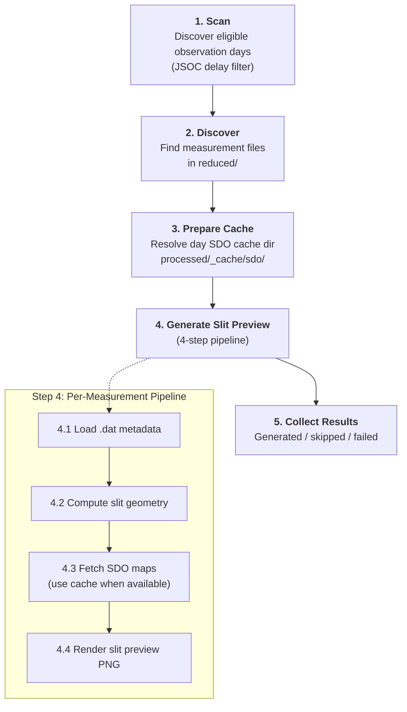
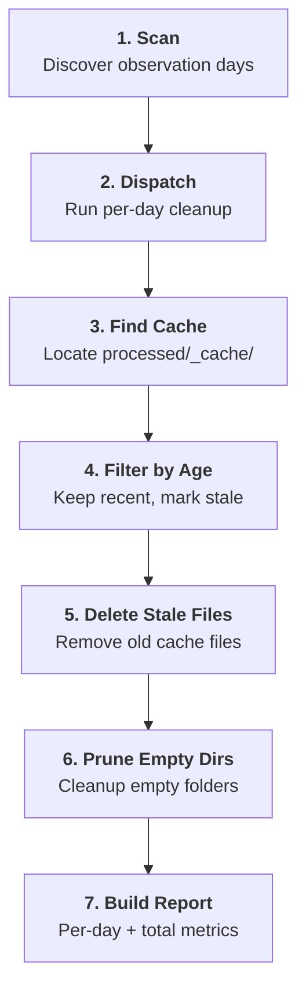
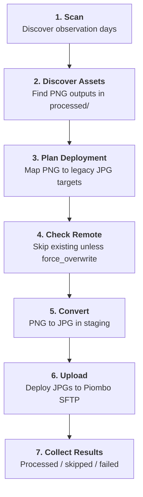

# Pipeline Overview

The pipeline layer orchestrates end-to-end processing of solar observation data. It ties together the core algorithms, IO modules, and caching logic into cohesive workflows that process individual measurements, entire observation days, or full dataset scans.

## Flat-field correction


### Stage 1 — Dataset Scanning

- Discovers all observation day directories under the dataset root.
- For each day, compares measurements in `reduced/` against outputs in `processed/`.
- A measurement is considered **processed** if either `*_corrected.fits` or `*_error.json` exists.

### Stage 2 — File Discovery

- **Measurement files** match the pattern `<wavelength>_m<number>.dat` (e.g., `6302_m1.dat`).
- **Flat-field files** match the pattern `ff<wavelength>_m<number>.dat` (e.g., `ff6302_m1.dat`).
- Files prefixed with `cal` or `dark` are ignored.

### Stage 3 — Flat-Field Cache

For each flat-field `.dat` file:

1. Check if a cached correction FITS file exists on disk. If so, load it.
2. Otherwise, load the flat-field `.dat`, run `analyze_flatfield()`, and persist the result.
3. Add the `FlatFieldCorrection` to the in-memory `FlatFieldCache`, keyed by wavelength.

The cache supports lookup by wavelength and timestamp:

```python
cache.find_best_correction(wavelength=6302, timestamp=measurement_time)
```

This returns the closest correction within `max_delta` (default: 2 hours), or `None` if no match exists.

### Stage 4 — Single Measurement Processing

The 8-step pipeline for each measurement:

| Step | Operation | Output |
|------|-----------|--------|
| 4.1 | Load `.dat` file | `StokesParameters` + `MeasurementMetadata` |
| 4.2 | Find closest flat-field correction | `FlatFieldCorrection` (from cache) |
| 4.3 | Apply dust-flat + smile correction | Corrected `StokesParameters` |
| 4.4 | Run wavelength auto-calibration | `CalibrationResult` |
| 4.5 | Write corrected FITS | `*_corrected.fits` |
| 4.6 | Write flat-field correction data | `*_flat_field_correction_data.fits` |
| 4.7 | Write processing metadata | `*_metadata.json` |
| 4.8 | Generate profile plots | `*_profile_original.png`, `*_profile_corrected.png` |

If any step fails, an error JSON (`*_error.json`) is written and the measurement is marked as failed.


## Slit Image Generation



### Stage 1 — Dataset Scanning

- Discovers observation days under the dataset root.
- Full-scan flow keeps only days older than or equal to `jsoc-data-delay-days` (inclusive).
- Daily flow processes exactly one `day_path`.

### Stage 2 — File Discovery

- Measurement inputs are discovered from `reduced/` using the same rules as flat-field processing.
- Files already considered complete are skipped.
- A measurement is considered **already handled** if either `*_slit_preview.png` or `*_slit_preview_error.json` exists.

### Stage 3 — SDO Cache

- Per-day cache directory is `processed/_cache/sdo/`.
- Downloaded SDO FITS files are reused across measurements for the same day.
- If no cached file is available, data is fetched via JSOC/DRMS using the configured `jsoc-email`.

### Stage 4 — Single Measurement Slit Processing

The 4-step slit image pipeline for each measurement:

| Step | Operation | Output |
|------|-----------|--------|
| 4.1 | Load measurement `.dat` and parse `MeasurementMetadata` | Metadata with solar pointing/time info |
| 4.2 | Compute slit geometry | Slit start/end geometry + `mu` context |
| 4.3 | Fetch SDO/AIA + SDO/HMI context maps | 6-map context set (from cache or download) |
| 4.4 | Render slit overlay figure | `*_slit_preview.png` |

If generation fails, an error file `*_slit_preview_error.json` is written and the measurement is marked as failed.


## Cache Cleanup



### Stage 1 — Dataset Scanning

- Discovers all observation days under the configured root.
- Retention is configured in hours (`cache-expiration-hours`, default `672`).

### Stage 2 — Per-Day Cache Discovery

- Resolves cache location as `processed/_cache/` for each day.
- If no cache directory exists, the day returns a zero-count cleanup result.

### Stage 3 — Stale-File Evaluation

- Computes a cutoff timestamp: `now - retention_hours`.
- Iterates cache files and compares each file's modification time against the cutoff.
- Files newer than cutoff are retained; older files are marked for deletion.

### Stage 4 — Deletion and Reporting

- Deletes stale cache files and tracks deleted bytes.
- Keeps counters for checked/deleted/skipped/failed files per day.
- Removes empty cache subdirectories after deletion.
- Produces a markdown cleanup report artifact with totals and per-day breakdown.


## Web Asset Compatibility



### Stage 1 — Dataset Scanning

- Full flow (`web-assets-compatibility-full`) scans all observation days.
- Daily flow (`web-assets-compatibility-daily`) processes one day path.

### Stage 2 — Asset Discovery

- Scans `processed/` for generated PNG assets:
    - `*_profile_corrected.png` (quicklook)
    - `*_slit_preview.png` (context)
- Builds `WebAssetSource` entries per measurement and asset kind.

### Stage 3 — Target Planning

- Each PNG is mapped to a legacy JPG target path:
    - quicklook: `img_quicklook/<observation_day>/<measurement>.jpg`
    - context: `img_data/<observation_day>/<measurement>.jpg`
- Day-level planning distinguishes upload candidates from already-existing remote assets.

### Stage 4 — Conversion and Deployment

- Converts selected PNG files to JPEG in a temporary staging directory.
- Uploads staged JPGs through the configured `RemoteFileSystem` implementation (Piombo SFTP in production).
- Existing remote files are skipped unless `force_overwrite=True`.

### Stage 5 — Result Aggregation

- Returns per-day `DayProcessingResult` counts (`processed`, `skipped`, `failed`).
- Conversion and upload failures are recorded and surfaced in flow logs and run summaries.


## Related Documentation
- [Flat-Field Correction](../core/flat_field_correction.md) — core correction algorithms
- [Wavelength Auto-Calibration](../core/wavelength_autocalibration.md) — calibration details
- [Slit Image Creation](../core/slit_image_creation.md) — slit geometry and SDO data
- [IO Modules](../io/io_modules.md) — file format details
- [Prefect Integration](prefect_integration.md) — orchestration of pipeline flows
