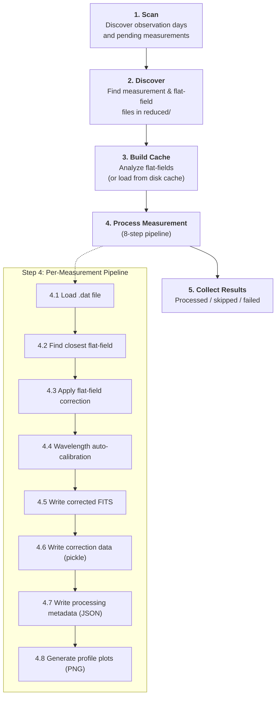

# Pipeline Overview

The pipeline layer orchestrates end-to-end processing of solar observation data. It ties together the core algorithms, IO modules, and caching logic into cohesive workflows that process individual measurements, entire observation days, or full dataset scans.

**Module:** `pipeline/`

## End-to-End Data Flow



## Processing Stages

### Stage 1 — Dataset Scanning

**Module:** `pipeline.scanner`

```python
def scan_dataset(root: Path) -> ScanResult:
```

- Discovers all observation day directories under the dataset root.
- For each day, compares measurements in `reduced/` against outputs in `processed/`.
- A measurement is considered **processed** if either `*_corrected.fits` or `*_error.json` exists.
- Returns a `ScanResult` with pending measurements grouped by observation day.

### Stage 2 — File Discovery

**Module:** `pipeline.filesystem`

```python
def discover_measurement_files(reduced_dir: Path) -> list[Path]:
def discover_flatfield_files(reduced_dir: Path) -> list[Path]:
```

- **Measurement files** match the pattern `<wavelength>_m<number>.dat` (e.g., `6302_m1.dat`).
- **Flat-field files** match the pattern `ff<wavelength>_m<number>.dat` (e.g., `ff6302_m1.dat`).
- Files prefixed with `cal` or `dark` are ignored.

### Stage 3 — Flat-Field Cache

**Module:** `pipeline.flatfield_cache`

```python
def build_flatfield_cache(
    flatfield_paths: list[Path],
    max_delta: datetime.timedelta = DEFAULT_MAX_DELTA,
    allow_cached_data: bool = True,
) -> FlatFieldCache:
```

For each flat-field `.dat` file:

1. Check if a cached correction pickle exists on disk. If so, load it.
2. Otherwise, load the flat-field `.dat`, run `analyze_flatfield()`, and persist the result.
3. Add the `FlatFieldCorrection` to the in-memory `FlatFieldCache`, keyed by wavelength.

The cache supports lookup by wavelength and timestamp:

```python
cache.find_best_correction(wavelength=6302, timestamp=measurement_time)
```

This returns the closest correction within `max_delta` (default: 2 hours), or `None` if no match exists.

### Stage 4 — Single Measurement Processing

**Module:** `pipeline.measurement_processor`

```python
def process_single_measurement(
    measurement_path: Path,
    processed_dir: Path,
    ff_cache: FlatFieldCache,
    max_delta_policy: MaxDeltaPolicy | None = None,
) -> None:
```

The 8-step pipeline for each measurement:

| Step | Operation | Output |
|------|-----------|--------|
| 4.1 | Load `.dat` file | `StokesParameters` + `MeasurementMetadata` |
| 4.2 | Find closest flat-field correction | `FlatFieldCorrection` (from cache) |
| 4.3 | Apply dust-flat + smile correction | Corrected `StokesParameters` |
| 4.4 | Run wavelength auto-calibration | `CalibrationResult` |
| 4.5 | Write corrected FITS | `*_corrected.fits` |
| 4.6 | Write flat-field correction data | `*_flat_field_correction_data.pkl` |
| 4.7 | Write processing metadata | `*_metadata.json` |
| 4.8 | Generate profile plots | `*_profile_original.png`, `*_profile_corrected.png` |

If any step fails, an error JSON (`*_error.json`) is written and the measurement is marked as failed.

### Stage 5 — Day Processing

**Module:** `pipeline.day_processor`

```python
def process_observation_day(
    day: ObservationDay,
    max_delta_policy: MaxDeltaPolicy | None = None,
) -> DayProcessingResult:
```

Coordinates processing of all measurements in a single observation day:

1. Discover measurement and flat-field files.
2. Build the flat-field cache (once per day).
3. Iterate over unprocessed measurements, calling `process_single_measurement()` for each.
4. On failure, write error JSON and continue to the next measurement.
5. Return a `DayProcessingResult` with processed, skipped, and failed counts.

## Slit Image Generation

The slit image pipeline runs independently from flat-field correction:

**Module:** `pipeline.slit_images_processor`

```python
def generate_slit_images_for_day(
    day: ObservationDay,
    jsoc_email: str,
    use_limbguider: bool = False,
) -> DayProcessingResult:
```

For each measurement in an observation day:

1. Check if a slit preview already exists (skip if so).
2. Load measurement metadata.
3. Validate solar coordinates.
4. Compute slit geometry.
5. Fetch SDO maps from JSOC.
6. Render and save the 6-panel slit preview.

## Cache Cleanup

**Module:** `pipeline.cache_cleanup`

```python
def cleanup_day_cache_files(
    day: ObservationDay,
    hours: float,
) -> CacheCleanupDayResult:
```

Removes stale pickle files from `processed/_cache/` and `processed/_sdo_cache/` directories. Files older than the specified threshold are deleted. This prevents unbounded cache growth on long-running deployments.

## Idempotency

The pipeline is designed to be safely re-runnable:

- **Flat-field correction:** measurements with an existing `*_corrected.fits` or `*_error.json` are skipped.
- **Slit images:** measurements with an existing `*_slit_preview.png` or `*_slit_preview_error.json` are skipped.
- **Cache:** already-analyzed flat-field corrections are loaded from disk pickle rather than re-computed.
- To force reprocessing, delete the relevant output files and re-run.

## Output Files

For each measurement (e.g., `6302_m1`), the pipeline produces:

| File | Description |
|------|-------------|
| `6302_m1_corrected.fits` | Corrected Stokes I, Q/I, U/I, V/I |
| `6302_m1_metadata.json` | Processing metadata and calibration info |
| `6302_m1_flat_field_correction_data.pkl` | Cached flat-field correction (in `_cache/`) |
| `6302_m1_profile_original.png` | Profile plot of uncorrected data |
| `6302_m1_profile_corrected.png` | Profile plot of corrected data |
| `6302_m1_slit_preview.png` | 6-panel SDO slit context image |
| `6302_m1_error.json` | Error record (only on failure) |

## Related Documentation

- [Flat-Field Correction](../core/flat_field_correction.md) — core correction algorithms
- [Wavelength Auto-Calibration](../core/wavelength_autocalibration.md) — calibration details
- [Slit Image Creation](../core/slit_image_creation.md) — slit geometry and SDO data
- [IO Modules](../io/io_modules.md) — file format details
- [Prefect Integration](prefect_integration.md) — orchestration of pipeline flows
