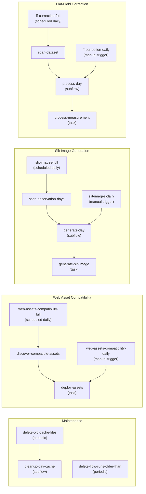

# Prefect Integration

The IRSOL Data Pipeline uses [Prefect 3](https://docs.prefect.io/) as an optional orchestration layer. Prefect provides scheduling, retries, a web dashboard, and run history — but the pipeline works equally well as plain Python when Prefect is not enabled.

## Conditional Decorators

The key design principle is that **Prefect is never required**. The module `prefect.decorators` provides drop-in replacements for `@prefect.task` and `@prefect.flow`:

```python
from irsol_data_pipeline.prefect.decorators import flow, task

@task(retries=2, retry_delay_seconds=10)
def process_measurement(...):
    ...

@flow(name="ff-correction-full")
def process_all(...):
    ...
```

When the environment variable `PREFECT_ENABLED` is set to `1`, `true`, or `yes`, these decorators behave like their Prefect counterparts. Otherwise, they are transparent no-ops — the decorated functions run as plain Python.

This is implemented in `prefect/decorators.py` and the variable is automatically set by any CLI entrypoint that uses these capabilities. Whenever the `irsol_data_pipeline` package is used as a library/dependency of other projects, this environment variable shall not be set.

> **Convention:** Only code inside the `prefect/` package may import from the `prefect` library. The `cli`, `core/`, `integrations`, `io/`, `pipeline/`, and `plotting/` sub-packages must remain Prefect-free.

## Flow Architecture




### Flow Groups

The pipeline defines four independent flow groups, each served as a separate Prefect deployment:

| Group | Flows | Schedule |
|-------|-------|----------|
| **flat-field-correction** | `process_unprocessed_measurements` (full scan), `process_daily_unprocessed_measurements` (single day) | Daily + manual |
| **slit-images** | `generate_slit_images` (full scan), `generate_daily_slit_images` (single day) | Daily + manual |
| **web-assets-compatibility** | `publish_web_assets_for_root` (full scan), `publish_web_assets_for_day` (single day) | Daily + manual |
| **maintenance** | `delete_flow_runs_older_than`, `delete_old_cache_files` | Periodic |

### Flat-Field Correction Flows


**`process_unprocessed_measurements`** (full):
1. Resolves the dataset root from arguments or Prefect Variables.
2. Scans the dataset for pending measurements.
3. Creates a markdown scan report artifact.
4. Dispatches day-processing subflows via `ThreadPoolTaskRunner` (max workers = CPU count − 1, capped at 12).
5. Collects results and logs a summary.

**`process_daily_unprocessed_measurements`** (daily):
1. Constructs an `ObservationDay` from the provided path.
2. Calls `process_observation_day()` with the configured `MaxDeltaPolicy`.

### Slit Image Generation Flows


**`generate_slit_images`** (full):
1. Resolves JSOC email and dataset root.
2. Scans observation days and keeps only days at least `jsoc-data-delay-days` old (inclusive, based on `YYMMDD` folder date).
3. Dispatches per-day generation tasks (max workers = CPU count − 1, capped at 4 due to network I/O).
4. Collects results.

**`generate_daily_slit_images`** (daily):
1. Resolves JSOC email.
2. Generates slit images for a single observation day.

### Maintenance Flows


**`delete_old_cache_files`**: Scans all observation days and deletes stale files from cache directories. Default retention: 672 hours (28 days).

**`delete_flow_runs_older_than`**: Queries the Prefect API for flow runs older than the retention window and deletes them. Default retention: 672 hours (28 days).

### Web Asset Compatibility Flows


**`publish_web_assets_for_root`** (full):
1. Resolves the dataset root from arguments or Prefect Variables.
2. Scans all observation days for PNG outputs (`*_profile_corrected.png`, `*_slit_preview.png`).
3. Creates JPEG targets for each PNG based on web asset configuration.
4. Dispatches per-day asset conversion tasks via `ThreadPoolTaskRunner`.
5. Uploads converted JPEGs to Piombo SFTP via the configured `RemoteFileSystem` adapter.
6. Collects results and logs a summary.

**`publish_web_assets_for_day`** (daily):
1. Constructs an `ObservationDay` from the provided path.
2. Discovers PNG assets for the day.
3. Converts PNGs to JPEGs and stages them in a temporary directory.
4. Uploads JPEGs to Piombo SFTP server.

#### Why Web Asset Compatibility Exists

The `web-assets-compatibility` flow exists to replace legacy script-and-cron image publishing
(`quick-look` and `image-generator`) with a first-class, observable pipeline step.

Without this flow, the pipeline would stop at local PNG generation and would not satisfy the
existing web contract used by `contrast-main`, SVO publication, and downstream public URLs.
The compatibility flow is responsible for:

1. Converting pipeline PNG outputs into the required deployed `.jpg` artifacts.
2. Preserving legacy destination paths (`img_quicklook/<obs>/` and `img_data/<obs>/`).
3. Enforcing idempotent upload behavior (skip existing by default, overwrite only when forced).
4. Making deployment state explicit in Prefect (retries, logs, failures, run history).


## Prefect Variables


Runtime configuration is stored as Prefect Variables, accessible via the dashboard or CLI:

| Variable | Description | Example |
|----------|-------------|---------|
| `data-root-path` | Dataset root directories | `/dati/mdata/pdata/irsol/zimpol,/dati/mdata/pdata/gregor/zimpol` |
| `jsoc-email` | Email for JSOC DRMS queries | `user@example.com` |
| `jsoc-data-delay-days` | Minimum day age for `slit-images-full` scanning | `14` |
| `cache-expiration-hours` | Cache file retention (hours) | `672` |
| `flow-run-expiration-hours` | Prefect run history retention (hours) | `672` |
| `piombo-hostname` | Piombo SFTP server hostname | `piombo.example.com` |
| `piombo-username` | SFTP login username | `web-assets` |
| `piombo-base-path` | Base path on Piombo SFTP server | `/irsol_db/docs/web-site/assets` |

## Prefect Secrets

Sensitive credentials are stored as Prefect Secret blocks, not as plain Variables:

| Secret | Description |
|--------|-------------|
| `piombo-password` | SFTP login password for Piombo uploads |

Access in code:

```python
from irsol_data_pipeline.prefect.variables import resolve_dataset_roots, get_variable

roots = resolve_dataset_roots()  # from arg, or Prefect Variable, or error
email = get_variable(PrefectVariableName.JSOC_EMAIL, default="")
```

## Related Documentation

- [Pipeline Overview](pipeline_overview.md) — processing logic details
- [Prefect Operations](../maintainer/prefect_operations.md) — deployment and monitoring guide
- [CLI Usage](../cli/cli_usage.md) — CLI commands for managing Prefect
