# Prefect Integration

The IRSOL Data Pipeline uses [Prefect 3](https://docs.prefect.io/) as an optional orchestration layer. Prefect provides scheduling, retries, a web dashboard, and run history — but the pipeline works equally well as plain Python when Prefect is not enabled.

**Module:** `prefect/`

## Conditional Decorators

The key design principle is that **Prefect is never required**. The module `prefect.decorators` provides drop-in replacements for `@prefect.task` and `@prefect.flow`:

```python
from irsol_data_pipeline.prefect.decorators import flow, task

@task(retries=2, retry_delay_seconds=10)
def process_measurement(...):
    ...

@flow(name="ff-correction-full")
def process_all(...):
    ...
```

When the environment variable `PREFECT_ENABLED` is set to `1`, `true`, or `yes`, these decorators behave like their Prefect counterparts. Otherwise, they are transparent no-ops — the decorated functions run as plain Python.

This is implemented in `prefect/decorators.py`:

```python
def prefect_enabled() -> bool:
    return os.environ.get("PREFECT_ENABLED", "").strip().lower() in {"1", "true", "yes"}
```

> **Convention:** Only code inside the `prefect/` package may import from the `prefect` library. The `core/`, `io/`, `pipeline/`, and `plotting/` packages must remain Prefect-free.

## Flow Architecture

```mermaid
flowchart TB
    subgraph "Flat-Field Correction"
        FF_FULL["ff-correction-full<br/>(scheduled daily)"]
        FF_DAILY["ff-correction-daily<br/>(manual trigger)"]
        FF_SCAN["scan-dataset"]
        FF_DAY["process-day<br/>(subflow)"]
        FF_MEAS["process-measurement<br/>(task)"]

        FF_FULL --> FF_SCAN --> FF_DAY --> FF_MEAS
        FF_DAILY --> FF_DAY
    end

    subgraph "Slit Image Generation"
        SLIT_FULL["slit-images-full<br/>(scheduled daily)"]
        SLIT_DAILY["slit-images-daily<br/>(manual trigger)"]
        SLIT_SCAN["scan-observation-days"]
        SLIT_DAY["generate-day<br/>(subflow)"]
        SLIT_MEAS["generate-slit-image<br/>(task)"]

        SLIT_FULL --> SLIT_SCAN --> SLIT_DAY --> SLIT_MEAS
        SLIT_DAILY --> SLIT_DAY
    end

    subgraph "Maintenance"
        MAINT_CACHE["delete-old-cache-files<br/>(periodic)"]
        MAINT_RUNS["delete-flow-runs-older-than<br/>(periodic)"]
        MAINT_DAY["cleanup-day-cache<br/>(subflow)"]

        MAINT_CACHE --> MAINT_DAY
    end
```



### Flow Groups

The pipeline defines three independent flow groups, each served as a separate Prefect deployment:

| Group | Flows | Schedule |
|-------|-------|----------|
| **flat-field-correction** | `process_unprocessed_measurements` (full scan), `process_daily_unprocessed_measurements` (single day) | Daily + manual |
| **slit-images** | `generate_slit_images` (full scan), `generate_daily_slit_images` (single day) | Daily + manual |
| **maintenance** | `delete_flow_runs_older_than`, `delete_old_cache_files` | Periodic |

### Flat-Field Correction Flows

**Module:** `prefect.flows.flat_field_correction`

**`process_unprocessed_measurements`** (full):
1. Resolves the dataset root from arguments or Prefect Variables.
2. Scans the dataset for pending measurements.
3. Creates a markdown scan report artifact.
4. Dispatches day-processing subflows via `ThreadPoolTaskRunner` (max workers = CPU count − 1, capped at 12).
5. Collects results and logs a summary.

**`process_daily_unprocessed_measurements`** (daily):
1. Constructs an `ObservationDay` from the provided path.
2. Calls `process_observation_day()` with the configured `MaxDeltaPolicy`.

### Slit Image Generation Flows

**Module:** `prefect.flows.slit_image_generation`

**`generate_slit_images`** (full):
1. Resolves JSOC email and dataset root.
2. Scans observation days.
3. Dispatches per-day generation tasks (max workers = CPU count − 1, capped at 4 due to network I/O).
4. Collects results.

**`generate_daily_slit_images`** (daily):
1. Resolves JSOC email.
2. Generates slit images for a single observation day.

### Maintenance Flows

**Module:** `prefect.flows.maintenance`

**`delete_old_cache_files`**: Scans all observation days and deletes stale `.pkl` files from cache directories. Default retention: 672 hours (28 days).

**`delete_flow_runs_older_than`**: Queries the Prefect API for flow runs older than the retention window and deletes them. Default retention: 672 hours (28 days).

## Task Structure and Retries

Pipeline tasks use retry logic with exception-based conditions:

```python
@task(
    retries=2,
    retry_delay_seconds=10,
    retry_condition_fn=retry_condition_except_on_exceptions(
        FlatFieldAssociationNotFoundException,
    ),
)
def _process_single_measurement(...):
    ...
```

The `retry_condition_except_on_exceptions()` helper prevents retries for errors that would never succeed on retry (e.g., no matching flat-field exists). Transient failures (network errors, temporary file locks) are retried.

| Task | Retries | Delay | Non-retryable Exceptions |
|------|---------|-------|--------------------------|
| Measurement processing | 2 | 10s | `FlatFieldAssociationNotFoundException` |
| Slit image generation | 2 | 30s | — |
| SDO map fetching | 2 | 30s | — |

## Prefect Variables

**Module:** `prefect.variables`

Runtime configuration is stored as Prefect Variables, accessible via the dashboard or CLI:

| Variable | Description | Example |
|----------|-------------|---------|
| `data-root-path` | Dataset root directory | `/data/observations` |
| `jsoc-email` | Email for JSOC DRMS queries | `user@example.com` |
| `cache-expiration-hours` | Cache file retention (hours) | `672` |
| `flow-run-expiration-hours` | Prefect run history retention (hours) | `672` |

Access in code:

```python
from irsol_data_pipeline.prefect.variables import resolve_dataset_root, get_variable

root = resolve_dataset_root()  # from arg, or Prefect Variable, or error
email = get_variable(PrefectVariableName.JSOC_EMAIL, default="")
```

## Prefect Server Configuration

**Module:** `prefect.config`

| Constant | Value |
|----------|-------|
| `PREFECT_SERVER_HOST` | `127.0.0.1` |
| `PREFECT_SERVER_PORT` | `4200` |
| `PREFECT_API_URL` | `http://127.0.0.1:4200/api` |

## Error Handling

- Flows catch exceptions per measurement and write error JSON files, allowing the batch to continue.
- Failed measurements are reported in the `DayProcessingResult` error list.
- Prefect's built-in state tracking shows failed tasks in the dashboard.
- Markdown artifacts are created for scan reports and cleanup summaries.

## Related Documentation

- [Pipeline Overview](pipeline_overview.md) — processing logic details
- [Prefect Operations](../maintainer/prefect_operations.md) — deployment and monitoring guide
- [CLI Usage](../cli/cli_usage.md) — CLI commands for managing Prefect
