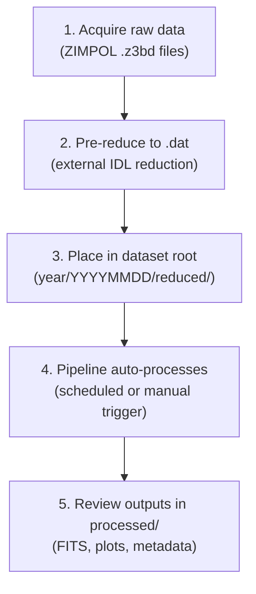

# Quick Start

This guide walks you through a minimal working example of the IRSOL Data Pipeline — from processing a single measurement to running the full automated pipeline.

## Processing a Single Measurement

The fastest way to see the pipeline in action is to process a single `.dat` file using the bundled entrypoint script:

```bash
uv run entrypoints/process_single_measurement.py /path/to/6302_m1.dat /path/to/ff6302_m1.dat
```

This performs the complete 8-step pipeline:

1. Loads the measurement and flat-field `.dat` files.
2. Analyzes the flat-field (dust-flat + smile correction parameters).
3. Applies the flat-field correction.
4. Runs wavelength auto-calibration.
5. Writes a corrected FITS file.
6. Writes processing metadata.
7. Generates profile plots.

### Expected Output Files

After processing `6302_m1.dat`, you should see:

```
6302_m1_corrected.fits             # Corrected Stokes I, Q/I, U/I, V/I
6302_m1_metadata.json              # Processing metadata
6302_m1_profile_original.png       # Profile plot (before correction)
6302_m1_profile_corrected.png      # Profile plot (after correction)
6302_m1_flat_field_correction_data.pkl  # Cached correction data
```

## Generating a Stokes Profile Plot

Use the CLI to render a profile plot from any measurement file:

```bash
# From a raw .dat file
uv run idp plot profile /path/to/6302_m1.dat --output-path profile.png

# From a corrected FITS file
uv run idp plot profile /path/to/6302_m1_corrected.fits --output-path profile.png

# Display interactively
uv run idp plot profile /path/to/6302_m1.dat --show
```

## Generating a Slit Context Image

Render a six-panel SDO context image showing where the slit was positioned on the solar disc:

```bash
uv run idp plot slit /path/to/6302_m1.dat user@example.com --output-path slit.png
```

> **Note:** This requires a JSOC-registered email for SDO data retrieval, and an internet connection.

## Running the Full Pipeline with Prefect

### Step 1 — Set Up the Dataset

Organize your data following the standard directory convention:

```
/data/observations/
└── 2025/
    └── 20250312/
        ├── raw/               # Original camera data
        ├── reduced/           # Pre-reduced ZIMPOL .dat files
        │   ├── 6302_m1.dat
        │   ├── ff6302_m1.dat
        │   └── ...
        └── processed/         # (created by pipeline)
```

### Step 2 — Configure Prefect

If you are the user who **runs the server** (maintainer), configure the full server profile first:

```bash
idp configure
```
This sets up the Prefect server profile and prompts you to confirm the database path and API port.

Now you can start the server:

```bash
idp prefect start
```

Then configure the pipeline variables:

```bash
idp prefect variables configure
```

Check the server status and variable values:

```bash
idp prefect status
idp prefect variables list
idp info
```

If you are a **regular user** connecting to an already-running server, point your client at it:

```bash
idp setup
```

You can now try to check you connection via:
```bash
idp prefect status
```

When prompted, provide:

- **data-root-path**: `/data/observations` (your dataset root)
- **jsoc-email**: your JSOC-registered email
- **jsoc-data-delay-days**: `14` (only process observation days at least 14 days old)
- **cache-expiration-hours**: `672` (28 days, or customize)
- **flow-run-expiration-hours**: `672` (28 days, or customize)

### Step 3 — Serve the Flows

Start the flow runners in separate terminals (or as systemd services):

```bash
# Terminal 1: Flat-field correction
uv run idp -v prefect flows serve flat-field-correction

# Terminal 2: Slit image generation
uv run idp -v prefect flows serve slit-images

# Terminal 3: Maintenance (cache cleanup)
uv run idp -v prefect flows serve maintenance
```

### Step 4 — Monitor

Open the Prefect dashboard at [http://127.0.0.1:4200](http://127.0.0.1:4200) to:

- View scheduled and running flows.
- Inspect individual task results.
- Manually trigger runs.

### Step 5 — Manually Trigger a Run (Optional)

Use the Prefect dashboard at [http://127.0.0.1:4200/deployments](http://127.0.0.1:4200/deployments) to manually trigger a run. Select a deployment and click **Run** — optionally overriding parameters such as `day_path`.

## Typical Workflow



## What to Check

After a pipeline run, verify the outputs:

```bash
# List corrected FITS files
find /data/observations/2025/20250312/processed -name '*_corrected.fits'

# Check for errors
find /data/observations/2025/20250312/processed -name '*_error.json'

# View processing metadata
cat /data/observations/2025/20250312/processed/6302_m1_metadata.json
```

## Related Documentation

- [Installation](installation.md) — setup and dependencies
- [CLI Usage](../cli/cli_usage.md) — full command reference
- [Pipeline Overview](../pipeline/pipeline_overview.md) — detailed processing steps
- [Architecture](../overview/architecture.md) — system design
