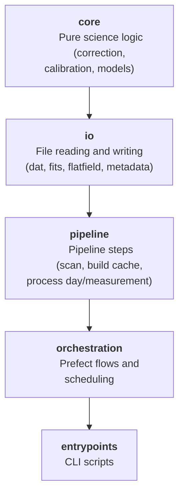

# Repository Architecture

## Layout

```text
irsol-data-pipeline/
├── data/                          # Local dataset root for development and testing
├── documentation/                 # Thematic documentation pages
├── entrypoints/                   # Thin executable scripts (CLI and deployment bootstrap)
│   ├── serve_flat_field_correction_pipeline.py   # Start Prefect processing deployments
│   ├── serve_prefect_maintenance.py              # Start Prefect maintenance deployment
│   ├── serve_slit_image_pipeline.py               # Start slit-image Prefect deployments
│   ├── process_single_measurement.py             # Process one .dat file from a terminal
│   └── plot_fits_profile.py                      # Visualise a processed FITS file
│
├── src/irsol_data_pipeline/
│   ├── core/                      # Scientific logic — no I/O, no orchestration
│   │   ├── models.py              # All shared data types (Pydantic models)
│   │   ├── config.py              # Shared constants and defaults
│   │   ├── correction/
│   │   │   ├── analyzer.py        # Analyse a flat-field → produces correction artefacts
│   │   │   └── corrector.py       # Apply the correction to a measurement
│   │   └── calibration/
│   │       ├── autocalibrate.py   # Wavelength calibration logic
│   │       └── refdata/           # Bundled reference solar spectra (.npy files)
│   │
│   ├── io/                        # File reading and writing — no science logic
│   │   ├── dat/
│   │   │   └── importer.py        # Read .dat/.sav → StokesParameters + info array
│   │   ├── fits/
│   │   │   ├── exporter.py        # Write StokesParameters → .fits
│   │   │   └── importer.py        # Read .fits → StokesParameters + CalibrationResult
│   │   ├── flatfield/
│   │   │   ├── exporter.py        # Serialise FlatFieldCorrection to .pkl
│   │   │   └── importer.py        # Load FlatFieldCorrection from .pkl
│   │   └── processing_metadata/
│   │       └── exporter.py        # Write *_metadata.json and *_error.json
│   │
│   ├── pipeline/                  # Orchestration of scientific steps (no Prefect dependency)
│   │   ├── filesystem.py          # Dataset discovery + canonical path helpers
│   │   ├── scanner.py             # Find observation days with pending measurements
│   │   ├── flatfield_cache.py     # Build and query the flat-field correction cache
│   │   ├── day_processor.py       # Process all measurements in one observation day
│   │   └── measurement_processor.py  # Process a single measurement end-to-end
│   │
│   ├── orchestration/             # Prefect-specific wiring (flows, decorators, logging)
│   │   ├── decorators.py          # Conditional @task/@flow (no-ops without PREFECT_ENABLED)
│   │   ├── patch_logging.py       # Forward loguru logs to Prefect's run logger
│   │   ├── retry.py               # Retry helper for Prefect tasks
│   │   ├── utils.py               # Prefect artifact helpers
│   │   └── flows/
│   │       ├── flat_field_correction.py   # Main flat-field correction flows
│   │       ├── slit_image_generation.py   # Main slit-image generation flows
│   │       ├── tags.py                    # Shared deployment tag enums
│   │       └── maintenance/
│   │           ├── delete_old_prefect_data.py # Prefect run-history cleanup flow
│   │           └── delete_old_cache_files.py  # processed/_cache and _sdo_cache cleanup flows
│   │
│   ├── plotting/
│   │   └── profile.py             # Matplotlib Stokes profile plots
│   ├── exceptions.py              # All custom exception types
│   ├── logging_config.py          # Loguru configuration
│   └── version.py                 # Package version string
│
├── tests/unit/                    # Pytest unit tests
├── pyproject.toml
├── Makefile
└── README.md
```

## Layered architecture

The codebase is deliberately split into four independent layers — you can use lower layers without knowing anything about higher ones:



> **Key design rule**: The `core/` and `io/` layers have no knowledge of Prefect or the pipeline structure.
> This means you can import and call them directly as plain Python functions — no Prefect context required.

See [library-usage.md](library-usage.md) for practical examples of using each layer independently.
