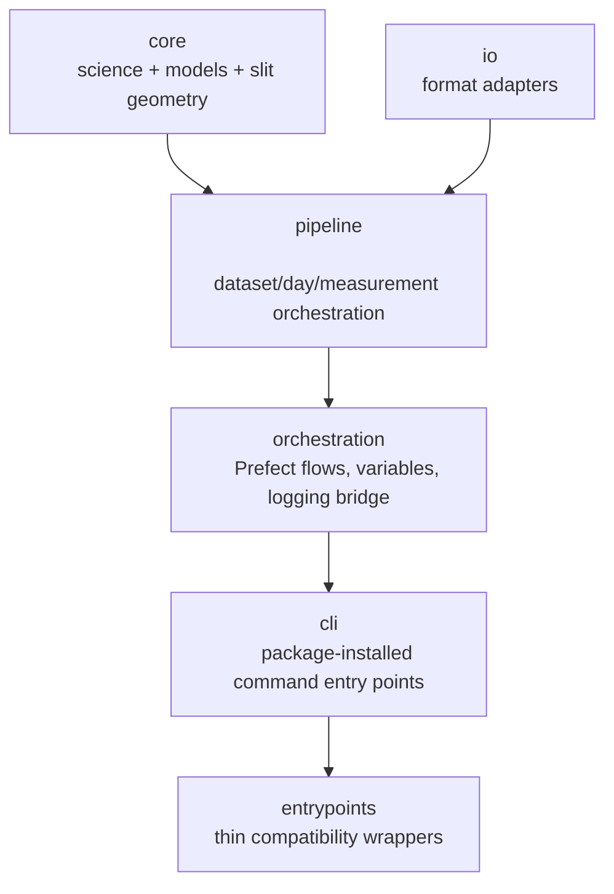

# Repository Architecture

## Design Goals

- Keep scientific logic reusable without orchestration runtime.
- Isolate I/O formats from science algorithms.
- Keep Prefect concerns inside `orchestration/`, with package-installed command implementations in `cli/`.

## High-Level Structure



## Source Tree (Current)

```text
src/irsol_data_pipeline/
├── core/
│   ├── config.py
│   ├── models.py
│   ├── calibration/
│   │   ├── autocalibrate.py
│   │   └── refdata/
│   ├── correction/
│   │   ├── analyzer.py
│   │   └── corrector.py
│   └── slit_images/
│       ├── config.py
│       ├── coordinates.py
│       ├── solar_data.py
│       └── z3readbd.py
├── io/
│   ├── dat/importer.py
│   ├── fits/{importer.py, exporter.py}
│   ├── flatfield/{importer.py, exporter.py}
│   └── processing_metadata/{importer.py, exporter.py}
├── pipeline/
│   ├── filesystem.py
│   ├── scanner.py
│   ├── flatfield_cache.py
│   ├── measurement_processor.py
│   ├── day_processor.py
│   ├── slit_images_processor.py
│   └── cache_cleanup.py
├── orchestration/
│   ├── decorators.py
│   ├── patch_logging.py
│   ├── retry.py
│   ├── utils.py
│   ├── variables.py
│   └── flows/
│       ├── flat_field_correction.py
│       ├── slit_image_generation.py
│       ├── tags.py
│       └── maintenance/
│           ├── delete_old_prefect_data.py
│           └── delete_old_cache_files.py
├── cli/
│   ├── bootstrap_variables.py
│   ├── dashboard.py
│   ├── serve_flat_field_correction.py
│   ├── serve_maintenance.py
│   └── serve_slit_images.py
├── plotting/
│   ├── profile.py
│   └── slit.py
├── exceptions.py
├── logging_config.py
└── version.py
```

## Command Layout

- `src/irsol_data_pipeline/cli/` contains the real implementation for package-installed commands such as `irsol-dashboard` and the Prefect serve commands.
- `entrypoints/` remains in the repository for local development convenience and backwards compatibility with existing `uv run entrypoints/...` usage.
- The files in `entrypoints/` are thin wrappers that delegate to the corresponding modules in `src/irsol_data_pipeline/cli/`.

## Execution Paths

| Path | Trigger | Main modules |
|---|---|---|
| Single measurement | `entrypoints/process_single_measurement.py` | `pipeline/measurement_processor.py`, `core/correction`, `core/calibration`, `io/fits` |
| Flat-field batch | Prefect flow `ff-correction-full` / `ff-correction-daily` | `orchestration/flows/flat_field_correction.py`, `pipeline/day_processor.py` |
| Slit preview batch | Prefect flow `slit-images-full` / `slit-images-daily` | `orchestration/flows/slit_image_generation.py`, `pipeline/slit_images_processor.py` |
| Maintenance | Prefect flow `maintenance-cleanup` / `maintenance-cache-cleanup` | `orchestration/flows/maintenance/*`, `pipeline/cache_cleanup.py` |

## Boundaries

- `core/` has no file-format policy and no scheduling policy.
- `io/` does not perform scientific transformations.
- `pipeline/` contains process logic but no Prefect deployment definitions.
- `orchestration/` owns flow wiring and deployment construction.
- `cli/` owns package-installed command implementations for serving, dashboard startup, and Prefect variable bootstrapping.
- `entrypoints/` exposes thin compatibility shims over `cli/` for repository-local execution.

For direct Python usage patterns, see [library-usage.md](library-usage.md).
