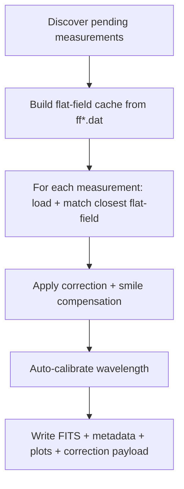

# Flat-Field Correction Pipeline

This is the main scientific pipeline. It converts reduced ZIMPOL measurements into calibrated Stokes FITS products.

## Processing Graph



## Inputs

| Type | Pattern | Notes |
|---|---|---|
| Measurement | `<wavelength>_m<id>.dat` | Read from `reduced/` |
| Flat-field | `ff<wavelength>_m<id>.dat` | Analyzed and cached under `processed/_cache/` |

## Outputs Per Measurement

| File | Purpose |
|---|---|
| `*_corrected.fits` | Corrected Stokes arrays + calibration headers |
| `*_flat_field_correction_data.pkl` | Persisted correction object |
| `*_metadata.json` | Processing metadata summary |
| `*_profile_corrected.png` | Corrected Stokes visualization |
| `*_profile_original.png` | Original Stokes visualization |
| `*_error.json` | Present only on failure |

## Idempotency

Skip condition: output already contains `*_corrected.fits` or `*_error.json`.

## Local Non-Prefect CLI

```bash
uv run entrypoints/process_single_measurement.py /path/to/reduced/6302_m1.dat
uv run entrypoints/plot_fits_profile.py /path/to/processed/6302_m1_corrected.fits
```

## Prefect Deployments

| Flow / deployment | Schedule |
|---|---|
| `ff-correction-full/flat-field-correction-full` | Daily 01:00 |
| `ff-correction-daily/flat-field-correction-daily` | On demand |

For serve and run commands, and parameter resolution policy, see [running.md](running.md).
