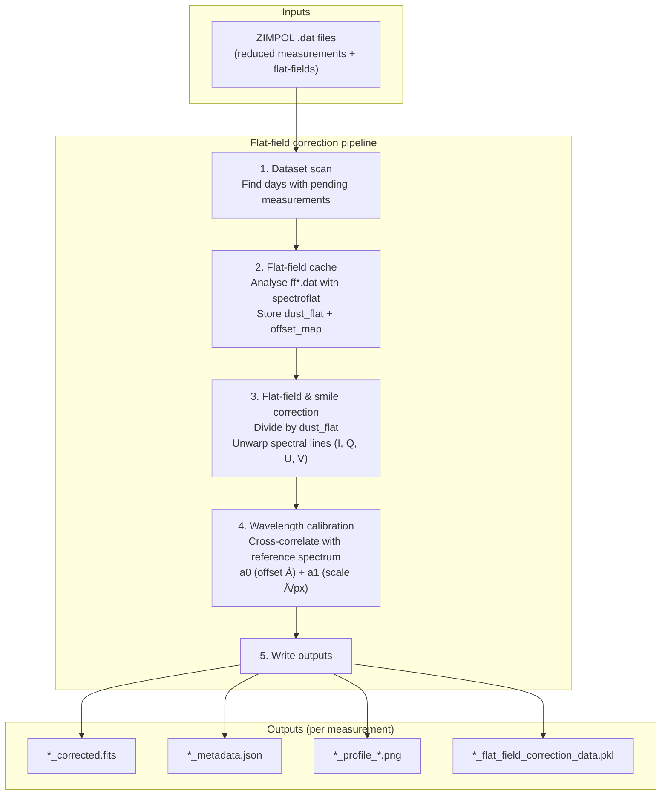
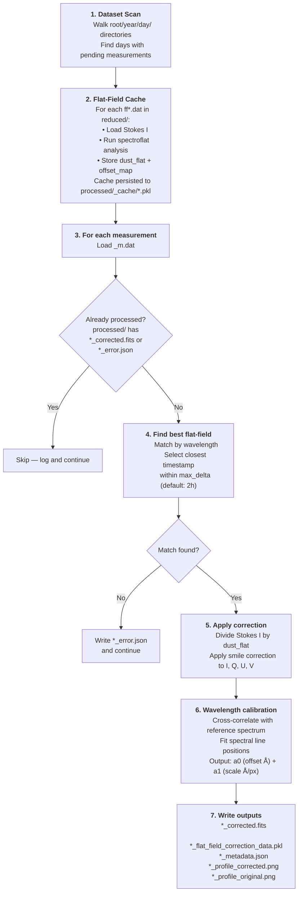

# Flat-Field Correction Pipeline

The flat-field correction pipeline is the main scientific pipeline. It turns raw ZIMPOL reduced `.dat` measurements into calibrated Stokes FITS files by applying flat-field correction, smile correction, and wavelength auto-calibration.

## What it does



## Dataset layout

The pipeline expects data organised like this:

```text
<root>/
└── 2025/
    └── 20250312/            ← observation day
        ├── raw/             ← raw camera files (not read by this pipeline)
        ├── reduced/         ← input files for this pipeline
        │   ├── 6302_m1.dat  ← measurement (wavelength 6302 Å, measurement id 1)
        │   ├── 6302_m2.dat
        │   ├── ff6302_m1.dat ← flat-field for wavelength 6302 Å
        │   └── ff6302_m2.dat
        └── processed/       ← output directory (created automatically)
```

**File naming conventions in `reduced/`:**
- Measurements: `<wavelength>_m<id>.dat` — e.g. `6302_m1.dat`
- Flat-fields: `ff<wavelength>_m<id>.dat` — e.g. `ff6302_m1.dat`
- Files starting with `cal` or `dark` are silently ignored.

## Step-by-step walkthrough



## Output files

For a source file `6302_m1.dat`, the pipeline produces inside `processed/`:

| File | Description |
|---|---|
| `6302_m1_corrected.fits` | Multi-extension FITS with four Stokes images (I, Q/I, U/I, V/I) and calibration headers |
| `6302_m1_flat_field_correction_data.pkl` | Serialised `FlatFieldCorrection` — can be reloaded to inspect or reapply the correction |
| `6302_m1_metadata.json` | Processing summary: timestamps, flat-field used, calibration values |
| `6302_m1_profile_corrected.png` | Plot of all four Stokes components after correction |
| `6302_m1_profile_original.png` | Plot of all four Stokes components before correction |
| `6302_m1_error.json` | Written **only** if processing fails — contains the error message |

Flat-field analysis cache files are stored separately under `processed/_cache/`:

| File | Description |
|---|---|
| `ff6302_m1_correction_cache.pkl` | Cached `FlatFieldCorrection` — reused across pipeline runs to avoid re-analysing flat-fields |

## Idempotency

The pipeline is **idempotent**: re-running it on a day that already has `*_corrected.fits` or `*_error.json` files will simply skip those measurements. To re-process a measurement, delete its output files from `processed/`.


## Running

### Process a single measurement (CLI)

The fastest way — no Prefect server required:

```bash
uv run entrypoints/process_single_measurement.py /path/to/reduced/6302_m1.dat
```

With explicit options:

```bash
uv run entrypoints/process_single_measurement.py /path/to/reduced/6302_m1.dat \
    --flatfield-dir /path/to/reduced \   # default: same directory as the measurement
    --output-dir    /path/to/processed \ # default: ../processed relative to reduced/
    --max-delta-hours 2.0 \              # default: 2.0
    --verbose                            # enable DEBUG logs
```

### Visualise a processed FITS file

```bash
uv run entrypoints/plot_fits_profile.py /path/to/processed/6302_m1_corrected.fits

# Save to a custom path
uv run entrypoints/plot_fits_profile.py /path/to/6302_m1_corrected.fits \
    --output /path/to/my_plot.png
```

The plot shows all four Stokes components (I, Q/I, U/I, V/I) as 2D images. When wavelength calibration is available in the FITS headers, the x-axis shows wavelengths in Ångström instead of pixel numbers.

### Run with Prefect

**Step 1 — Start the Prefect server:**

```bash
make prefect/dashboard
# Server starts at http://127.0.0.1:4200
```

**Step 2 — Serve the deployments:**

```bash
make prefect/serve-flat-field-correction-pipeline
```

This registers two deployments:

| Deployment name | Schedule | What it does |
|---|---|---|
| `run-flat-field-correction-pipeline` | Daily at 01:00 | Scans the whole dataset and processes all pending measurements |
| `run-daily-flat-field-correction-pipeline` | On demand | Processes a single observation day directory |

**Trigger a run manually:**

From the UI at `http://127.0.0.1:4200` → **Deployments** → select deployment → **Quick Run** or **Custom Run**.

From the CLI:

```bash
# Full dataset
uv run prefect deployment run 'process-unprocessed-measurements/run-flat-field-correction-pipeline'

# Single day
uv run prefect deployment run \
    'process-unprocessed-daily-measurements/run-daily-flat-field-correction-pipeline' \
    --param day_path=/path/to/data/2025/20250312
```

**Runtime parameters:**

| Parameter | Default | Description |
|---|---|---|
| `root` | `<repo>/data` | Dataset root path |
| `max_delta_hours` | `2.0` | Maximum flat-field time gap in hours |
| `max_concurrent_days_to_process` | CPU count − 1 (max 12) | How many days to process in parallel |
| `day_path` | *(required for daily flow)* | Path to a single observation day directory |
