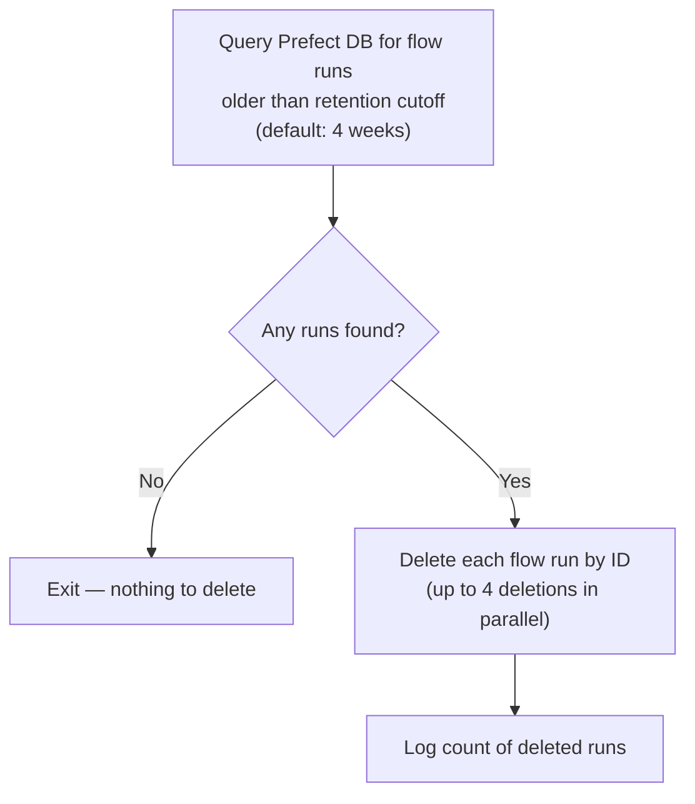

# Prefect Maintenance Pipeline

The maintenance pipeline is a housekeeping flow that deletes old Prefect flow run history. It keeps the local Prefect database small and prevents unbounded growth over time.

## What it does



The retention window is configurable. The default is 672 hours (4 weeks).

When `interactive=True` (useful for manual CLI runs), it prints the list of run IDs and asks for confirmation before deleting.

## Output

No files are written. The flow modifies the Prefect internal database only.


## Running

### Run with Prefect

**Step 1 — Start the Prefect server:**

```bash
make prefect/dashboard
```

**Step 2 — Serve the maintenance deployment:**

```bash
make prefect/serve-maintenance-pipeline
```

This registers one deployment:

| Deployment name | Schedule | What it does |
|---|---|---|
| `delete-old-prefect-flow-runs` | Daily at 00:00 | Deletes flow runs older than the retention window |

**Trigger a run manually:**

From the UI at `http://127.0.0.1:4200` → **Deployments** → `delete-old-prefect-flow-runs` → **Quick Run**.

From the CLI:

```bash
uv run prefect deployment run 'delete-flow-runs-older-than/delete-old-prefect-flow-runs'
```

**Runtime parameters:**

| Parameter | Default | Description |
|---|---|---|
| `hours` | `672` | Retention window in hours (672 h = 4 weeks) |
| `interactive` | `false` | If `true`, ask for confirmation before deleting (useful in CLI) |

### Changing the retention window

Override `hours` at run time from the UI or CLI, or edit the default in `entrypoints/serve_prefect_maintenance.py`:

```python
delete_old_prefect_data_deployment = delete_flow_runs_older_than.to_deployment(
    name="delete-old-prefect-flow-runs",
    parameters={"hours": 24 * 7 * 2, "interactive": False},  # 2 weeks
    ...
)
```
