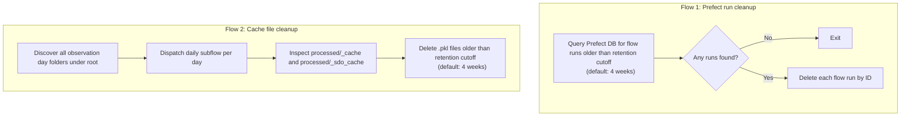

# Prefect Maintenance Pipeline

The maintenance pipeline provides housekeeping flows for:

- deleting old Prefect flow run history;
- deleting stale cache ``.pkl`` files in day-level processed cache folders.

This keeps both the local Prefect database and the on-disk cache footprint bounded over time.

## What it does



The retention window is configurable. The default is 672 hours (4 weeks) for both flows.

When `interactive=True` (useful for manual CLI runs), it prints the list of run IDs and asks for confirmation before deleting.

## Output

The maintenance flows:

- modify Prefect internal database state (run-history cleanup);
- delete stale cache files from day-level ``processed/_cache`` and ``processed/_sdo_cache`` folders.


## Running

### Run with Prefect

**Step 1 — Start the Prefect server:**

```bash
make prefect/dashboard
```

**Step 2 — Serve the maintenance deployment:**

```bash
make prefect/serve-maintenance-pipeline
```

This registers two deployments:

| Deployment name | Schedule | What it does |
|---|---|---|
| `maintenance-cleanup/cleanup` | Daily at 00:00 | Deletes flow runs older than the retention window |
| `maintenance-cache-cleanup/cache-cleanup` | Daily at 00:30 | Deletes stale `.pkl` files in `processed/_cache` and `processed/_sdo_cache` |

**Trigger a run manually:**

From the UI at `http://127.0.0.1:4200` → **Deployments** → `maintenance-cleanup/cleanup` → **Quick Run**.

From the CLI:

```bash
uv run prefect deployment run 'maintenance-cleanup/cleanup'
uv run prefect deployment run 'maintenance-cache-cleanup/cache-cleanup'
```

**Runtime parameters:**

`maintenance-cleanup/cleanup`

| Parameter | Default | Description |
|---|---|---|
| `hours` | `672` | Retention window in hours (672 h = 4 weeks) |
| `interactive` | `false` | If `true`, ask for confirmation before deleting (useful in CLI) |

`maintenance-cache-cleanup/cache-cleanup`

| Parameter | Default | Description |
|---|---|---|
| `root` | `<repo>/data` | Dataset root to scan (`<root>/<year>/<day>`) |
| `hours` | `672` | Delete only `.pkl` cache files older than this retention window |

### Changing the retention window

Override `hours` at run time from the UI or CLI, or edit defaults in `entrypoints/serve_prefect_maintenance.py`:

```python
delete_old_prefect_data_deployment = delete_flow_runs_older_than.to_deployment(
    name="cleanup",
    parameters={"hours": 24 * 7 * 2, "interactive": False},  # 2 weeks
    ...
)

delete_old_cache_files_deployment = delete_old_cache_files.to_deployment(
    name="cache-cleanup",
    parameters={"root": str(root_path / "data"), "hours": 24 * 7 * 2},
    ...
)
```
