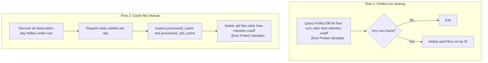

# Prefect Maintenance Pipeline

The maintenance pipeline provides housekeeping flows for:

- deleting old Prefect flow run history;
- deleting stale cache ``.pkl`` files in day-level processed cache folders.

This keeps both the local Prefect database and the on-disk cache footprint bounded over time.

## What it does



Retention windows are runtime-configurable. If `hours` is omitted when triggering a run, maintenance flows resolve it from Prefect Variables:

- `flow-run-expiration-hours` for Prefect run-history cleanup.
- `cache-expiration-hours` for cache file cleanup.


## Output

The maintenance flows:

- modify Prefect internal database state (run-history cleanup);
- delete stale cache files from day-level ``processed/_cache`` and ``processed/_sdo_cache`` folders.


## Running

### Run with Prefect

**Step 1 — Start the Prefect server:**

```bash
make prefect/dashboard
```

**Step 2 — Serve the maintenance deployment:**

```bash
make prefect/serve-maintenance-pipeline
```

This registers two deployments:

| Deployment name | Schedule | What it does |
|---|---|---|
| `maintenance-cleanup/cleanup` | Daily at 00:00 | Deletes flow runs older than the retention window |
| `maintenance-cache-cleanup/cache-cleanup` | Daily at 00:30 | Deletes stale `.pkl` files in `processed/_cache` and `processed/_sdo_cache` |

**Trigger a run manually:**

From the UI at `http://127.0.0.1:4200` → **Deployments** → `maintenance-cleanup/cleanup` → **Quick Run**.

From the CLI:

```bash
uv run prefect deployment run 'maintenance-cleanup/cleanup'
uv run prefect deployment run 'maintenance-cache-cleanup/cache-cleanup'
```

**Runtime parameters:**

`maintenance-cleanup/cleanup`

| Parameter | Source | Description |
|---|---|---|
| `hours` | Run parameter or Prefect Variable `flow-run-expiration-hours` | Retention window in hours used to delete old Prefect flow runs |

`maintenance-cache-cleanup/cache-cleanup`

| Parameter | Source | Description |
|---|---|---|
| `root` | Run parameter | Dataset root to scan (`<root>/<year>/<day>`) |
| `hours` | Run parameter or Prefect Variable `cache-expiration-hours` | Delete only `.pkl` cache files older than this retention window |

### Changing retention windows

Use one of these two mechanisms:

1. Set or update Prefect Variables (`flow-run-expiration-hours`, `cache-expiration-hours`) for baseline values.
2. Override `hours` for a specific run from the UI or CLI.

To bootstrap or refresh baseline values:

```bash
uv run entrypoints/bootstrap_variables.py
```
