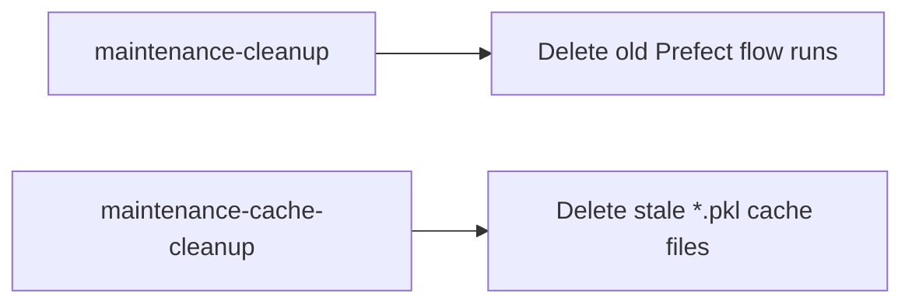

# Prefect Maintenance Pipeline

Maintenance is split into two flows.



## Deployments and Schedules

| Flow / deployment | Schedule | Runtime parameter fallback |
|---|---|---|
| `maintenance-cleanup/prefect-run-cleanup` | Daily 00:00 | `hours` -> `flow-run-expiration-hours` |
| `maintenance-cache-cleanup/cache-cleanup` | Daily 00:30 | `hours` -> `cache-expiration-hours` |

## Scope of Cache Cleanup

- Scans day-level `processed/_cache` and `processed/_sdo_cache`.
- Deletes only stale `*.pkl` files.
- Current SDO files are FITS-based; they are not removed by this flow.

## Manual Trigger (CLI)

```bash
uv run prefect deployment run 'maintenance-cleanup/prefect-run-cleanup'
uv run prefect deployment run 'maintenance-cache-cleanup/cache-cleanup'
```

For serve commands and variable bootstrap, see [running.md](running.md).
