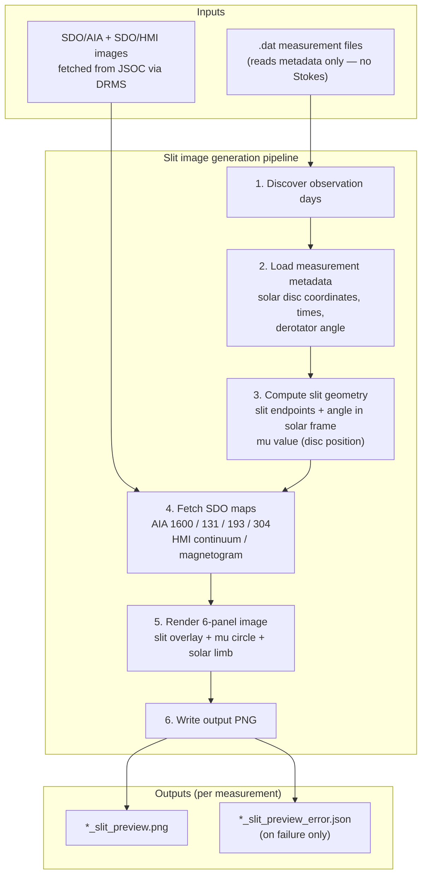

# Slit Image Generation Pipeline

The slit image generation pipeline produces 6-panel solar context images for each measurement. It overlays the spectrograph slit position on simultaneous SDO/AIA and SDO/HMI images fetched from the JSOC archive, giving observers a spatial context for where on the sun the measurement was taken.

## What it does



## Prerequisites

A JSOC email address is required to query the DRMS service. Register for free at [http://jsoc.stanford.edu/ajax/register_email.html](http://jsoc.stanford.edu/ajax/register_email.html).

Set it as the Prefect Variable `jsoc-email` before serving the deployments:

```bash
uv run entrypoints/bootstrap_variables.py
make prefect/serve-slit-image-pipeline
```

You can also pass `jsoc_email` explicitly as a flow parameter when triggering a run. If omitted, the flow resolves `jsoc_email` from the Prefect Variable `jsoc-email`.

## Processing steps

For each measurement in an observation day:

1. **Load measurement metadata** — reads the `.dat` info array for solar disc coordinates (`solar_x`, `solar_y`), observation times, and derotator configuration. Measurements without solar disc coordinates are skipped with an error.

2. **Compute slit geometry** — transforms the slit center position from the instrument frame to the solar frame using the derotator angle and coordinate system; computes slit endpoints and the mu value (limb position parameter).

3. **Fetch SDO data** — queries JSOC DRMS for the six SDO images closest to the observation midpoint:
   - AIA 1600 Å (chromosphere)
   - AIA 131 Å (flare plasma)
   - AIA 193 Å (corona)
   - AIA 304 Å (chromosphere/transition region)
   - HMI continuum (photosphere intensity)
   - HMI magnetogram (line-of-sight magnetic field)

   Downloaded FITS files are cached under `processed/_sdo_cache/` and reused on subsequent runs.

4. **Render the 6-panel image** — draws a 2×3 grid with each SDO panel cropped to a field of view centred on the slit, with overlays for:
   - The spectrograph slit (coloured line)
   - The +Q polarisation direction (if derotator offset is available)
   - The mu iso-contour circle
   - The solar limb

5. **Write outputs** — saves the PNG to `processed/`. If any step fails, writes a `*_slit_preview_error.json` instead.

## Output files

For a source file `6302_m1.dat`, the pipeline produces inside `processed/`:

| File | Description |
|---|---|
| `6302_m1_slit_preview.png` | 6-panel SDO context image with slit overlay |
| `6302_m1_slit_preview_error.json` | Written **only** on failure — contains the error message |

SDO FITS cache files live separately under `processed/_sdo_cache/`.

## Idempotency

The pipeline skips measurements that already have a `*_slit_preview.png` or `*_slit_preview_error.json` in `processed/`. Delete those files to re-run a measurement.


## Running

### Run with Prefect

**Step 1 — Start the Prefect server:**

```bash
make prefect/dashboard
# Server starts at http://127.0.0.1:4200
```

**Step 2 — Serve the deployments:**

```bash
make prefect/serve-slit-image-pipeline
```

This registers two deployments:

| Deployment name | Schedule | What it does |
|---|---|---|
| `slit-images-full/slit-images-full` | Daily at 04:00 | Scans the whole dataset and generates slit images for all days |
| `slit-images-daily/slit-images-daily` | On demand | Generates slit images for a single observation day |

**Trigger a run manually:**

From the UI at `http://127.0.0.1:4200` → **Deployments** → select deployment → **Quick Run** or **Custom Run**.

From the CLI:

```bash
# Full dataset
uv run prefect deployment run 'slit-images-full/slit-images-full'

# Single day
uv run prefect deployment run \
    'slit-images-daily/slit-images-daily' \
    --param day_path=/path/to/data/2025/20250312
```

**Runtime parameters:**

| Parameter | Source | Description |
|---|---|---|
| `root` | Run parameter | Dataset root path |
| `jsoc_email` | Run parameter or Prefect Variable `jsoc-email` | JSOC email used for DRMS queries |
| `use_limbguider` | Run parameter | Use limbguider coordinates instead of solar disc coordinates |
| `max_concurrent_days` | Run parameter | Concurrent day tasks (lower than flat-field pipeline due to network I/O) |
| `day_path` | Run parameter (required for daily flow) | Path to a single observation day directory |
