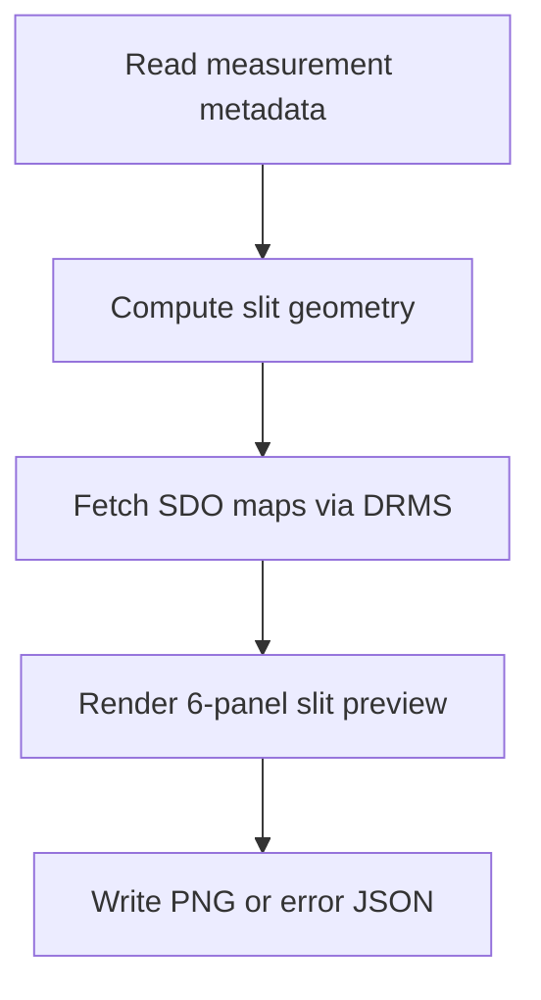

# Slit Image Generation Pipeline

This pipeline generates per-measurement slit preview images by combining measurement metadata with SDO images fetched from JSOC.

## Processing Graph

## Prerequisite

JSOC access email is required (`jsoc_email` parameter or Prefect Variable `jsoc-email`).

## Outputs Per Measurement

| File | Purpose |
|---|---|
| `*_slit_preview.png` | Rendered 6-panel context image |
| `*_slit_preview_error.json` | Present only on failure |

Cache:
- SDO downloads are cached under `processed/_sdo_cache/` as FITS files.

## Idempotency

Skip condition: `*_slit_preview.png` or `*_slit_preview_error.json` already exists.

## Prefect Deployments

| Flow / deployment | Schedule |
|---|---|
| `slit-images-full/slit-images-full` | Daily 04:00 |
| `slit-images-daily/slit-images-daily` | On demand |

For serve/run commands and runtime parameter policy, see [running.md](running.md).
