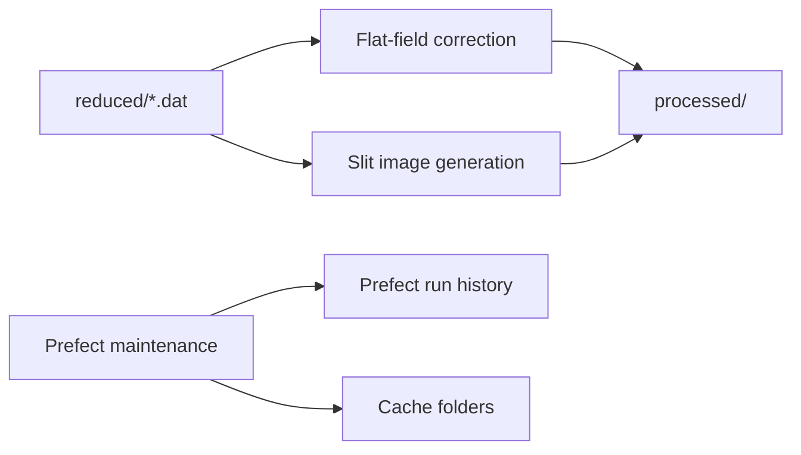

# Pipelines Overview

This project provides three independent pipelines over the same dataset root.



## Pipeline Matrix

| Pipeline | Input | Main output | Schedules |
|---|---|---|---|
| Flat-field correction | Measurement `.dat` + `ff*.dat` | `*_corrected.fits`, metadata, profile plots | Daily full run + on-demand daily run |
| Slit image generation | Measurement `.dat` metadata + JSOC/SDO data | `*_slit_preview.png` | Daily full run + on-demand daily run |
| Maintenance | Prefect DB + cache directories | Deleted old flow runs and stale cache files | Daily cleanup jobs |

## Shared Dataset Contract

```text
<root>/<year>/<day>/
├── raw/
├── reduced/
│   ├── <wavelength>_m<id>.dat
│   └── ff<wavelength>_m<id>.dat
└── processed/
```

Rules:
- Measurement pattern: `<wavelength>_m<id>.dat`
- Flat-field pattern: `ff<wavelength>_m<id>.dat`
- `cal*` and `dark*` are ignored during measurement discovery.

## Idempotency Model

| Pipeline | Skip condition |
|---|---|
| Flat-field correction | `*_corrected.fits` or `*_error.json` already exists |
| Slit image generation | `*_slit_preview.png` or `*_slit_preview_error.json` already exists |

Reprocessing is file-based: delete the corresponding output(s) under `processed/` and run again.

## Related Pages

- [pipeline-flat-field-correction.md](pipeline-flat-field-correction.md)
- [pipeline-slit-image-generation.md](pipeline-slit-image-generation.md)
- [pipeline-maintenance.md](pipeline-maintenance.md)
- [running.md](running.md)
