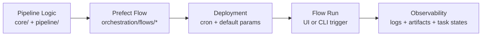

# Prefect Introduction

## What Prefect Is

Prefect is the orchestration layer used to run pipeline logic as managed flows and tasks.

In this codebase, scientific logic remains in `core/` and `pipeline/`, while Prefect concerns (flow wiring, deployment schedules, runtime variables, and reports) live in `orchestration/` and `entrypoints/`.



## Why It Was Chosen

| Need | How Prefect Helps |
|---|---|
| Schedule management | Deployments run on cron schedules without custom scheduler code |
| Retry management | Task-level retries and delay policies are declarative in decorators |
| Observability | UI exposes flow/task states, logs, and generated artifacts |

## Core Concepts Used Here

| Concept | Meaning in this project |
|---|---|
| Flow | Top-level orchestration unit (`ff-correction-full`, `slit-images-full`, etc.) |
| Task | Smaller unit within flows (scan, process day, fetch maps, cleanup actions) |
| Deployment | Named runnable unit with schedule and default parameters |
| Run parameter | Per-run override passed from UI or CLI |
| Prefect Variable | Dynamic baseline value used when run parameter is not provided |

## Sample: Flow + Task + Retries + Runtime Variables

The sample below shows the same pattern used in this repository:
- task retries for transient failures;
- deployment-level hardcoded defaults;
- per-run parameter override with Prefect Variable fallback;
- artifact and log output for observability.

### 1. Flow module

```python
from __future__ import annotations

from pathlib import Path

from loguru import logger

from irsol_data_pipeline.orchestration.decorators import flow, task
from irsol_data_pipeline.orchestration.patch_logging import setup_logging
from irsol_data_pipeline.orchestration.utils import create_prefect_markdown_report
from irsol_data_pipeline.orchestration.variables import (
    PrefectVariableName,
    get_variable,
)


@task(
    task_run_name="demo/process-day/{day_path.name}",
    retries=2,
    retry_delay_seconds=20,
)
def process_day_task(day_path: Path, jsoc_email: str) -> str:
    logger.info("Processing day", day_path=day_path, jsoc_email=jsoc_email)
    return f"Processed {day_path.name}"


@flow(
    name="demo-pipeline-full",
    flow_run_name="demo/full/{root}",
    description="Demo flow showing defaults, retries, variables, and observability",
)
def demo_pipeline_full(
    root: str,
    jsoc_email: str = "",
) -> list[str]:
    setup_logging()

    email = jsoc_email or get_variable(PrefectVariableName.JSOC_EMAIL, default="")
    if not email:
        logger.error(
            "Missing JSOC email. Pass jsoc_email or set Prefect Variable",
            variable=PrefectVariableName.JSOC_EMAIL.value,
        )
        return []

    # Example static day list for tutorial purposes.
    day_paths = [Path(root) / "2025" / "20250312", Path(root) / "2025" / "20250313"]

    results = [process_day_task(day_path=day_path, jsoc_email=email) for day_path in day_paths]

    create_prefect_markdown_report(
        content="\n".join(["# Demo pipeline summary", "", *[f"- {r}" for r in results]]),
        description="Demo run summary",
    )
    logger.success("Demo pipeline complete", days=len(results))
    return results
```

### 2. Deployment entrypoint with hardcoded defaults

```python
from __future__ import annotations

from pathlib import Path

from prefect import serve

from irsol_data_pipeline.orchestration.flows.demo_pipeline import demo_pipeline_full


def main() -> None:
    root_path = Path(__file__).parent.parent

    deployment = demo_pipeline_full.to_deployment(
        name="demo-pipeline-full",
        parameters={
            # Hardcoded default parameters for scheduled runs.
            "root": str(root_path / "data"),
            "jsoc_email": "",
        },
        cron="0 5 * * *",
        description="Daily demo deployment",
    )

    serve(deployment)


if __name__ == "__main__":
    main()
```

### 3. Trigger behavior

- Scheduled run: uses deployment defaults (`root`) and Prefect Variable fallback (`jsoc-email`) if `jsoc_email` is empty.
- Manual run with override: pass `jsoc_email` or any other parameter from UI/CLI to override defaults.

For real project deployment names and commands, see [running.md](running.md).
