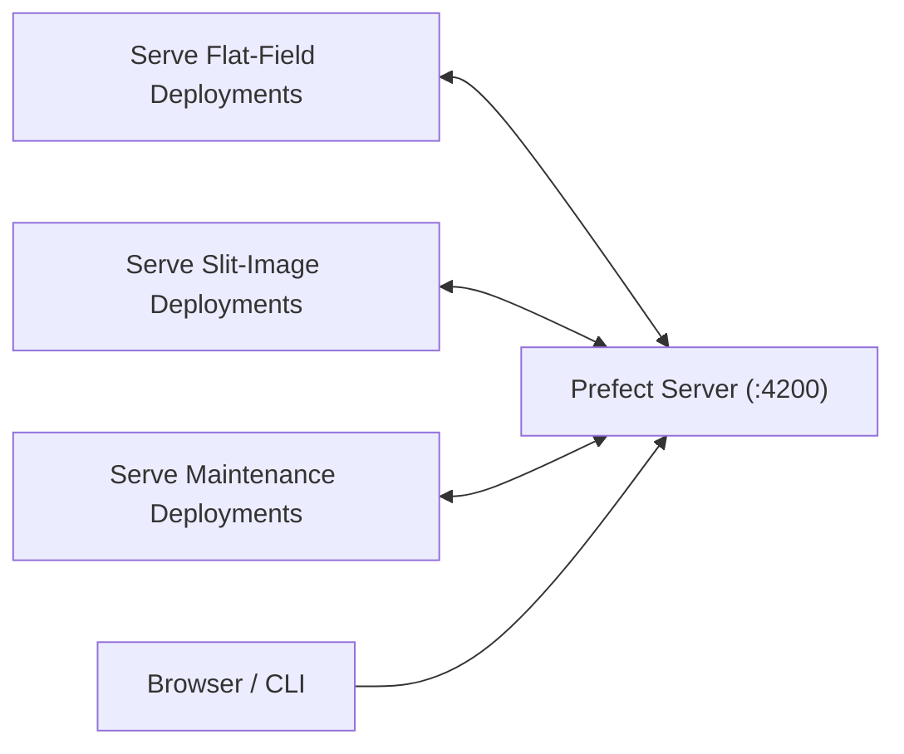

# Managing Prefect in Production

## Process Model

Run these long-lived processes:



Commands:

```bash
make prefect/dashboard
make prefect/serve-flat-field-correction-pipeline
make prefect/serve-slit-image-pipeline
make prefect/serve-maintenance-pipeline
```

## Operational Guidance

- Use `systemd` (preferred) or `screen` to keep processes alive.
- If one serve process is down, its deployments stop executing even if server is running.
- Verify health from `http://<server>:4200/deployments` and `http://<server>:4200/runs`.

## Manual Run Triggers

Use the Deployments page in UI or CLI commands documented in [running.md](running.md).

## Reset Procedure

```bash
make prefect/reset
```

This removes Prefect run history. Restart all serve processes afterward.
