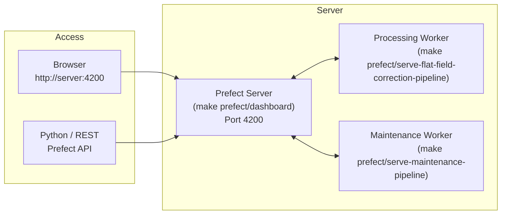

# Managing Prefect Deployments in Production

This page covers what you need to do when the system runs on a server rather than a development laptop.

## Architecture in production

In production, three long-running processes must be kept alive simultaneously:



- **Prefect Server**: stores flow run history, schedules, and artefacts in a local SQLite database.
- **Processing Worker**: serves the `flat-field-correction-full` and `flat-field-correction-daily` deployments.
- **Maintenance Worker**: serves the `cleanup` and `cache-cleanup` deployments.

> The workers contact the Prefect server and poll for scheduled or manually triggered runs. If a worker is stopped, its deployments will not execute even if the server is running.

## Keeping workers alive (systemd or screen)

Use a process manager to keep all three processes running across reboots. Example using `screen`:

```bash
# Terminal 1 — Prefect server
screen -S prefect-server
make prefect/dashboard
# Ctrl+A, D  to detach

# Terminal 2 — Processing worker
screen -S processing-worker
make prefect/serve-flat-field-correction-pipeline
# Ctrl+A, D to detach

# Terminal 3 — Maintenance worker
screen -S maintenance-worker
make prefect/serve-maintenance-pipeline
# Ctrl+A, D to detach
```

For a production setup, prefer `systemd` unit files or a container orchestrator.

## Triggering a run manually

From the UI:
1. Open `http://<server>:4200`.
2. Go to **Deployments**.
3. Select the desired deployment and click **Quick Run** or **Custom Run**.

From the command line (with the Prefect server running):

```bash
# Trigger the full dataset pipeline
uv run prefect deployment run 'ff-correction-full/flat-field-correction-full'

# Trigger a single-day run with a specific day path
uv run prefect deployment run \
    'ff-correction-daily/flat-field-correction-daily' \
    --param day_path=/path/to/data/2025/20250312
```

## Runtime parameter management

Use this policy for dynamic runtime values:

1. Pass a run parameter when you need a one-off override.
2. Otherwise, let the flow resolve from Prefect Variables.

`PREFECT_ENABLED` remains the only supported environment variable for orchestration behavior. It does not carry dynamic runtime parameter values.

Managed Prefect Variables:

| Variable | Used by |
|---|---|
| `jsoc-email` | Slit-image flows (`jsoc_email`) |
| `cache-expiration-hours` | Cache-cleanup maintenance flow (`hours`) |
| `flow-run-expiration-hours` | Run-history cleanup maintenance flow (`hours`) |

Bootstrap or refresh these values with:

```bash
uv run entrypoints/bootstrap_variables.py
```

You can still override any flow parameter from the UI or CLI for an individual run.

## Monitoring and logs

Prefect stores all logs, task states, and run metadata in its local database:

- **Flow run list**: `http://<server>:4200/runs`
- **Deployment list**: `http://<server>:4200/deployments`
- **Task runs for a flow**: click any flow run to expand its task tree and logs

Each processing run also publishes Prefect **artefacts**:
- A markdown scan summary (total measurements, pending counts per day).
- Per-measurement metadata JSON reports.
- Per-measurement error JSON reports when processing fails.

## Resetting Prefect state

If the Prefect database becomes corrupted or you want a clean slate:

```bash
# WARNING: this deletes ALL flow run history
make prefect/reset
```

After resetting, restart all three processes. The workers will re-register their deployments automatically on the next start.

## Scheduled cleanup

The maintenance deployment handles database growth automatically. Its schedule deletes old run history and stale cache files daily. Retention windows are managed through Prefect Variables (`flow-run-expiration-hours` and `cache-expiration-hours`) and can be overridden per run when needed.
