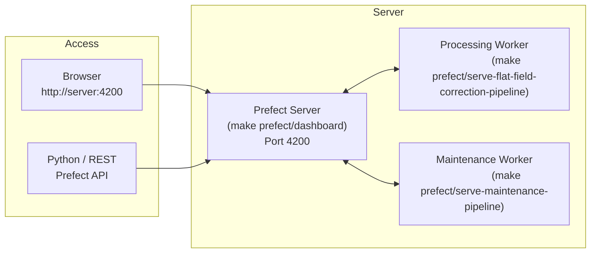

# Managing Prefect Deployments in Production

This page covers what you need to do when the system runs on a server rather than a development laptop.

## Architecture in production

In production, three long-running processes must be kept alive simultaneously:



- **Prefect Server**: stores flow run history, schedules, and artefacts in a local SQLite database.
- **Processing Worker**: serves the `run-flat-field-correction-pipeline` and `run-daily-flat-field-correction-pipeline` deployments.
- **Maintenance Worker**: serves the `delete-old-prefect-flow-runs` deployment.

> The workers contact the Prefect server and poll for scheduled or manually triggered runs. If a worker is stopped, its deployments will not execute even if the server is running.

## Keeping workers alive (systemd or screen)

Use a process manager to keep all three processes running across reboots. Example using `screen`:

```bash
# Terminal 1 — Prefect server
screen -S prefect-server
make prefect/dashboard
# Ctrl+A, D  to detach

# Terminal 2 — Processing worker
screen -S processing-worker
make prefect/serve-flat-field-correction-pipeline
# Ctrl+A, D to detach

# Terminal 3 — Maintenance worker
screen -S maintenance-worker
make prefect/serve-maintenance-pipeline
# Ctrl+A, D to detach
```

For a production setup, prefer `systemd` unit files or a container orchestrator.

## Triggering a run manually

From the UI:
1. Open `http://<server>:4200`.
2. Go to **Deployments**.
3. Select the desired deployment and click **Quick Run** or **Custom Run**.

From the command line (with the Prefect server running):

```bash
# Trigger the full dataset pipeline
uv run prefect deployment run 'process-unprocessed-measurements/run-flat-field-correction-pipeline'

# Trigger a single-day run with a specific day path
uv run prefect deployment run \
    'process-unprocessed-daily-measurements/run-daily-flat-field-correction-pipeline' \
    --param day_path=/path/to/data/2025/20250312
```

## Overriding parameters at runtime

When triggering a run from the UI, you can override any parameter defined in the flow function signature:

| Parameter | Flow | Default | Description |
|---|---|---|---|
| `root` | `process-unprocessed-measurements` | `<repo>/data` | Dataset root path |
| `max_delta_hours` | both flows | `2.0` | Maximum flat-field time gap in hours |
| `max_concurrent_days_to_process` | `process-unprocessed-measurements` | CPU count − 1 (max 12) | How many days to process in parallel |
| `day_path` | `process-unprocessed-daily-measurements` | *(required)* | Path to a single observation day directory |
| `hours` | `delete-flow-runs-older-than` | `672` | Retention window in hours (default: 4 weeks) |
| `interactive` | `delete-flow-runs-older-than` | `false` | Ask for confirmation before deleting (useful in CLI) |

## Monitoring and logs

Prefect stores all logs, task states, and run metadata in its local database:

- **Flow run list**: `http://<server>:4200/runs`
- **Deployment list**: `http://<server>:4200/deployments`
- **Task runs for a flow**: click any flow run to expand its task tree and logs

Each processing run also publishes Prefect **artefacts**:
- A markdown scan summary (total measurements, pending counts per day).
- Per-measurement metadata JSON reports.
- Per-measurement error JSON reports when processing fails.

## Resetting Prefect state

If the Prefect database becomes corrupted or you want a clean slate:

```bash
# WARNING: this deletes ALL flow run history
make prefect/reset
```

After resetting, restart all three processes. The workers will re-register their deployments automatically on the next start.

## Scheduled cleanup

The maintenance deployment handles database growth automatically. Its default schedule (daily at midnight) deletes all flow runs older than 4 weeks. To change the retention window, edit `entrypoints/serve_prefect_maintenance.py` and update the `hours` parameter default, or override it when triggering a manual run.
