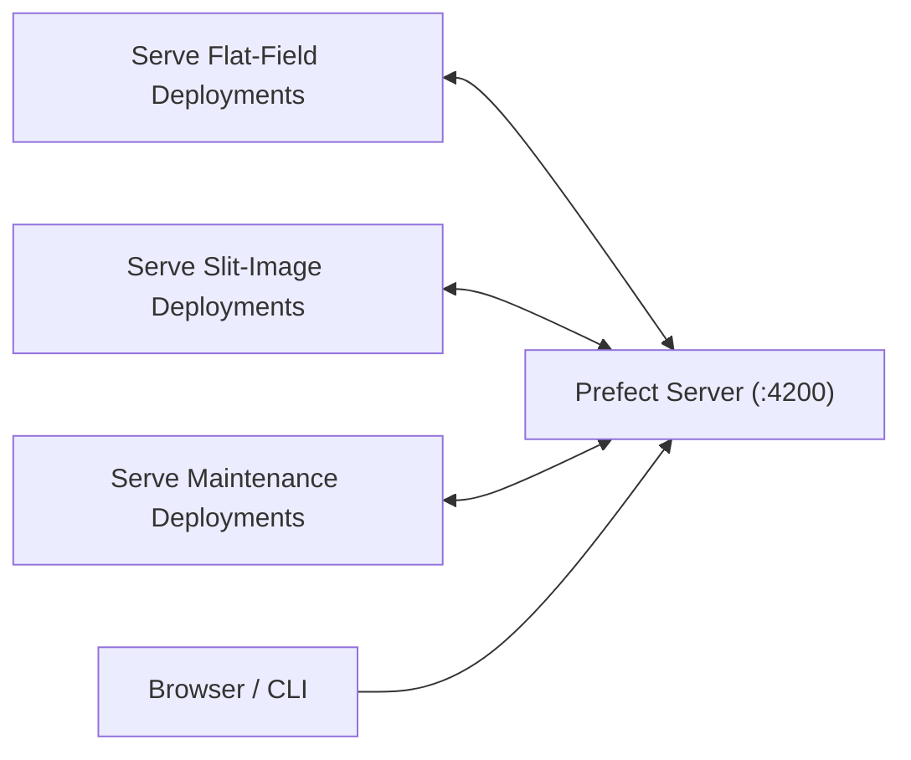

# Managing Prefect in Production

## Process Model

Run these long-lived processes:



Commands:

```bash
irsol-dashboard
irsol-serve-flat-field-correction
irsol-serve-slit-images
irsol-serve-maintenance

```

The `irsol-*` commands are the package-installed production interface. The
`make` targets remain convenient wrappers when operating from a repository
checkout.

## Why Three Serve Processes

This project intentionally serves deployments in three independent processes
instead of one combined process.

- Better fault isolation: if one serve process crashes, only that deployment
    group stops scheduling.
- Independent restarts: roll out a change or restart one pipeline without
    interrupting the others.
- Clearer operations: separate logs, health checks, and process supervision per
    pipeline domain.
- Easier resource control: apply different `systemd` limits or priorities to
    flat-field, slit-image, and maintenance workloads.

A single process for all deployments is simpler to manage, but it introduces a
single point of failure and couples restarts across unrelated workflows.

## Operational Guidance

- Use `systemd` (preferred) or `screen` to keep processes alive.
- If one serve process is down, its deployments stop executing even if server is running.
- Verify health from `http://<server>:4200/deployments` and `http://<server>:4200/runs`.

## Manual Run Triggers

Use the Deployments page in UI or CLI commands documented in [running.md](running.md).

## Reset Procedure

```bash
make prefect/reset
```

This removes Prefect run history. Restart all serve processes afterward.
