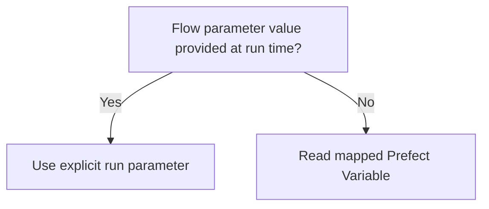

# Running the Pipelines

This page is the single source of truth for:
- run commands;
- deployment names;
- runtime parameter and Prefect Variable resolution.

## Runtime Resolution Policy



`PREFECT_ENABLED` is the only orchestration environment toggle in this repository.

- `PREFECT_ENABLED=true`: decorators integrate with Prefect runtime.
- unset or `false`: same call paths remain plain-Python callable.

`PREFECT_ENABLED` is not used for dynamic runtime values.

## Managed Prefect Variables

Bootstrap or refresh:

```bash
idp variables configure
```

The package-installed unified CLI is the canonical interface.

| Variable name | Typical flow parameter |
|---|---|
| `data-root-path` | `root` |
| `jsoc-email` | `jsoc_email` |
| `cache-expiration-hours` | `hours` (cache cleanup) |
| `flow-run-expiration-hours` | `hours` (run-history cleanup) |

## Local Prefect Commands

```bash
uv run prefect server start
idp flows serve flat-field-correction
idp flows serve slit-images
idp flows serve maintenance

```

When the project is installed from a package, use `idp`. Inside a repository
checkout, the `make` targets call the same underlying CLI.

Run each `idp flows serve ...` command as a separate long-lived process. For the
design rationale and operational trade-offs versus a single combined serve
process, see [prefect-production.md](prefect-production.md#why-three-serve-processes).

## Deployment Triggers (CLI)

### Flat-field correction

```bash
uv run prefect deployment run 'ff-correction-full/flat-field-correction-full'
uv run prefect deployment run \
	'ff-correction-daily/flat-field-correction-daily' \
	--param day_path=/path/to/data/2025/20250312
```

### Slit image generation

```bash
uv run prefect deployment run 'slit-images-full/slit-images-full'
uv run prefect deployment run \
	'slit-images-daily/slit-images-daily' \
	--param day_path=/path/to/data/2025/20250312
```

### Maintenance

```bash
uv run prefect deployment run 'maintenance-cleanup/prefect-run-cleanup'
uv run prefect deployment run 'maintenance-cache-cleanup/cache-cleanup'
```

## Primary Runtime Parameters

| Flow | Parameter | Notes |
|---|---|---|
| `ff-correction-full` | `root`, `max_delta_hours`, `max_concurrent_days_to_process` | `root` falls back to `data-root-path` |
| `ff-correction-daily` | `day_path`, `max_delta_hours` | Single day |
| `slit-images-full` | `root`, `jsoc_email`, `use_limbguider`, `max_concurrent_days` | `root` falls back to `data-root-path`; `jsoc_email` can come from Prefect Variable |
| `slit-images-daily` | `day_path`, `jsoc_email`, `use_limbguider` | Single day |
| `maintenance-cleanup` | `hours` | Falls back to `flow-run-expiration-hours` |
| `maintenance-cache-cleanup` | `root`, `hours` | `root` falls back to `data-root-path`; `hours` falls back to `cache-expiration-hours` |

## Related Pages

- [prefect-introduction.md](prefect-introduction.md)
- [pipeline-flat-field-correction.md](pipeline-flat-field-correction.md)
- [pipeline-slit-image-generation.md](pipeline-slit-image-generation.md)
- [pipeline-maintenance.md](pipeline-maintenance.md)
- [prefect-production.md](prefect-production.md)
